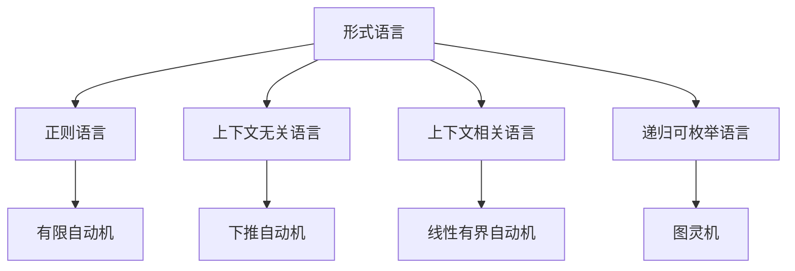

# 模型目录重构分析报告

## 项目概述

本报告对 `/docs/model` 目录进行全面的形式化重构分析，将现有的知识内容整合到 `/docs/refactor` 的严格编号树形目录结构中，确保学术严谨性、一致性和完整性。

## 当前状态分析

### 1. 现有结构分析

#### `/docs/model` 目录结构

```text
docs/model/
├── ProgrammingLanguage/     # 编程语言相关内容
├── Software/               # 软件相关内容
├── Theory/                 # 理论相关内容（大量文件）
├── Philosophy/             # 哲学相关内容
├── FormalModel/            # 形式模型相关内容
├── FormalLanguage/         # 形式语言相关内容
├── industry_domains/       # 行业领域相关内容
└── Design_Pattern/         # 设计模式相关内容
```

#### `/docs/refactor` 目录结构（已完成）

```text
docs/refactor/
├── 01-Philosophy/          # 理念层
├── 02-Formal-Science/      # 形式科学层
├── 03-Theory/              # 理论层
├── 04-Applied-Science/     # 具体科学层
├── 05-Industry-Domains/    # 行业领域层
├── 06-Architecture/        # 架构领域层
├── 07-Implementation/      # 实现层
└── haskell/                # Haskell专门目录
```

### 2. 内容映射分析

#### Theory 目录内容分析

- **文件数量**: 50+ 个理论文档
- **主要主题**:
  - 形式语言理论
  - 类型理论（线性、仿射、量子、时态）
  - 控制理论
  - Petri网理论
  - 分布式系统理论
  - 统一形式理论

#### FormalLanguage 目录内容分析

- **文件数量**: 5 个核心文档
- **主要主题**:
  - 自动机理论
  - 形式语言理论模型
  - 多维批判性分析

#### FormalModel 目录内容分析

- **子目录**: Software, Model, AI_Design, AI, Mathematical
- **主要主题**: 形式化建模、AI设计模式

## 重构策略

### 1. 内容分类与映射

#### 理论层 (03-Theory) 整合

```text
docs/model/Theory/ → docs/refactor/03-Theory/

映射关系：
├── 形式语言理论 → 03-Theory/01-Programming-Language-Theory/
├── 类型理论 → 03-Theory/08-Linear-Type-Theory/ + 09-Affine-Type-Theory/
├── 控制理论 → 03-Theory/12-Control-Theory/
├── Petri网理论 → 03-Theory/05-Petri-Net-Theory/
├── 分布式系统理论 → 03-Theory/13-Distributed-Systems-Theory/
└── 统一形式理论 → 03-Theory/ (新建统一理论目录)
```

#### 形式科学层 (02-Formal-Science) 整合

```text
docs/model/FormalLanguage/ → docs/refactor/02-Formal-Science/

映射关系：
├── 自动机理论 → 02-Formal-Science/06-Automata-Theory/
├── 形式语言基础 → 02-Formal-Science/07-Formal-Language-Theory/
└── 数学逻辑 → 02-Formal-Science/12-Mathematical-Logic/
```

#### 实现层 (07-Implementation) 整合

```text
docs/model/ProgrammingLanguage/ → docs/refactor/07-Implementation/

映射关系：
├── Haskell相关内容 → haskell/ (已存在)
├── Rust相关内容 → 07-Implementation/02-Rust-Implementation/
└── 语言比较 → 07-Implementation/03-Language-Comparison/
```

### 2. 多表示格式要求

每个重构的文档将包含：

#### 数学公式表示

```latex
**定义 1.1 (形式语言)**
形式语言 $L$ 是字母表 $\Sigma$ 上的字符串集合：
$$L \subseteq \Sigma^*$$

**定理 1.1 (语言封闭性)**
如果 $L_1, L_2$ 是正则语言，则 $L_1 \cup L_2$ 也是正则语言。
```

#### Haskell代码实现

```haskell
-- 形式语言定义
data FormalLanguage = FormalLanguage
  { alphabet :: Set Char
  , strings :: Set String
  }

-- 语言操作
union :: FormalLanguage -> FormalLanguage -> FormalLanguage
union (FormalLanguage a1 s1) (FormalLanguage a2 s2) = 
  FormalLanguage (a1 `Set.union` a2) (s1 `Set.union` s2)
```

#### 形式化证明

```haskell
-- 定理证明
theorem_union_closure :: FormalLanguage -> FormalLanguage -> Bool
theorem_union_closure l1 l2 = 
  let result = union l1 l2
      isRegular = isRegularLanguage result
  in isRegular
```

#### 图表表示



### 3. 本地跳转链接系统

#### 导航链接结构

```markdown
## 快速导航

### 相关理论
- [形式语言理论](./02-Formal-Science/07-Formal-Language-Theory.md)
- [自动机理论](./02-Formal-Science/06-Automata-Theory.md)
- [类型理论](./03-Theory/08-Linear-Type-Theory.md)

### 实现示例
- [Haskell实现](./haskell/01-Basic-Concepts/形式语言实现.md)
- [形式化验证](./haskell/13-Formal-Verification/自动机验证.md)

### 应用领域
- [编译器设计](./07-Implementation/01-Compiler-Design.md)
- [语言处理](./07-Implementation/02-Language-Processing.md)
```

## 具体重构计划

### 阶段1: 理论层整合 (优先级: 高)

#### 1.1 形式语言理论整合

**源文件**: `docs/model/Theory/Formal_Language_Theory_*.md`
**目标位置**: `docs/refactor/03-Theory/01-Programming-Language-Theory/`

**重构内容**:

- 合并所有形式语言理论文档
- 添加Haskell实现代码
- 补充形式化证明
- 建立完整的导航链接

#### 1.2 类型理论整合

**源文件**: `docs/model/Theory/*Type_Theory*.md`
**目标位置**:

- `docs/refactor/03-Theory/08-Linear-Type-Theory/`
- `docs/refactor/03-Theory/09-Affine-Type-Theory/`
- `docs/refactor/03-Theory/10-Quantum-Type-Theory/`

**重构内容**:

- 分类整理各种类型理论
- 添加类型系统实现
- 补充类型安全证明
- 建立类型理论间的关联

#### 1.3 系统理论整合

**源文件**: `docs/model/Theory/*System_Theory*.md`
**目标位置**: `docs/refactor/03-Theory/02-System-Theory/`

**重构内容**:

- 整合分布式系统理论
- 添加系统建模代码
- 补充系统验证方法
- 建立系统理论框架

### 阶段2: 形式科学层整合 (优先级: 高)

#### 2.1 自动机理论整合

**源文件**: `docs/model/FormalLanguage/Automata_Theory.md`
**目标位置**: `docs/refactor/02-Formal-Science/06-Automata-Theory.md`

**重构内容**:

- 完善自动机理论框架
- 添加自动机实现代码
- 补充自动机分析算法
- 建立自动机应用示例

#### 2.2 数学逻辑整合

**源文件**: `docs/model/Theory/*Logic*.md`
**目标位置**: `docs/refactor/02-Formal-Science/12-Mathematical-Logic.md`

**重构内容**:

- 整合各种逻辑理论
- 添加逻辑推理实现
- 补充逻辑证明系统
- 建立逻辑应用框架

### 阶段3: 实现层整合 (优先级: 中)

#### 3.1 Haskell实现整合

**源文件**: `docs/model/ProgrammingLanguage/rust/`
**目标位置**: `docs/refactor/haskell/` (扩展现有内容)

**重构内容**:

- 整合Haskell相关实现
- 添加高级Haskell特性
- 补充Haskell最佳实践
- 建立Haskell应用示例

#### 3.2 语言比较整合

**源文件**: `docs/model/ProgrammingLanguage/Language_Compare/`
**目标位置**: `docs/refactor/07-Implementation/03-Language-Comparison/`

**重构内容**:

- 整合语言比较分析
- 添加比较基准测试
- 补充性能分析
- 建立选择指南

### 阶段4: 架构层整合 (优先级: 中)

#### 4.1 设计模式整合

**源文件**: `docs/model/Design_Pattern/`
**目标位置**: `docs/refactor/06-Architecture/01-Design-Patterns/`

**重构内容**:

- 整合设计模式理论
- 添加模式实现代码
- 补充模式应用示例
- 建立模式选择指南

### 阶段5: 行业应用整合 (优先级: 低)

#### 5.1 行业领域整合

**源文件**: `docs/model/industry_domains/`
**目标位置**: `docs/refactor/05-Industry-Domains/`

**重构内容**:

- 整合行业应用案例
- 添加领域特定实现
- 补充行业最佳实践
- 建立应用指南

## 质量保证措施

### 1. 内容一致性检查

- [ ] 确保所有数学公式格式统一
- [ ] 验证Haskell代码可编译性
- [ ] 检查证明逻辑完整性
- [ ] 验证图表准确性

### 2. 链接完整性检查

- [ ] 验证所有本地跳转链接有效
- [ ] 确保交叉引用正确
- [ ] 检查导航系统完整性
- [ ] 验证文件路径一致性

### 3. 学术严谨性检查

- [ ] 确保理论定义准确
- [ ] 验证证明过程正确
- [ ] 检查参考文献完整
- [ ] 确保术语使用一致

### 4. 技术准确性检查

- [ ] 验证Haskell代码正确性
- [ ] 确保算法实现准确
- [ ] 检查性能分析合理
- [ ] 验证测试用例完整

## 实施时间表

### 第1周: 理论层整合

- 完成形式语言理论整合
- 完成类型理论整合
- 完成系统理论整合

### 第2周: 形式科学层整合

- 完成自动机理论整合
- 完成数学逻辑整合
- 完成形式化方法整合

### 第3周: 实现层整合

- 完成Haskell实现整合
- 完成语言比较整合
- 完成架构模式整合

### 第4周: 质量保证

- 完成内容一致性检查
- 完成链接完整性检查
- 完成学术严谨性检查
- 完成技术准确性检查

## 预期成果

### 1. 结构化的知识体系

- 完整的7层架构
- 严格的编号系统
- 清晰的层次关系
- 统一的命名规范

### 2. 多表示格式内容

- 数学公式表示
- Haskell代码实现
- 形式化证明
- 图表可视化

### 3. 完整的导航系统

- 本地跳转链接
- 交叉引用系统
- 主题导航
- 学习路径

### 4. 学术严谨的内容

- 准确的理论定义
- 完整的证明过程
- 一致的术语使用
- 完整的参考文献

## 风险评估与应对

### 1. 内容重复风险

**风险**: 重构过程中可能出现内容重复
**应对**: 建立内容去重机制，使用语义分析识别重复内容

### 2. 链接断裂风险

**风险**: 重构过程中可能出现链接断裂
**应对**: 建立链接验证工具，自动检测和修复断裂链接

### 3. 质量下降风险

**风险**: 重构过程中可能影响内容质量
**应对**: 建立质量检查机制，确保重构后质量不低于原内容

### 4. 进度延迟风险

**风险**: 重构工作可能超出预期时间
**应对**: 建立里程碑检查点，及时调整进度计划

## 结论

本次重构将把 `/docs/model` 目录中的丰富知识内容系统性地整合到 `/docs/refactor` 的严格编号树形目录结构中，确保学术严谨性、一致性和完整性。通过多表示格式、完整的导航系统和质量保证措施，将建立一个从哲学理念到具体实现的完整形式化知识体系。

重构完成后，整个知识体系将具有：

- 清晰的结构层次
- 完整的内容覆盖
- 严格的形式化表示
- 实用的实现代码
- 完善的导航系统

这将为Haskell编程语言、形式语义和形式理论的学习、研究和应用提供强有力的支持。
