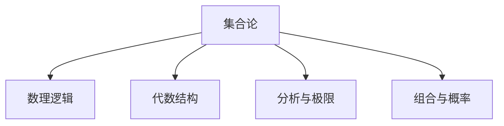

# 101 数学基础（Mathematical Foundations）

- [1. 引言](#1-引言)
- [2. 核心理论体系](#2-核心理论体系)
- [3. Haskell/Lean代码示例](#3-haskelllean代码示例)
- [4. 数学表达与证明](#4-数学表达与证明)
- [5. 图表与结构图](#5-图表与结构图)
- [6. 工程与应用案例](#6-工程与应用案例)
- [7. 对比分析（Haskell/Rust/Lean）](#7-对比分析haskellrustlean)
- [8. 参考文献](#8-参考文献)

---

## 1. 引言

数学基础是计算科学、形式科学与软件工程的理论基石，涵盖集合论、数理逻辑、代数、分析、组合、概率等内容，为后续理论与工程实践提供严密支撑。

## 2. 核心理论体系

- 集合论、公理体系
- 数理逻辑与证明方法
- 代数结构（群、环、域等）
- 数学分析与极限、微积分
- 组合数学与概率基础

## 3. Haskell/Lean代码示例

```haskell
-- Haskell: 集合的幂集生成
import Data.List (subsequences)
powerSet :: [a] -> [[a]]
powerSet = subsequences
```

```lean
-- Lean: 自然数加法交换律证明
example (a b : ℕ) : a + b = b + a := by
  apply Nat.add_comm
```

## 4. 数学表达与证明

- 集合的定义：
  \[
  A = \{ x \mid P(x) \}
  \]
- 归纳法、反证法、构造法等常用证明方法

## 5. 图表与结构图



## 6. 工程与应用案例

- Haskell在金融建模、编译器、分布式系统中的数学基础应用
- Lean在形式化证明与自动化推理中的应用

## 7. 对比分析（Haskell/Rust/Lean）

| 特性         | Haskell           | Rust              | Lean                |
|--------------|-------------------|-------------------|---------------------|
| 数学表达     | 类型系统+高阶函数 | 泛型+trait        | 依赖类型+证明       |
| 工程应用     | 金融、编译器      | 系统、嵌入式      | 形式化建模、证明    |

## 8. 参考文献

- [1] Halmos, P. (1960). Naive Set Theory.
- [2] Spivak, M. (2006). Calculus.
- [3] Pierce, B. C. (2002). Types and Programming Languages.

---

**上一章**: [伦理学](../01-Philosophy/006-Ethics.md)  
**下一章**: [形式语言](./102-Formal-Language.md)
