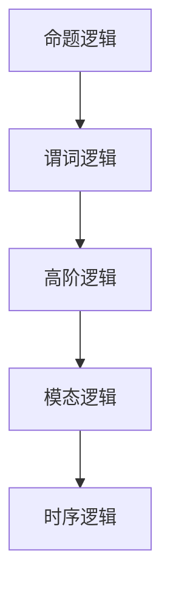

# 103 逻辑系统（Logical Systems）

- [1. 引言](#1-引言)
- [2. 核心理论体系](#2-核心理论体系)
- [3. Haskell/Lean代码示例](#3-haskelllean代码示例)
- [4. 数学表达与证明](#4-数学表达与证明)
- [5. 图表与结构图](#5-图表与结构图)
- [6. 工程与应用案例](#6-工程与应用案例)
- [7. 对比分析（Haskell/Rust/Lean）](#7-对比分析haskellrustlean)
- [8. 参考文献](#8-参考文献)

---

## 1. 引言

逻辑系统是形式科学和计算机科学的基础，研究推理规则、证明方法和真值体系。涵盖命题逻辑、一阶逻辑、高阶逻辑、模态逻辑等，为程序验证、自动推理、类型系统等提供理论支撑。

## 2. 核心理论体系

- 命题逻辑与真值表
- 谓词逻辑（First-Order Logic, FOL）
- 高阶逻辑与类型理论
- 模态逻辑、时序逻辑
- 归纳与演绎推理、证明系统

## 3. Haskell/Lean代码示例

```haskell
-- Haskell: 命题逻辑的简单实现
not' :: Bool -> Bool
not' True = False
not' False = True

and' :: Bool -> Bool -> Bool
and' True True = True
and' _ _ = False
```

```lean
-- Lean: 命题逻辑的定理证明
example (P Q : Prop) : P ∧ Q → Q ∧ P :=
  fun h => ⟨h.right, h.left⟩
```

## 4. 数学表达与证明

- 命题逻辑的真值表：
  \[
  \begin{array}{c|c|c}
  P & Q & P \land Q \\
  \hline
  T & T & T \\
  T & F & F \\
  F & T & F \\
  F & F & F \\
  \end{array}
  \]
- 谓词逻辑的推理规则（如全称引入、存在消去）
- 归纳法与演绎法证明思路

## 5. 图表与结构图



## 6. 工程与应用案例

- Haskell在DSL、类型系统、自动推理中的逻辑实现
- Lean在定理证明、自动化推理中的应用

## 7. 对比分析（Haskell/Rust/Lean）

| 特性         | Haskell           | Rust              | Lean                |
|--------------|-------------------|-------------------|---------------------|
| 逻辑实现     | 类型系统+模式匹配 | trait+宏          | 依赖类型+证明       |
| 工程应用     | DSL、类型系统     | 宏系统、嵌入式    | 形式化建模、证明    |

## 8. 参考文献

- [1] Enderton, H. B. (2001). A Mathematical Introduction to Logic.
- [2] Huth, M., & Ryan, M. (2004). Logic in Computer Science.
- [3] Pierce, B. C. (2002). Types and Programming Languages.

---

**上一章**: [形式语言](./102-Formal-Language.md)  
**下一章**: [形式科学导航](../README.md)
