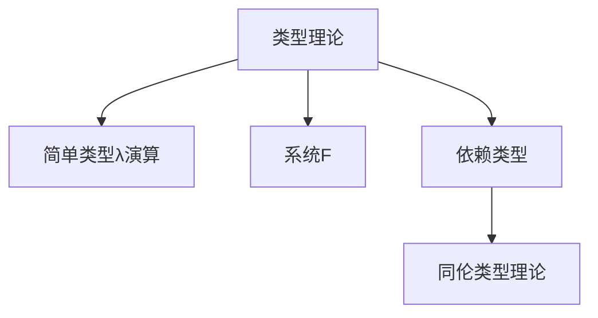

# 104 类型理论（Type Theory）

- [104 类型理论（Type Theory）](#104-类型理论type-theory)
  - [1. 引言](#1-引言)
  - [2. 核心理论体系](#2-核心理论体系)
  - [3. Haskell/Lean代码示例](#3-haskelllean代码示例)
  - [4. 数学表达与证明](#4-数学表达与证明)
  - [5. 图表与结构图](#5-图表与结构图)
  - [6. 工程与应用案例](#6-工程与应用案例)
  - [7. 对比分析（Haskell/Rust/Lean）](#7-对比分析haskellrustlean)
  - [8. 参考文献](#8-参考文献)

---

## 1. 引言

类型理论是现代编程语言、形式化验证和数学基础的重要理论体系，研究类型、项、类型系统及其推理规则。广泛应用于函数式编程、定理证明、同伦类型理论等领域。

## 2. 核心理论体系

- 简单类型λ演算、系统F、依赖类型、同伦类型理论（HoTT）
- 类型推断与类型检查
- 类型安全、类型等价、子类型、多态
- Curry-Howard同构（类型即命题）

## 3. Haskell/Lean代码示例

```haskell
-- Haskell: 多态函数与类型类
class Eq a where
  (==) :: a -> a -> Bool

instance Eq Int where
  x == y = x Prelude.== y
```

```lean
-- Lean: 依赖类型与定理证明
inductive Vec (α : Type) : Nat → Type
| nil : Vec α 0
| cons : α → Vec α n → Vec α (n+1)
```

## 4. 数学表达与证明

- 类型系统的形式化定义：
  \[
  \Gamma \vdash e : \tau
  \]
- Curry-Howard同构：类型与命题的对应关系
- 类型安全性证明思路（进步性与保型性）

## 5. 图表与结构图



## 6. 工程与应用案例

- Haskell类型系统在安全抽象、泛型编程中的应用
- Lean依赖类型在形式化证明、自动化推理中的应用

## 7. 对比分析（Haskell/Rust/Lean）

| 特性         | Haskell           | Rust              | Lean                |
|--------------|-------------------|-------------------|---------------------|
| 类型系统     | 强、惰性、多态    | 强、所有权/生命周期| 依赖类型、证明辅助  |
| 工程应用     | 泛型、类型类      | trait、泛型、安全 | 形式化建模、证明    |

## 8. 参考文献

- [1] Pierce, B. C. (2002). Types and Programming Languages.
- [2] Wadler, P. (2015). Propositions as Types.
- [3] The Univalent Foundations Program (2013). Homotopy Type Theory: Univalent Foundations of Mathematics.
