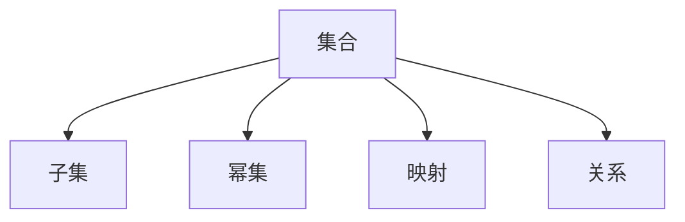

# 105 集合论（Set Theory）

- [105 集合论（Set Theory）](#105-集合论set-theory)
  - [1. 引言](#1-引言)
  - [2. 核心理论体系](#2-核心理论体系)
  - [3. Haskell/Lean代码示例](#3-haskelllean代码示例)
  - [4. 数学表达与证明](#4-数学表达与证明)
  - [5. 图表与结构图](#5-图表与结构图)
  - [6. 工程与应用案例](#6-工程与应用案例)
  - [7. 对比分析（Haskell/Rust/Lean）](#7-对比分析haskellrustlean)
  - [8. 参考文献](#8-参考文献)

---

## 1. 引言

集合论是现代数学和计算机科学的基础理论之一，研究集合、元素、关系、运算及其公理体系。为数理逻辑、类型理论、范畴论等提供理论支撑。

## 2. 核心理论体系

- 集合的定义与表示
- 集合运算（并、交、差、补、笛卡尔积）
- 子集、幂集、映射、关系
- 公理化集合论（ZFC、ZF、NBG等）
- 基数、序数、无穷集合

## 3. Haskell/Lean代码示例

```haskell
-- Haskell: 幂集生成
import Data.List (subsequences)
powerSet :: [a] -> [[a]]
powerSet = subsequences
```

```lean
-- Lean: 集合的基本操作
open Set
example (A B : set ℕ) : A ∩ B ⊆ A := inter_subset_left A B
```

## 4. 数学表达与证明

- 集合的描述：
  \[
  A = \{ x \mid P(x) \}
  \]
- 幂集定义：
  \[
  \mathcal{P}(A) = \{ B \mid B \subseteq A \}
  \]
- ZFC公理体系简述

## 5. 图表与结构图



## 6. 工程与应用案例

- Haskell在数据结构、集合操作、数据库查询中的应用
- Lean在集合论公理化证明、自动化推理中的应用

## 7. 对比分析（Haskell/Rust/Lean）

| 特性         | Haskell           | Rust              | Lean                |
|--------------|-------------------|-------------------|---------------------|
| 集合实现     | 列表、Set库       | Vec、HashSet      | set类型、归纳定义   |
| 工程应用     | 数据结构、查询    | 系统、嵌入式      | 形式化建模、证明    |

## 8. 参考文献

- [1] Halmos, P. (1960). Naive Set Theory.
- [2] Jech, T. (2002). Set Theory.
- [3] Kunen, K. (2011). Set Theory.
