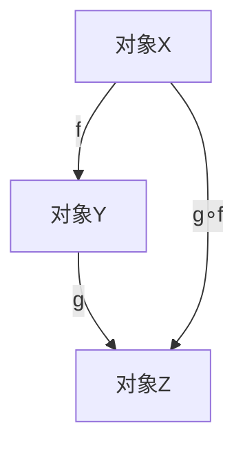

# 106 范畴论（Category Theory）

- [106 范畴论（Category Theory）](#106-范畴论category-theory)
  - [1. 引言](#1-引言)
  - [2. 核心理论体系](#2-核心理论体系)
  - [3. Haskell/Lean代码示例](#3-haskelllean代码示例)
  - [4. 数学表达与证明](#4-数学表达与证明)
  - [5. 图表与结构图](#5-图表与结构图)
  - [6. 工程与应用案例](#6-工程与应用案例)
  - [7. 对比分析（Haskell/Rust/Lean）](#7-对比分析haskellrustlean)
  - [8. 参考文献](#8-参考文献)

---

## 1. 引言

范畴论是现代数学、计算机科学和函数式编程的重要理论工具，研究对象、态射、函子、自然变换等抽象结构。为类型理论、代数、程序语义等提供统一视角。

## 2. 核心理论体系

- 范畴、对象、态射的定义
- 恒等态射与态射复合
- 函子、自然变换、对偶范畴
- 极限与余极限、积与余积
- 单子、伴随、幺半范畴

## 3. Haskell/Lean代码示例

```haskell
-- Haskell: Functor类型类
class Functor f where
  fmap :: (a -> b) -> f a -> f b
```

```lean
-- Lean: 范畴与函子的定义（简化）
structure Category :=
  (Obj : Type)
  (Hom : Obj → Obj → Type)
  (id : Π X, Hom X X)
  (comp : Π {X Y Z}, Hom X Y → Hom Y Z → Hom X Z)
```

## 4. 数学表达与证明

- 范畴的公理：
  \[
  \forall f : X \to Y, \forall g : Y \to Z, \forall h : Z \to W,\ h \circ (g \circ f) = (h \circ g) \circ f
  \]
- 恒等元与结合律证明
- 函子的结构保持性

## 5. 图表与结构图



## 6. 工程与应用案例

- Haskell中Functor/Monad等抽象的工程应用
- Lean在范畴论结构与证明自动化中的应用

## 7. 对比分析（Haskell/Rust/Lean）

| 特性         | Haskell           | Rust              | Lean                |
|--------------|-------------------|-------------------|---------------------|
| 范畴实现     | 类型类、Functor   | trait、泛型       | 结构体、归纳类型    |
| 工程应用     | 抽象、泛型编程    | trait、组合       | 形式化建模、证明    |

## 8. 参考文献

- [1] Awodey, S. (2010). Category Theory.
- [2] Mac Lane, S. (1998). Categories for the Working Mathematician.
- [3] Milewski, B. (2018). Category Theory for Programmers.
