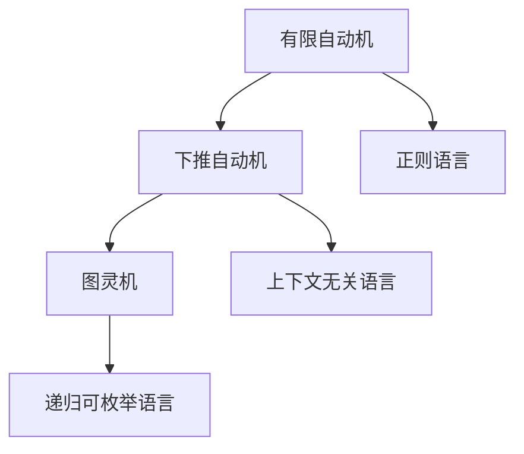

# 111 自动机理论（Automata Theory）

- [111 自动机理论（Automata Theory）](#111-自动机理论automata-theory)
  - [1. 引言](#1-引言)
  - [2. 核心理论体系](#2-核心理论体系)
  - [3. Haskell/Lean代码示例](#3-haskelllean代码示例)
  - [4. 数学表达与证明](#4-数学表达与证明)
  - [5. 图表与结构图](#5-图表与结构图)
  - [6. 工程与应用案例](#6-工程与应用案例)
  - [7. 对比分析（Haskell/Rust/Lean）](#7-对比分析haskellrustlean)
  - [8. 参考文献](#8-参考文献)

---

## 1. 引言

自动机理论是计算机科学和形式语言理论的基础，研究有限自动机、栈自动机、图灵机等抽象计算模型，为编译原理、程序分析、复杂性理论等提供理论支撑。

## 2. 核心理论体系

- 有限自动机（DFA/NFA）、正则语言
- 下推自动机、上下文无关语言
- 图灵机、递归可枚举语言
- 自动机的等价性、判定性、封闭性

## 3. Haskell/Lean代码示例

```haskell
-- Haskell: DFA的简单实现
import Data.List (foldl')
type State = Int
type Symbol = Char
type DFA = ([State], [Symbol], State, [State], State -> Symbol -> State)

accepts :: DFA -> [Symbol] -> Bool
accepts (_, _, start, finals, delta) input =
  let end = foldl' delta start input
  in end `elem` finals
```

```lean
-- Lean: DFA的结构定义（简化）
structure DFA (σ : Type) :=
  (Q : Type) (q₀ : Q) (F : set Q) (δ : Q → σ → Q)
```

## 4. 数学表达与证明

- DFA定义：
  \[
  M = (Q, \Sigma, \delta, q_0, F)
  \]
- 自动机的等价性、判定性证明思路
- 泵引理、不可判定性定理

## 5. 图表与结构图



## 6. 工程与应用案例

- Haskell在词法分析、正则表达式、编译器中的自动机实现
- Lean在自动机理论性质证明、形式化建模中的应用

## 7. 对比分析（Haskell/Rust/Lean）

| 特性         | Haskell           | Rust              | Lean                |
|--------------|-------------------|-------------------|---------------------|
| 自动机实现   | 数据类型、函数    | 结构体、trait     | 结构体、归纳类型    |
| 工程应用     | 词法分析、编译器  | 系统、嵌入式      | 形式化建模、证明    |

## 8. 参考文献

- [1] Hopcroft, J. E., Motwani, R., & Ullman, J. D. (2006). Introduction to Automata Theory, Languages, and Computation.
- [2] Sipser, M. (2012). Introduction to the Theory of Computation.
- [3] Kozen, D. (1997). Automata and Computability.
