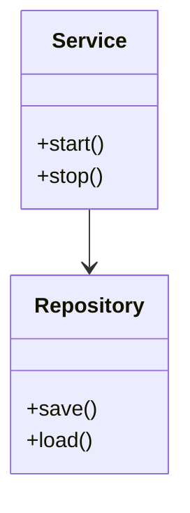

# 303 架构与设计模式（Architecture & Design Patterns）

- [1. 引言](#1-引言)
- [2. 架构基础理论](#2-架构基础理论)
- [3. 常用设计模式分类](#3-常用设计模式分类)
- [4. Haskell/Rust/Lean设计模式对比](#4-haskellrustlean设计模式对比)
- [5. 代码示例与模式应用](#5-代码示例与模式应用)
- [6. 结构图与模式图](#6-结构图与模式图)
- [7. 参考文献](#7-参考文献)

---

## 1. 引言

架构与设计模式是软件工程中提升系统可维护性、可扩展性与复用性的核心理论与实践。架构关注系统整体结构与分层，设计模式关注局部结构与通用解决方案。

## 2. 架构基础理论

- 分层架构、微服务、事件驱动、管道-过滤器等
- 架构决策与权衡分析
- 典型架构流程与结构图（见下方Mermaid示例）

## 3. 常用设计模式分类

- 创建型：单例、工厂、建造者、原型等
- 结构型：适配器、装饰器、组合、外观、代理等
- 行为型：观察者、策略、命令、状态、责任链等
- 并发/分布式：生产者-消费者、读写锁、分布式事务等

## 4. Haskell/Rust/Lean设计模式对比

| 模式/特性   | Haskell           | Rust              | Lean                |
|-------------|-------------------|-------------------|---------------------|
| 单例        | IORef/STM实现     | 静态变量/Mutex    | 依赖类型/模块化     |
| 工厂        | 类型类/高阶函数   | Trait/泛型        | 类型类/证明辅助     |
| 观察者      | FRP/事件流        | 通道/回调         | 依赖类型事件建模    |
| 并发支持    | STM/Async         | 线程/async/await  | Lean4支持并发建模   |

## 5. 代码示例与模式应用

```haskell
-- Haskell中的单例模式实现
module Singleton where
import Data.IORef
import System.IO.Unsafe (unsafePerformIO)

singleton :: IORef Int
singleton = unsafePerformIO (newIORef 0)
```

```rust
// Rust中的单例模式实现（伪代码）
use std::sync::{Once, ONCE_INIT};
static mut INSTANCE: Option<MyType> = None;
static INIT: Once = ONCE_INIT;

fn get_instance() -> &'static MyType {
    unsafe {
        INIT.call_once(|| {
            INSTANCE = Some(MyType::new());
        });
        INSTANCE.as_ref().unwrap()
    }
}
```

## 6. 结构图与模式图



## 7. 参考文献

- [1] Gamma, E. et al. (1994). Design Patterns: Elements of Reusable Object-Oriented Software.
- [2] Bass, L., Clements, P., & Kazman, R. (2012). Software Architecture in Practice.
- [3] Evans, E. (2003). Domain-Driven Design: Tackling Complexity in the Heart of Software.
