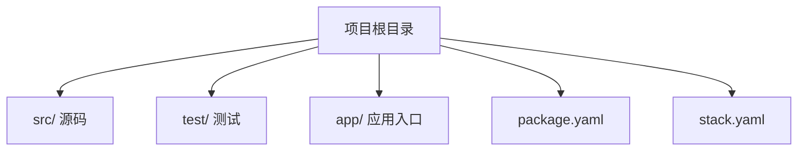

# 305 Haskell工程实践（Haskell Engineering Practices）

- [1. 引言](#1-引言)
- [2. Haskell工程项目结构](#2-haskell工程项目结构)
- [3. 模块化与依赖管理](#3-模块化与依赖管理)
- [4. 测试、CI/CD与自动化工具](#4-测试cicd与自动化工具)
- [5. 工程最佳实践与常见陷阱](#5-工程最佳实践与常见陷阱)
- [6. 代码示例与工程模板](#6-代码示例与工程模板)
- [7. 与Rust/Lean工程实践对比](#7-与rustlean工程实践对比)
- [8. 参考文献](#8-参考文献)

---

## 1. 引言

Haskell工程实践聚焦于Haskell在实际软件开发中的应用方法、工程流程、工具链与最佳实践。强调类型安全、函数式抽象、并发与高可靠性，适用于金融、区块链、编译器等高要求领域。

## 2. Haskell工程项目结构

- 典型Haskell项目结构：src/、test/、app/、package.yaml、stack.yaml等
- 依赖管理工具：Stack、Cabal、Nix
- Mermaid项目结构图：



## 3. 模块化与依赖管理

- Haskell模块系统与命名空间
- 依赖管理与版本控制（Stack、Cabal、Nix）
- 第三方库与包管理（Hackage、Stackage）

## 4. 测试、CI/CD与自动化工具

- 单元测试（HUnit、QuickCheck）
- 静态分析（HLint、Weeder）
- 持续集成（GitHub Actions、Travis CI、CI/CD脚本）
- 自动化构建与部署

## 5. 工程最佳实践与常见陷阱

- 类型安全优先、纯函数优先、避免副作用
- 代码风格与文档规范
- 性能优化与内存泄漏排查
- 常见陷阱：惰性求值导致空间泄漏、类型推断不明确、依赖冲突等

## 6. 代码示例与工程模板

```haskell
-- 典型模块结构与主程序
module Lib (add) where
add :: Int -> Int -> Int
add x y = x + y

-- 主程序入口
module Main where
import Lib
main :: IO ()
main = print (add 2 3)
```

## 7. 与Rust/Lean工程实践对比

| 特性         | Haskell           | Rust              | Lean                |
|--------------|-------------------|-------------------|---------------------|
| 工程工具链   | Stack/Cabal/Nix   | Cargo             | Lean工具链          |
| 类型系统     | 强，惰性          | 强，所有权/生命周期| 依赖类型，证明辅助  |
| 并发支持     | STM、Async        | 线程、async/await | Lean4支持并发建模   |
| 主要应用     | 金融、编译器、科研| 系统、嵌入式、Web | 形式化建模、证明    |

## 8. 参考文献

- [1] Lipovaca, M. (2011). Learn You a Haskell for Great Good!
- [2] O'Sullivan, B., Goerzen, J., & Stewart, D. (2014). Real World Haskell.
- [3] Marlow, S. (2013). Parallel and Concurrent Programming in Haskell.
