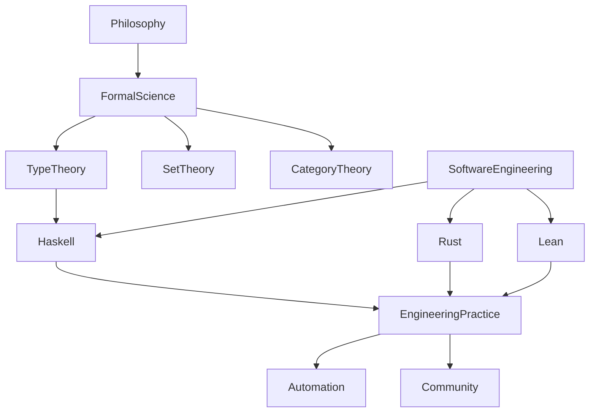

# 知识图谱说明（Knowledge Graph）

## 1. 主要概念节点

- 哲学基础（Philosophy）
- 形式科学（Formal Science）
- 理论体系（Type Theory, Set Theory, Category Theory, 等）
- 软件工程（Software Engineering）
- Haskell、Rust、Lean等语言与工具
- 工程实践、自动化工具链、社区协作

## 2. 关系类型

- 包含（层级/归属）
- 依赖（理论与工程、工具与实践）
- 对比（多语言、方法论、工具链）
- 交叉（学科交叉、理论与应用）
- 演进（历史发展、路线图）

## 3. 分层结构

- 顶层：哲学基础、形式科学、工程层、集成与总结
- 中层：各理论分支、工程专题、工具链、社区机制
- 底层：具体概念、代码示例、案例、流程、规范

## 4. 可视化建议

- 推荐使用Mermaid或Graphviz绘制知识图谱
- 示例（Mermaid）：

- 可结合分层配色、节点分组、交互式展示等方式增强可读性

## 5. 应用场景

- 全局导航与内容查找
- 理论与工程关联分析
- 团队协作与知识共享
- 智能化内容推荐与自动化工具集成

## 6. 扩展建议

- 持续补充新节点与关系，反映知识体系演进
- 探索AI辅助知识图谱自动生成与可视化
- 支持与外部知识库、行业标准对接

> 知识图谱是结构化认知与全局导航的核心工具，建议团队与社区共同维护与持续优化。
