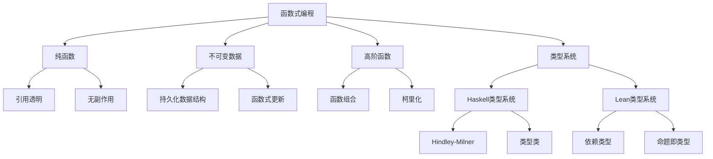
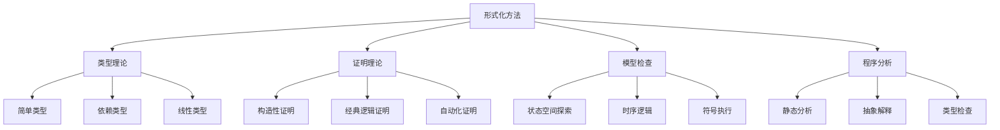

# Lean与Haskell深度分析整合

> 本文档提供Lean与Haskell在多个维度的深度关联性分析，探索两种语言的互补性和整合价值。

## 1. 语言特性深度对比

### 1.1 类型系统对比

| 特性 | Haskell | Lean | 整合价值 |
|------|---------|------|---------|
| **类型推导** | Hindley-Milner系统，强大但有限制 | 依赖类型系统，更强大但需更多类型注解 | 结合自动推导和精确控制 |
| **多态性** | 参数多态、ad-hoc多态（类型类） | 依赖类型多态、宇宙多态 | 全面的抽象能力 |
| **类型安全** | 强类型，编译时检查 | 更强的类型系统，可表达定理 | 最高级别的类型安全保证 |
| **类型级编程** | 类型族、GADTs、多参数类型类 | 原生依赖类型、归纳族、元编程 | 强大的类型级抽象能力 |

### 1.2 计算模型对比

| 特性 | Haskell | Lean | 整合价值 |
|------|---------|------|---------|
| **求值策略** | 惰性求值（非严格） | 严格求值 | 适应不同场景的灵活性 |
| **副作用处理** | 单子封装 | 基于效应的IO | 纯函数式与副作用隔离 |
| **并发模型** | 轻量级线程、STM | 有限支持 | 高性能并发与验证结合 |
| **内存管理** | 垃圾回收 | 垃圾回收 | 自动内存管理的便利性 |

### 1.3 语言生态对比

| 特性 | Haskell | Lean | 整合价值 |
|------|---------|------|---------|
| **库生态** | 丰富成熟 | 正在发展 | 结合成熟库与前沿功能 |
| **工具链** | GHC、Cabal、Stack | Lean编译器、Lake | 完整的开发工具链 |
| **社区** | 活跃、成熟 | 学术为主，正在扩大 | 理论与实践的社区支持 |
| **应用领域** | Web、数据处理、编译器等 | 数学证明、形式化验证 | 广泛的应用覆盖 |

## 2. 范式整合分析

### 2.1 函数式编程范式

### 2.2 形式化方法范式

## 3. 设计模式整合

### 3.1 函数式设计模式整合

| 设计模式 | Haskell实现 | Lean实现 | 整合应用 |
|---------|------------|---------|---------|
| **单子模式** | `Monad`类型类，多种实现 | `Monad`结构，证明友好 | 可验证的副作用封装 |
| **函子模式** | `Functor`类型类 | 范畴论结构 | 统一的数据变换抽象 |
| **应用函子** | `Applicative`类型类 | 函数式结构 | 并行计算与验证 |
| **遍历模式** | `Traversable`类型类 | 依赖类型遍历 | 类型安全的数据遍历 |

### 3.2 架构设计模式整合

| 架构模式 | Haskell实现 | Lean实现 | 整合应用 |
|---------|------------|---------|---------|
| **分层架构** | 单子变换器堆栈 | 依赖记录类型 | 可验证的模块化架构 |
| **组件模型** | 类型类、高阶组件 | 依赖类型组件 | 形式化组件契约 |
| **领域建模** | 代数数据类型 | 归纳类型与定理 | 可验证的领域模型 |
| **事件溯源** | 函数式事件处理 | 形式化状态转换 | 可证明正确的事件系统 |

## 4. 执行流与控制流整合

### 4.1 执行流模型对比

| 执行流特性 | Haskell | Lean | 整合价值 |
|-----------|---------|------|---------|
| **求值顺序** | 惰性（按需） | 严格（立即） | 灵活的计算策略 |
| **递归模型** | 尾递归优化有限 | 结构化递归、良基递归 | 可证明终止的递归 |
| **并行执行** | 并行策略、并行单子 | 有限支持 | 高性能并行与正确性 |
| **异常处理** | Maybe、Either单子 | 依赖类型错误处理 | 类型安全的错误处理 |

### 4.2 控制流模型对比

| 控制流特性 | Haskell | Lean | 整合价值 |
|-----------|---------|------|---------|
| **模式匹配** | 广泛支持 | 依赖类型模式匹配 | 强大的数据析构能力 |
| **守卫表达式** | 支持 | 支持 | 条件逻辑的清晰表达 |
| **高阶控制** | 延续、回调 | 证明策略 | 高级控制流抽象 |
| **代数效应** | 有限支持 | 有限支持 | 模块化副作用处理 |

## 5. 应用场景整合分析

### 5.1 领域特定语言(DSL)开发

| DSL特性 | Haskell优势 | Lean优势 | 整合方案 |
|--------|------------|---------|---------|
| **语法设计** | 强大的解析器组合子 | 宏系统、元编程 | 结合易用性与形式化 |
| **语义模型** | 代数数据类型 | 依赖类型、证明 | 可验证的语义模型 |
| **类型安全** | 强类型系统 | 依赖类型系统 | 最高级别类型安全 |
| **执行效率** | 优化编译器 | 有限优化 | 结合性能与正确性 |

### 5.2 形式化验证应用

| 验证特性 | Haskell能力 | Lean能力 | 整合方案 |
|---------|------------|---------|---------|
| **属性测试** | QuickCheck、Hedgehog | 有限支持 | 结合测试与证明 |
| **定理证明** | 有限支持 | 强大的证明系统 | 形式化验证核心算法 |
| **模型检查** | 有第三方工具 | 内置支持 | 全面的验证策略 |
| **类型级验证** | 高级类型特性 | 依赖类型 | 编译时保证与运行时验证 |

## 6. 整合路径与最佳实践

### 6.1 技术选择指南

- **以Haskell为主**：当性能、生态系统和工程化是关键考量
- **以Lean为主**：当形式化验证、定理证明是核心需求
- **混合使用**：Lean验证核心算法，Haskell实现系统架构

### 6.2 知识迁移路径

- **Haskell → Lean**：从类型类到依赖类型，从单子到证明
- **Lean → Haskell**：从形式化思维到工程实践，从证明到测试

### 6.3 整合工具链

- **互操作性**：通过中间语言或FFI实现互操作
- **验证流程**：Lean验证，Haskell实现，属性测试验证一致性
- **文档与规范**：使用Lean作为形式化规范语言，Haskell作为实现语言

---

*最后更新：2024年整理阶段*
