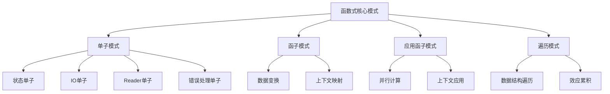
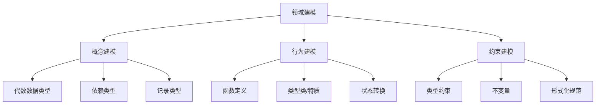

# Lean与Haskell软件设计深度分析

> 本文档深入分析Lean与Haskell在软件设计方面的特性、模式和最佳实践，探讨如何结合两种语言的优势进行高质量软件设计。

## 1. 软件设计原则对比

### 1.1 函数式设计原则

| 设计原则 | Haskell实践 | Lean实践 | 综合应用 |
|---------|------------|---------|---------|
| **组合优于继承** | 函数组合、类型组合 | 依赖类型组合、结构化证明 | 可验证的组合模式 |
| **不可变性** | 默认不可变数据 | 数学化不可变模型 | 强保证的状态管理 |
| **类型驱动设计** | 类型作为设计工具 | 类型即规范与证明 | 形式化的设计方法 |
| **引用透明性** | 纯函数设计 | 数学函数与证明 | 可推理的系统行为 |

### 1.2 软件架构原则

| 架构原则 | Haskell实现 | Lean实现 | 整合价值 |
|---------|------------|---------|---------|
| **关注点分离** | 单子变换器、类型类 | 依赖记录、模块系统 | 形式化的模块边界 |
| **抽象层次** | 类型类层次、高阶抽象 | 宇宙层次、元理论 | 多层次抽象能力 |
| **可测试性** | 纯函数易测试 | 可证明的正确性 | 测试与证明结合 |
| **可维护性** | 声明式代码、类型安全 | 形式化规范、证明 | 长期可维护系统 |

## 2. 设计模式深度分析

### 2.1 函数式核心模式

### 2.2 高级设计模式

| 设计模式 | Haskell实现 | Lean实现 | 应用场景 |
|---------|------------|---------|---------|
| **自由单子** | `Free`单子、DSL解释器 | 依赖类型编码 | 可扩展DSL、效应系统 |
| **最终编码** | `Finally Tagless`风格 | 依赖记录、类型类 | 可扩展解释器 |
| **类型状态** | 幻影类型、类型族 | 依赖类型、索引类型 | 状态机、协议验证 |
| **代数效应** | 效应系统库 | 元编程实现 | 模块化副作用 |

### 2.3 架构设计模式

| 架构模式 | Haskell实现 | Lean实现 | 整合应用 |
|---------|------------|---------|---------|
| **洋葱架构** | 函数式分层 | 依赖类型约束 | 可验证的分层架构 |
| **六边形架构** | 端口与适配器 | 接口形式化 | 领域驱动与形式化 |
| **CQRS** | 命令查询分离 | 形式化状态转换 | 可证明的状态一致性 |
| **事件溯源** | 不可变事件流 | 证明状态演化 | 可验证的事件系统 |

## 3. 领域建模深度分析

### 3.1 类型驱动领域建模

### 3.2 领域特定语言设计

| DSL特性 | Haskell方法 | Lean方法 | 整合策略 |
|--------|------------|---------|---------|
| **语法设计** | 解析器组合子、准引用 | 宏、元编程 | 结合易用性与安全性 |
| **语义模型** | 解释器、编译器 | 形式化语义、证明 | 可验证的语义模型 |
| **类型安全** | 嵌入式类型检查 | 依赖类型检查 | 最高级别类型安全 |
| **组合性** | 函数组合、单子组合 | 证明组合、类型组合 | 可组合、可验证的DSL |

### 3.3 验证驱动设计

| 验证方法 | Haskell实现 | Lean实现 | 整合价值 |
|---------|------------|---------|---------|
| **属性测试** | QuickCheck、Hedgehog | 有限支持 | 随机测试与形式化验证 |
| **类型级验证** | 类型族、GADT | 依赖类型 | 编译时验证与证明 |
| **形式化规约** | 有限支持 | 一等公民 | 规约即证明目标 |
| **运行时检查** | 断言、契约 | 提取的验证代码 | 多层次验证策略 |

## 4. 软件质量深度分析

### 4.1 可靠性保障

| 可靠性方面 | Haskell方法 | Lean方法 | 整合策略 |
|-----------|------------|---------|---------|
| **错误处理** | Maybe、Either、异常 | 依赖类型、证明 | 类型安全的错误处理 |
| **不变量维护** | 封装、抽象数据类型 | 定理、证明 | 可证明的不变量 |
| **边界条件** | 测试、类型约束 | 形式化证明 | 全面的边界保护 |
| **并发安全** | STM、不可变数据 | 形式化并发模型 | 可验证的并发系统 |

### 4.2 性能优化

| 性能方面 | Haskell技术 | Lean技术 | 整合方法 |
|---------|------------|---------|---------|
| **算法选择** | 渐进复杂度分析 | 形式化复杂度证明 | 可证明的性能特性 |
| **内存优化** | 严格求值注解、空间分析 | 提取到优化语言 | 理论与实践结合 |
| **并行化** | 并行策略、并行单子 | 形式化并行模型 | 正确且高效的并行 |
| **编译优化** | GHC优化、RULES | 提取优化 | 多层次优化策略 |

### 4.3 可维护性

| 维护性方面 | Haskell实践 | Lean实践 | 整合价值 |
|-----------|------------|---------|---------|
| **模块化** | 强类型模块系统 | 依赖类型模块 | 形式化模块边界 |
| **可读性** | 声明式风格、类型签名 | 证明即文档 | 自文档化代码 |
| **可扩展性** | 类型类、高阶抽象 | 依赖记录、类型类 | 类型安全的扩展 |
| **重构安全** | 类型系统辅助 | 证明辅助 | 可验证的重构 |

## 5. 实践案例分析

### 5.1 编译器设计

| 编译器组件 | Haskell实现 | Lean实现 | 整合方案 |
|-----------|------------|---------|---------|
| **词法分析** | 解析器组合子 | 形式化语法 | 可验证的解析器 |
| **语法分析** | 代数数据类型AST | 归纳类型AST | 类型安全的语法树 |
| **类型检查** | 类型推导算法 | 形式化类型系统 | 可证明的类型检查 |
| **中间表示** | 函数式IR | 依赖类型IR | 可验证的程序变换 |
| **代码生成** | 目标代码映射 | 提取到目标语言 | 可证明正确的生成 |

### 5.2 Web系统设计

| Web系统组件 | Haskell实现 | Lean实现 | 整合策略 |
|------------|------------|---------|---------|
| **路由系统** | 类型安全路由 | 形式化URL模型 | 可验证的路由逻辑 |
| **数据验证** | 类型驱动验证 | 依赖类型规约 | 多层次验证策略 |
| **状态管理** | 函数式状态 | 形式化状态模型 | 可证明的状态转换 |
| **并发处理** | 异步IO、STM | 形式化并发模型 | 高性能且安全的并发 |
| **安全机制** | 类型级权限 | 形式化安全模型 | 可证明的安全属性 |

## 6. 最佳实践与整合策略

### 6.1 设计方法论

1. **类型优先设计**：先设计类型，再实现函数
2. **证明驱动开发**：关键算法先证明，再实现
3. **渐进式形式化**：重要组件形式化，其他部分类型安全

### 6.2 技术选择策略

- **核心算法**：使用Lean进行形式化验证
- **系统架构**：使用Haskell实现工程化架构
- **关键接口**：两种语言共享接口规范
- **性能热点**：考虑低级语言实现，形式化验证

### 6.3 团队协作模式

- **专业分工**：形式化专家与工程实践专家协作
- **知识共享**：建立共同的函数式和形式化基础
- **工具链整合**：构建统一的开发、测试和验证流程

---

*最后更新：2024年整理阶段*
