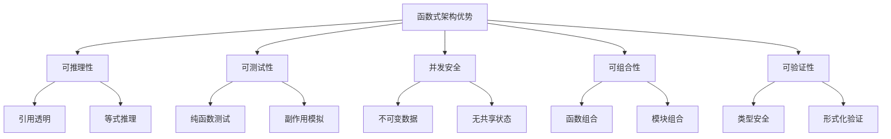
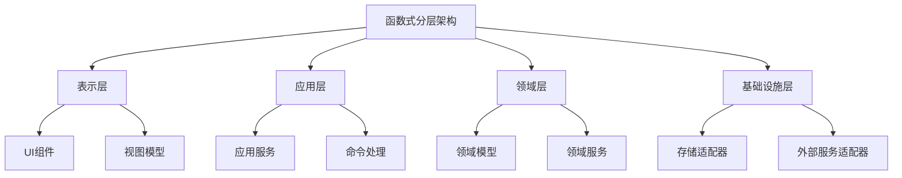
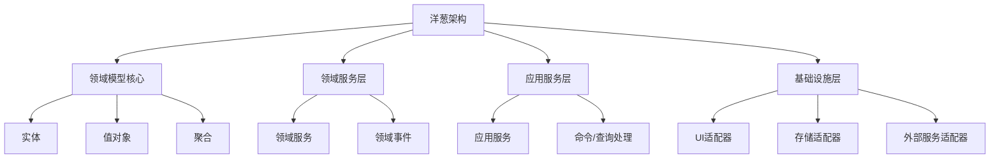

# Lean与Haskell架构设计模式

> 本文档探讨Lean与Haskell在架构设计模式方面的应用，包括函数式架构、分层架构和验证驱动架构等。

## 1. 函数式架构基础

### 1.1 函数式架构核心原则

- **不可变性**：系统状态不可直接修改，而是通过函数转换
- **组合性**：通过组合小型组件构建复杂系统
- **类型驱动**：利用类型系统设计和验证架构
- **副作用隔离**：明确分离纯计算和副作用
- **声明式设计**：描述系统"是什么"而非"如何做"

### 1.2 函数式架构优势



## 2. 分层架构模式

### 2.1 函数式分层架构

函数式分层架构将系统分为不同的关注层，每层通过纯函数接口通信。



### 2.2 单子变换器架构

单子变换器架构使用单子变换器堆栈组织系统的不同关注点。

```haskell
-- Haskell中的单子变换器架构
newtype AppM a = AppM 
  { runAppM :: ReaderT Env (StateT AppState (ExceptT AppError IO)) a }
  deriving (Functor, Applicative, Monad, 
            MonadReader Env, MonadState AppState, MonadError AppError, MonadIO)

-- 应用层服务
createUser :: Username -> Password -> AppM User
createUser username password = do
  validateUsername username
  validatePassword password
  hashedPwd <- hashPassword password
  user <- createUserEntity username hashedPwd
  saveUser user
  notifyUserCreated user
  return user
```

```lean
-- Lean中的单子变换器架构
def AppM (α : Type) := ReaderT Env (StateT AppState (ExceptT AppError IO)) α

-- 应用层服务
def createUser (username : Username) (password : Password) : AppM User := do
  validateUsername username
  validatePassword password
  let hashedPwd ← hashPassword password
  let user ← createUserEntity username hashedPwd
  saveUser user
  notifyUserCreated user
  return user
```

### 2.3 洋葱架构

洋葱架构围绕领域模型组织系统，通过层次化依赖确保关注点分离。



## 3. 函数式领域驱动设计

### 3.1 代数数据类型建模

使用代数数据类型(ADT)表达领域模型，确保类型安全和领域完整性。

```haskell
-- Haskell中的代数数据类型建模
data OrderStatus = Draft | Confirmed | Shipped | Delivered | Cancelled

data Order = Order
  { orderId :: OrderId
  , customerInfo :: CustomerInfo
  , items :: NonEmpty OrderItem
  , status :: OrderStatus
  , createdAt :: UTCTime
  , updatedAt :: UTCTime
  }

-- 领域事件
data OrderEvent
  = OrderCreated Order
  | OrderConfirmed OrderId
  | OrderShipped OrderId ShippingInfo
  | OrderDelivered OrderId
  | OrderCancelled OrderId CancellationReason
```

```lean
-- Lean中的归纳类型建模
inductive OrderStatus
| draft
| confirmed
| shipped
| delivered
| cancelled

structure Order where
  orderId : OrderId
  customerInfo : CustomerInfo
  items : NonEmptyList OrderItem
  status : OrderStatus
  createdAt : UTCTime
  updatedAt : UTCTime

-- 领域事件
inductive OrderEvent
| orderCreated : Order → OrderEvent
| orderConfirmed : OrderId → OrderEvent
| orderShipped : OrderId → ShippingInfo → OrderEvent
| orderDelivered : OrderId → OrderEvent
| orderCancelled : OrderId → CancellationReason → OrderEvent
```

### 3.2 不变量与验证

使用类型系统和验证函数确保领域不变量。

```haskell
-- Haskell中的不变量验证
newtype Email = Email { unEmail :: Text }

makeEmail :: Text -> Either ValidationError Email
makeEmail text =
  if isValidEmail text
  then Right (Email text)
  else Left (InvalidEmail text)

-- 智能构造器确保不变量
data Order = Order
  { orderId :: OrderId
  , items :: NonEmpty OrderItem
  , total :: Money
  }

makeOrder :: OrderId -> NonEmpty OrderItem -> Either ValidationError Order
makeOrder orderId items = do
  let total = calculateTotal items
  validateOrderTotal total
  return Order {orderId, items, total}
```

```lean
-- Lean中的依赖类型不变量
structure Email where
  value : String
  valid : IsValidEmail value

-- 带证明的构造函数
def makeEmail (s : String) : Option Email :=
  if h : isValidEmail s then
    some { value := s, valid := h }
  else
    none

-- 依赖类型确保不变量
structure Order where
  orderId : OrderId
  items : NonEmptyList OrderItem
  total : Money
  totalValid : ValidateTotal items total
```

### 3.3 副作用处理

明确分离纯领域逻辑和副作用操作。

```haskell
-- Haskell中的副作用处理
-- 纯领域逻辑
processOrder :: Order -> OrderEvent -> Either DomainError Order
processOrder order event = ...

-- 副作用处理
handleOrderCommand :: OrderCommand -> AppM Order
handleOrderCommand cmd = do
  order <- loadOrder (getOrderId cmd)
  event <- toDomainEvent cmd
  case processOrder order event of
    Left err -> throwError (DomainError err)
    Right newOrder -> do
      saveOrder newOrder
      publishEvent event
      return newOrder
```

```lean
-- Lean中的副作用处理
-- 纯领域逻辑
def processOrder (order : Order) (event : OrderEvent) : Except DomainError Order := ...

-- 副作用处理
def handleOrderCommand (cmd : OrderCommand) : AppM Order := do
  let order ← loadOrder (getOrderId cmd)
  let event ← toDomainEvent cmd
  match processOrder order event with
  | .error err => throw (DomainError err)
  | .ok newOrder => do
      saveOrder newOrder
      publishEvent event
      return newOrder
```

## 4. 验证驱动架构

### 4.1 类型级架构验证

使用类型系统验证架构约束和不变量。

```haskell
-- Haskell中的类型级架构验证
-- 使用幻影类型跟踪状态
data Unvalidated
data Validated

newtype Form s a = Form { unForm :: a }

validateForm :: Form Unvalidated a -> Either ValidationError (Form Validated a)
validateForm = ...

-- 只接受已验证的表单
processForm :: Form Validated a -> IO ()
processForm = ...

-- 编译错误：类型不匹配
-- wrongUsage = processForm (Form rawData)
```

```lean
-- Lean中的依赖类型架构验证
inductive ValidationStatus
| unvalidated
| validated

structure Form (s : ValidationStatus) (α : Type) where
  value : α

def validateForm : Form ValidationStatus.unvalidated α → 
                  Except ValidationError (Form ValidationStatus.validated α)
:= ...

-- 只接受已验证的表单
def processForm : Form ValidationStatus.validated α → IO Unit
:= ...

-- 编译错误：类型不匹配
-- def wrongUsage := processForm (Form rawData)
```

### 4.2 形式化规约与实现

使用形式化方法指导架构设计和实现。

```haskell
-- Haskell中的契约式设计
-- 使用注释表达形式化规约
{-
  规约: transferMoney 函数必须满足以下条件
  1. 源账户余额必须大于等于转账金额
  2. 转账后，源账户余额 = 原余额 - 转账金额
  3. 转账后，目标账户余额 = 原余额 + 转账金额
-}
transferMoney :: AccountId -> AccountId -> Money -> AppM TransferResult
transferMoney fromId toId amount = do
  fromAccount <- getAccount fromId
  toAccount <- getAccount toId
  
  -- 前置条件检查
  when (accountBalance fromAccount < amount) $
    throwError InsufficientFunds
    
  -- 执行转账
  let newFromAccount = updateBalance fromAccount (subtract amount)
  let newToAccount = updateBalance toAccount (+ amount)
  
  saveAccount newFromAccount
  saveAccount newToAccount
  
  -- 后置条件检查（在测试中验证）
  return TransferSuccess{fromAccount = newFromAccount, toAccount = newToAccount}
```

```lean
-- Lean中的形式化规约与实现
-- 形式化规约
theorem transfer_preserves_total (from to : Account) (amount : Money) :
  accountBalance from ≥ amount →
  let newFrom := updateBalance from (subtract amount)
  let newTo := updateBalance to (add amount)
  accountBalance from + accountBalance to = accountBalance newFrom + accountBalance newTo

-- 带证明的实现
def transferMoney (fromId toId : AccountId) (amount : Money) : AppM TransferResult := do
  let fromAccount ← getAccount fromId
  let toAccount ← getAccount toId
  
  -- 前置条件检查
  if h : accountBalance fromAccount < amount then
    throw InsufficientFunds
  else
    -- 执行转账
    let newFromAccount := updateBalance fromAccount (subtract amount)
    let newToAccount := updateBalance toAccount (add amount)
    
    saveAccount newFromAccount
    saveAccount newToAccount
    
    -- 证明在编译时验证
    return TransferSuccess.mk newFromAccount newToAccount
```

## 5. 函数式架构模式

### 5.1 解释器模式

将程序表示为数据结构，然后通过解释器执行。

```haskell
-- Haskell中的解释器模式
-- 程序表示
data Program a
  = Pure a
  | ReadFile FilePath (String -> Program a)
  | WriteFile FilePath String (Program a)
  | LogMessage String (Program a)

-- 解释器
interpret :: Program a -> IO a
interpret (Pure a) = return a
interpret (ReadFile path next) = do
  content <- readFile path
  interpret (next content)
interpret (WriteFile path content next) = do
  writeFile path content
  interpret next
interpret (LogMessage msg next) = do
  putStrLn msg
  interpret next
```

```lean
-- Lean中的解释器模式
inductive Program (α : Type)
| pure : α → Program α
| readFile : FilePath → (String → Program α) → Program α
| writeFile : FilePath → String → Program α → Program α
| logMessage : String → Program α → Program α

def interpret : Program α → IO α
| .pure a => pure a
| .readFile path next => do
  let content ← IO.FS.readFile path
  interpret (next content)
| .writeFile path content next => do
  IO.FS.writeFile path content
  interpret next
| .logMessage msg next => do
  IO.println msg
  interpret next
```

### 5.2 自由单子架构

使用自由单子分离关注点，实现可扩展的架构。

```haskell
-- Haskell中的自由单子架构
-- 定义效应
data DatabaseF next
  = Query String ([Row] -> next)
  | Execute String next

data LoggingF next
  = Log LogLevel String next

-- 自由单子
type Database = Free DatabaseF
type Logging = Free LoggingF

-- 组合效应
type App = Free (Sum DatabaseF (Sum LoggingF VoidF))

-- 解释器
runDatabase :: Database a -> IO a
runDatabase = ...

runLogging :: Logging a -> IO a
runLogging = ...

-- 组合解释器
runApp :: App a -> IO a
runApp = ...
```

```lean
-- Lean中的自由单子架构
inductive DatabaseF (α : Type)
| query : String → (List Row → α) → DatabaseF α
| execute : String → α → DatabaseF α

inductive LoggingF (α : Type)
| log : LogLevel → String → α → LoggingF α

def Database := Free DatabaseF
def Logging := Free LoggingF

-- 组合效应
def App := Free (Sum DatabaseF (Sum LoggingF VoidF))

-- 解释器
def runDatabase : Database α → IO α := ...
def runLogging : Logging α → IO α := ...

-- 组合解释器
def runApp : App α → IO α := ...
```

### 5.3 依赖注入模式

使用Reader单子实现依赖注入。

```haskell
-- Haskell中的依赖注入模式
data AppDependencies = AppDependencies
  { dbConn :: Connection
  , logger :: Logger
  , config :: Config
  , httpClient :: HttpClient
  }

type AppM a = ReaderT AppDependencies IO a

getUserData :: UserId -> AppM UserData
getUserData userId = do
  deps <- ask
  result <- liftIO $ query (dbConn deps) (userQuery userId)
  logInfo (logger deps) $ "Fetched data for user: " <> show userId
  return result
```

```lean
-- Lean中的依赖注入模式
structure AppDependencies where
  dbConn : Connection
  logger : Logger
  config : Config
  httpClient : HttpClient

def AppM (α : Type) := ReaderT AppDependencies IO α

def getUserData (userId : UserId) : AppM UserData := do
  let deps ← read
  let result ← query deps.dbConn (userQuery userId)
  logInfo deps.logger s!"Fetched data for user: {userId}"
  return result
```

## 6. 实践应用

### 6.1 Web应用架构

| 架构组件 | Haskell实现 | Lean实现 | 整合策略 |
|---------|------------|---------|---------|
| **路由** | 类型安全路由 | 依赖类型路由 | 可验证的路由系统 |
| **中间件** | 函数组合 | 证明友好组合 | 可组合、可验证的中间件 |
| **控制器** | 单子变换器 | 依赖类型约束 | 类型安全的控制器 |
| **视图** | 纯函数模板 | 类型安全渲染 | 类型驱动的UI生成 |

### 6.2 数据处理架构

| 架构组件 | Haskell实现 | Lean实现 | 整合策略 |
|---------|------------|---------|---------|
| **ETL管道** | 函数式流处理 | 可证明的转换 | 可验证的数据管道 |
| **数据验证** | 类型驱动验证 | 依赖类型规约 | 多层次验证策略 |
| **数据转换** | 纯函数映射 | 证明友好变换 | 可证明正确的转换 |
| **并行处理** | 并行策略 | 形式化并行模型 | 正确且高效的并行 |

### 6.3 微服务架构

| 架构组件 | Haskell实现 | Lean实现 | 整合策略 |
|---------|------------|---------|---------|
| **服务边界** | 类型安全接口 | 形式化契约 | 可验证的服务契约 |
| **消息传递** | 类型驱动序列化 | 依赖类型消息 | 类型安全的通信 |
| **服务发现** | 函数式客户端 | 形式化协议 | 可靠的服务发现 |
| **容错处理** | 单子错误处理 | 证明友好恢复 | 可验证的容错策略 |

## 7. Lean与Haskell架构对比

| 架构方面 | Haskell特点 | Lean特点 | 整合价值 |
|---------|------------|---------|---------|
| **类型安全** | 强类型系统 | 依赖类型系统 | 最高级别类型安全 |
| **模块化** | 类型类、高阶抽象 | 依赖记录、证明 | 可验证的模块边界 |
| **可测试性** | 纯函数易测试 | 形式化验证 | 测试与证明结合 |
| **扩展性** | 类型类、高阶函数 | 类型类、元编程 | 类型安全的扩展 |
| **性能** | 优化编译器 | 提取到高效语言 | 可验证且高效 |

---

*最后更新：2024年整理阶段*
