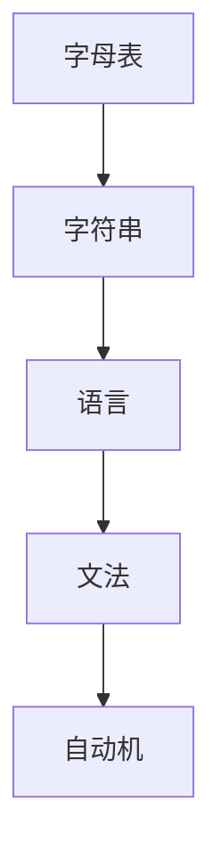

# 102 形式语言（Formal Language）

- [1. 引言](#1-引言)
- [2. 核心理论体系](#2-核心理论体系)
- [3. Haskell/Lean代码示例](#3-haskelllean代码示例)
- [4. 数学表达与证明](#4-数学表达与证明)
- [5. 图表与结构图](#5-图表与结构图)
- [6. 工程与应用案例](#6-工程与应用案例)
- [7. 对比分析（Haskell/Rust/Lean）](#7-对比分析haskellrustlean)
- [8. 参考文献](#8-参考文献)

---

## 1. 引言

形式语言是计算机科学、形式科学和编程语言理论的基础，研究符号串的生成、识别与变换，为编译原理、自动机理论、程序分析等提供理论支撑。

## 2. 核心理论体系

- 字母表、字符串、语言的定义
- 文法类型（Chomsky层级：0型-无约束、1型-上下文相关、2型-上下文无关、3型-正则）
- 生成与识别机制：自动机、推理系统
- 语言的封闭性、等价性、判定性

## 3. Haskell/Lean代码示例

```haskell
-- Haskell: 正则文法生成所有二进制串
binaryStrings :: Int -> [String]
binaryStrings 0 = [""]
binaryStrings n = [ c:s | c <- "01", s <- binaryStrings (n-1)]
```

```lean
-- Lean: 形式语言的递归定义
inductive bin_str : ℕ → Type
| nil : bin_str 0
| cons : Π {n}, char → bin_str n → bin_str (n+1)
```

## 4. 数学表达与证明

- 形式语言的定义：
  \[
  L \subseteq \Sigma^*
  \]
- 文法G = (N, Σ, P, S)的四元组定义
- 归纳法证明语言性质（如封闭性、等价性）

## 5. 图表与结构图



## 6. 工程与应用案例

- Haskell在编译器、解释器、DSL设计中的文法与解析应用
- Lean在形式化语言理论与自动机证明中的应用

## 7. 对比分析（Haskell/Rust/Lean）

| 特性         | Haskell           | Rust              | Lean                |
|--------------|-------------------|-------------------|---------------------|
| 文法实现     | 代数数据类型      | 枚举+trait        | 归纳类型+证明       |
| 工程应用     | 编译器、DSL       | 解析器、嵌入式    | 形式化建模、证明    |

## 8. 参考文献

- [1] Hopcroft, J. E., Motwani, R., & Ullman, J. D. (2006). Introduction to Automata Theory, Languages, and Computation.
- [2] Sipser, M. (2012). Introduction to the Theory of Computation.
- [3] Pierce, B. C. (2002). Types and Programming Languages.

---

**上一章**: [数学基础](./101-Mathematical-Foundations.md)  
**下一章**: [逻辑系统](./103-Logical-Systems.md)
