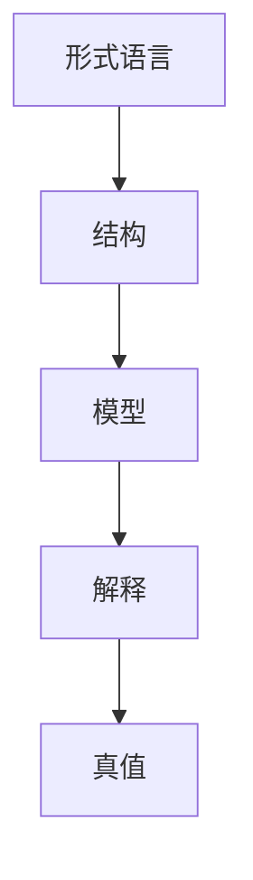

# 107 模型论（Model Theory）

- [107 模型论（Model Theory）](#107-模型论model-theory)
  - [1. 引言](#1-引言)
  - [2. 核心理论体系](#2-核心理论体系)
  - [3. Haskell/Lean代码示例](#3-haskelllean代码示例)
  - [4. 数学表达与证明](#4-数学表达与证明)
  - [5. 图表与结构图](#5-图表与结构图)
  - [6. 工程与应用案例](#6-工程与应用案例)
  - [7. 对比分析（Haskell/Rust/Lean）](#7-对比分析haskellrustlean)
  - [8. 参考文献](#8-参考文献)

---

## 1. 引言

模型论是数理逻辑的一个分支，研究形式语言与其模型之间的关系。它分析理论的可满足性、完全性、同构、紧致性等，为自动推理、数据库理论、程序语义等提供理论基础。

## 2. 核心理论体系

- 结构、语言、模型的定义
- 可满足性、完全性、同构、紧致性定理
- 域、解释、真值赋值
- 元理论与可判定性

## 3. Haskell/Lean代码示例

```haskell
-- Haskell: 结构与解释的简单建模
-- 以一阶结构为例

data Domain = A | B deriving (Eq, Show)
type Interpretation = String -> Domain
```

```lean
-- Lean: 结构与模型的定义（简化）
structure Structure (L : Type) :=
  (dom : Type)
  (interp : L → dom)
```

## 4. 数学表达与证明

- 结构的定义：
  \[
  \mathcal{M} = (D, I)
  \]
- 可满足性：存在模型使公式为真
- 紧致性定理、完全性定理的基本表述

## 5. 图表与结构图



## 6. 工程与应用案例

- Haskell在DSL、数据库查询、自动推理中的模型建模
- Lean在模型论定理证明、自动化推理中的应用

## 7. 对比分析（Haskell/Rust/Lean）

| 特性         | Haskell           | Rust              | Lean                |
|--------------|-------------------|-------------------|---------------------|
| 模型建模     | 数据类型、ADT     | 结构体、trait     | 结构体、归纳类型    |
| 工程应用     | DSL、数据库       | 系统、嵌入式      | 形式化建模、证明    |

## 8. 参考文献

- [1] Hodges, W. (1993). Model Theory.
- [2] Chang, C. C., & Keisler, H. J. (1990). Model Theory.
- [3] Marker, D. (2002). Model Theory: An Introduction.
