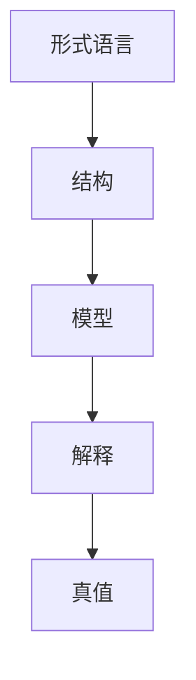

# 107 模型论（Model Theory）

- [107 模型论（Model Theory）](#107-模型论model-theory)
  - [1. 引言](#1-引言)
  - [2. 核心理论体系](#2-核心理论体系)
  - [3. Haskell/Lean代码示例](#3-haskelllean代码示例)
  - [4. 数学表达与证明](#4-数学表达与证明)
  - [5. 图表与结构图](#5-图表与结构图)
  - [6. 工程与应用案例](#6-工程与应用案例)
  - [7. 对比分析（Haskell/Rust/Lean）](#7-对比分析haskellrustlean)
  - [8. 参考文献](#8-参考文献)
  - [9. 哲科视角与国际化扩展 Philosophical-Scientific Perspective \& Internationalization](#9-哲科视角与国际化扩展-philosophical-scientific-perspective--internationalization)
    - [定义 Definition](#定义-definition)
    - [历史与发展 History \& Development](#历史与发展-history--development)
    - [哲学科学特性分析 Philosophical-Scientific Feature Analysis](#哲学科学特性分析-philosophical-scientific-feature-analysis)
    - [应用 Applications](#应用-applications)
    - [例子 Examples](#例子-examples)
    - [相关理论 Related Theories](#相关理论-related-theories)
    - [参考文献 References](#参考文献-references)

---

## 1. 引言

模型论是数理逻辑的一个分支，研究形式语言与其模型之间的关系。它分析理论的可满足性、完全性、同构、紧致性等，为自动推理、数据库理论、程序语义等提供理论基础。

## 2. 核心理论体系

- 结构、语言、模型的定义
- 可满足性、完全性、同构、紧致性定理
- 域、解释、真值赋值
- 元理论与可判定性

## 3. Haskell/Lean代码示例

```haskell
-- Haskell: 结构与解释的简单建模
-- 以一阶结构为例

data Domain = A | B deriving (Eq, Show)
type Interpretation = String -> Domain
```

```lean
-- Lean: 结构与模型的定义（简化）
structure Structure (L : Type) :=
  (dom : Type)
  (interp : L → dom)
```

## 4. 数学表达与证明

- 结构的定义：
  \[
  \mathcal{M} = (D, I)
  \]
- 可满足性：存在模型使公式为真
- 紧致性定理、完全性定理的基本表述

## 5. 图表与结构图



## 6. 工程与应用案例

- Haskell在DSL、数据库查询、自动推理中的模型建模
- Lean在模型论定理证明、自动化推理中的应用

## 7. 对比分析（Haskell/Rust/Lean）

| 特性         | Haskell           | Rust              | Lean                |
|--------------|-------------------|-------------------|---------------------|
| 模型建模     | 数据类型、ADT     | 结构体、trait     | 结构体、归纳类型    |
| 工程应用     | DSL、数据库       | 系统、嵌入式      | 形式化建模、证明    |

## 8. 参考文献

- [1] Hodges, W. (1993). Model Theory.
- [2] Chang, C. C., & Keisler, H. J. (1990). Model Theory.
- [3] Marker, D. (2002). Model Theory: An Introduction.

---

## 9. 哲科视角与国际化扩展 Philosophical-Scientific Perspective & Internationalization

### 定义 Definition

- **中文**：模型论是数理逻辑的分支，研究形式语言与其模型之间的关系，关注理论的可满足性、完全性、同构、紧致性等。它不仅是逻辑和计算机科学的基础，也是哲学关于真理、解释和结构的核心领域。
- **English**: Model theory is a branch of mathematical logic that studies the relationship between formal languages and their models, focusing on satisfiability, completeness, isomorphism, compactness, etc. It is foundational not only to logic and computer science, but also to philosophical inquiry into truth, interpretation, and structure.

### 历史与发展 History & Development

- **中文**：模型论起源于20世纪初，Löwenheim、Skolem、Tarski等人奠定了基础。Gödel的完全性定理、紧致性定理等推动了模型论的发展。现代模型论与数据库理论、程序语义、人工智能等深度融合。
- **English**: Model theory originated in the early 20th century, with foundational work by Löwenheim, Skolem, Tarski, and others. Gödel's completeness and compactness theorems further advanced the field. Modern model theory is deeply integrated with database theory, program semantics, artificial intelligence, etc.

### 哲学科学特性分析 Philosophical-Scientific Feature Analysis

- **中文**：模型论不仅关注形式系统的技术细节，更关涉真理观、解释学、结构主义等哲学基础。它与证明论、类型理论、范畴论等共同构成现代形式科学的基石。
- **English**: Model theory is concerned not only with the technical details of formal systems, but also with philosophical foundations such as theories of truth, hermeneutics, and structuralism. Together with proof theory, type theory, and category theory, it forms the cornerstone of modern formal science.

### 应用 Applications

- **中文**：数据库理论、程序语义、自动推理、知识表示、人工智能、形式化验证等。
- **English**: Database theory, program semantics, automated reasoning, knowledge representation, artificial intelligence, formal verification, etc.

### 例子 Examples

```haskell
-- Haskell: 结构与解释的简单建模
-- 以一阶结构为例

data Domain = A | B deriving (Eq, Show)
type Interpretation = String -> Domain
```

```lean
-- Lean: 结构与模型的定义（简化）
structure Structure (L : Type) :=
  (dom : Type)
  (interp : L → dom)
```

### 相关理论 Related Theories

- 证明论 Proof Theory
- 类型理论 Type Theory
- 范畴论 Category Theory
- 形式语言理论 Formal Language Theory
- 自动机理论 Automata Theory
- 系统理论 System Theory
- 计算复杂性理论 Computational Complexity Theory

### 参考文献 References

- [1] Hodges, W. (1993). Model Theory.
- [2] Chang, C. C., & Keisler, H. J. (1990). Model Theory.
- [3] Marker, D. (2002). Model Theory: An Introduction.
- [4] Wikipedia: Model Theory <https://en.wikipedia.org/wiki/Model_theory>
- [5] Types and Programming Languages, Benjamin C. Pierce
