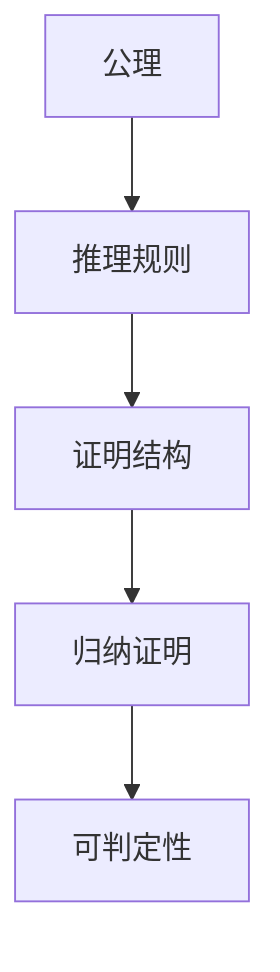

# 108 证明论（Proof Theory）

- [108 证明论（Proof Theory）](#108-证明论proof-theory)
  - [1. 引言](#1-引言)
  - [2. 核心理论体系](#2-核心理论体系)
  - [3. Haskell/Lean代码示例](#3-haskelllean代码示例)
  - [4. 数学表达与证明](#4-数学表达与证明)
  - [5. 图表与结构图](#5-图表与结构图)
  - [6. 工程与应用案例](#6-工程与应用案例)
  - [7. 对比分析（Haskell/Rust/Lean）](#7-对比分析haskellrustlean)
  - [8. 参考文献](#8-参考文献)
  - [9. 哲科视角与国际化扩展 Philosophical-Scientific Perspective \& Internationalization](#9-哲科视角与国际化扩展-philosophical-scientific-perspective--internationalization)
    - [定义 Definition](#定义-definition)
    - [历史与发展 History \& Development](#历史与发展-history--development)
    - [哲学科学特性分析 Philosophical-Scientific Feature Analysis](#哲学科学特性分析-philosophical-scientific-feature-analysis)
    - [应用 Applications](#应用-applications)
    - [例子 Examples](#例子-examples)
    - [相关理论 Related Theories](#相关理论-related-theories)
    - [参考文献 References](#参考文献-references)

---

## 1. 引言

证明论是数理逻辑的一个分支，研究形式系统中的证明结构、推理规则和可证明性。涵盖自然演绎、序列演算、归纳证明、可判定性等，为自动定理证明、程序验证、类型理论等提供理论基础。

## 2. 核心理论体系

- 形式系统、公理、推理规则
- 自然演绎、序列演算、Hilbert系统
- 归纳证明、结构归纳、数学归纳法
- 可判定性、可计算性、哥德尔不完备性

## 3. Haskell/Lean代码示例

```haskell
-- Haskell: 归纳证明结构的建模
-- 自然数归纳定义

data Nat = Zero | Succ Nat deriving (Eq, Show)
add :: Nat -> Nat -> Nat
add Zero n = n
add (Succ m) n = Succ (add m n)
```

```lean
-- Lean: 归纳证明示例
open Nat
example (n : ℕ) : n + 0 = n := by induction n <;> simp [*]
```

## 4. 数学表达与证明

- 归纳法证明：
  \[
  \begin{cases}
  P(0) \\
  \forall n, P(n) \Rightarrow P(n+1)
  \end{cases}
  \Rightarrow \forall n, P(n)
  \]
- 序列演算与推理树
- 可判定性与不完备性定理

## 5. 图表与结构图



## 6. 工程与应用案例

- Haskell在类型系统、自动推理、归纳证明中的应用
- Lean在定理证明、自动化推理、归纳结构中的应用

## 7. 对比分析（Haskell/Rust/Lean）

| 特性         | Haskell           | Rust              | Lean                |
|--------------|-------------------|-------------------|---------------------|
| 证明建模     | 数据类型、模式匹配 | trait、宏         | 归纳类型、证明      |
| 工程应用     | 类型系统、推理    | 宏系统、嵌入式    | 形式化建模、证明    |

## 8. 参考文献

- [1] Gentzen, G. (1935). Investigations into Logical Deduction.
- [2] Troelstra, A. S., & Schwichtenberg, H. (2000). Basic Proof Theory.
- [3] Girard, J.-Y. (1987). Proof Theory and Logical Complexity.

---

## 9. 哲科视角与国际化扩展 Philosophical-Scientific Perspective & Internationalization

### 定义 Definition

- **中文**：证明论是数理逻辑的分支，研究形式系统中证明的结构、推理规则、可证明性与可判定性。它不仅是数学和计算机科学的基础，也是哲学关于知识、真理和推理的核心领域。
- **English**: Proof theory is a branch of mathematical logic that studies the structure of proofs, inference rules, provability, and decidability in formal systems. It is foundational not only to mathematics and computer science, but also to philosophical inquiry into knowledge, truth, and reasoning.

### 历史与发展 History & Development

- **中文**：证明论起源于Hilbert学派对数学基础的形式化追求，Gentzen提出序列演算和归纳证明，Gödel的不完备性定理揭示了形式系统的极限。现代证明论与类型理论、自动定理证明、程序验证等深度融合。
- **English**: Proof theory originated from the Hilbert school's quest for the formalization of mathematics. Gentzen introduced sequent calculus and inductive proofs, while Gödel's incompleteness theorems revealed the limits of formal systems. Modern proof theory is deeply integrated with type theory, automated theorem proving, and program verification.

### 哲学科学特性分析 Philosophical-Scientific Feature Analysis

- **中文**：证明论不仅关注形式推理的技术细节，更关涉知识论、真理观、可证明性与可计算性的哲学基础。它与模型论、类型理论、范畴论等共同构成现代形式科学的基石。
- **English**: Proof theory is concerned not only with the technical details of formal reasoning, but also with the philosophical foundations of epistemology, theories of truth, provability, and computability. Together with model theory, type theory, and category theory, it forms the cornerstone of modern formal science.

### 应用 Applications

- **中文**：自动定理证明、程序验证、类型系统设计、形式化方法、知识表示、人工智能推理等。
- **English**: Automated theorem proving, program verification, type system design, formal methods, knowledge representation, AI reasoning, etc.

### 例子 Examples

```haskell
-- Haskell: 归纳证明结构的建模
-- 自然数归纳定义

data Nat = Zero | Succ Nat deriving (Eq, Show)
add :: Nat -> Nat -> Nat
add Zero n = n
add (Succ m) n = Succ (add m n)
```

```lean
-- Lean: 归纳证明示例
open Nat
example (n : ℕ) : n + 0 = n := by induction n <;> simp [*]
```

### 相关理论 Related Theories

- 类型理论 Type Theory
- 范畴论 Category Theory
- 模型论 Model Theory
- 形式语言理论 Formal Language Theory
- 自动机理论 Automata Theory
- 系统理论 System Theory
- 计算复杂性理论 Computational Complexity Theory

### 参考文献 References

- [1] Gentzen, G. (1935). Investigations into Logical Deduction.
- [2] Troelstra, A. S., & Schwichtenberg, H. (2000). Basic Proof Theory.
- [3] Girard, J.-Y. (1987). Proof Theory and Logical Complexity.
- [4] Wikipedia: Proof Theory <https://en.wikipedia.org/wiki/Proof_theory>
- [5] Lean Theorem Prover Documentation <https://leanprover.github.io/>
- [6] Types and Programming Languages, Benjamin C. Pierce
