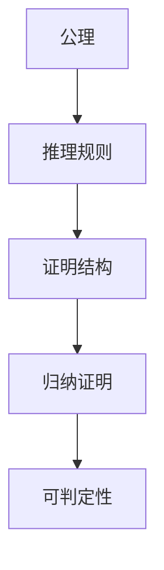

# 108 证明论（Proof Theory）

- [108 证明论（Proof Theory）](#108-证明论proof-theory)
  - [1. 引言](#1-引言)
  - [2. 核心理论体系](#2-核心理论体系)
  - [3. Haskell/Lean代码示例](#3-haskelllean代码示例)
  - [4. 数学表达与证明](#4-数学表达与证明)
  - [5. 图表与结构图](#5-图表与结构图)
  - [6. 工程与应用案例](#6-工程与应用案例)
  - [7. 对比分析（Haskell/Rust/Lean）](#7-对比分析haskellrustlean)
  - [8. 参考文献](#8-参考文献)

---

## 1. 引言

证明论是数理逻辑的一个分支，研究形式系统中的证明结构、推理规则和可证明性。涵盖自然演绎、序列演算、归纳证明、可判定性等，为自动定理证明、程序验证、类型理论等提供理论基础。

## 2. 核心理论体系

- 形式系统、公理、推理规则
- 自然演绎、序列演算、Hilbert系统
- 归纳证明、结构归纳、数学归纳法
- 可判定性、可计算性、哥德尔不完备性

## 3. Haskell/Lean代码示例

```haskell
-- Haskell: 归纳证明结构的建模
-- 自然数归纳定义

data Nat = Zero | Succ Nat deriving (Eq, Show)
add :: Nat -> Nat -> Nat
add Zero n = n
add (Succ m) n = Succ (add m n)
```

```lean
-- Lean: 归纳证明示例
open Nat
example (n : ℕ) : n + 0 = n := by induction n <;> simp [*]
```

## 4. 数学表达与证明

- 归纳法证明：
  \[
  \begin{cases}
  P(0) \\
  \forall n, P(n) \Rightarrow P(n+1)
  \end{cases}
  \Rightarrow \forall n, P(n)
  \]
- 序列演算与推理树
- 可判定性与不完备性定理

## 5. 图表与结构图



## 6. 工程与应用案例

- Haskell在类型系统、自动推理、归纳证明中的应用
- Lean在定理证明、自动化推理、归纳结构中的应用

## 7. 对比分析（Haskell/Rust/Lean）

| 特性         | Haskell           | Rust              | Lean                |
|--------------|-------------------|-------------------|---------------------|
| 证明建模     | 数据类型、模式匹配 | trait、宏         | 归纳类型、证明      |
| 工程应用     | 类型系统、推理    | 宏系统、嵌入式    | 形式化建模、证明    |

## 8. 参考文献

- [1] Gentzen, G. (1935). Investigations into Logical Deduction.
- [2] Troelstra, A. S., & Schwichtenberg, H. (2000). Basic Proof Theory.
- [3] Girard, J.-Y. (1987). Proof Theory and Logical Complexity.
