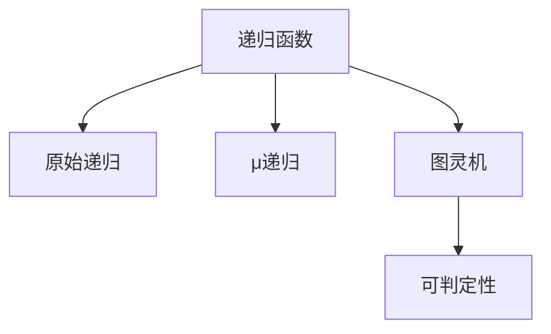

# 109 递归论（Recursion Theory）

- [109 递归论（Recursion Theory）](#109-递归论recursion-theory)
  - [1. 引言](#1-引言)
  - [2. 核心理论体系](#2-核心理论体系)
  - [3. Haskell/Lean代码示例](#3-haskelllean代码示例)
  - [4. 数学表达与证明](#4-数学表达与证明)
  - [5. 图表与结构图](#5-图表与结构图)
  - [6. 工程与应用案例](#6-工程与应用案例)
  - [7. 对比分析（Haskell/Rust/Lean）](#7-对比分析haskellrustlean)
  - [8. 参考文献](#8-参考文献)

---

## 1. 引言

递归论（可计算性理论）研究可计算函数、递归函数、图灵机、可判定性与不可判定性等，是理论计算机科学和数学逻辑的基础。

## 2. 核心理论体系

- 可计算函数、递归函数、原始递归与μ递归
- 图灵机、λ演算、可判定性与不可判定性
- 归约、可枚举集、停机问题
- 递归可枚举语言与复杂性分级

## 3. Haskell/Lean代码示例

```haskell
-- Haskell: 递归定义的阶乘函数
factorial :: Integer -> Integer
factorial 0 = 1
factorial n = n * factorial (n-1)
```

```lean
-- Lean: 递归定义的斐波那契数列
def fib : ℕ → ℕ
| 0 := 0
| 1 := 1
| (n+2) := fib (n+1) + fib n
```

## 4. 数学表达与证明

- 递归函数的定义：
  \[
  f(0) = a,\quad f(n+1) = g(n, f(n))
  \]
- 图灵可计算性、停机问题不可判定性
- μ递归函数的形式化表达

## 5. 图表与结构图



## 6. 工程与应用案例

- Haskell在递归算法、函数式编程、自动推理中的应用
- Lean在可计算性证明、递归结构建模中的应用

## 7. 对比分析（Haskell/Rust/Lean）

| 特性         | Haskell           | Rust              | Lean                |
|--------------|-------------------|-------------------|---------------------|
| 递归实现     | 递归函数、模式匹配 | 递归函数、宏      | 递归定义、证明      |
| 工程应用     | 算法、推理        | 系统、嵌入式      | 形式化建模、证明    |

## 8. 参考文献

- [1] Rogers, H. (1987). Theory of Recursive Functions and Effective Computability.
- [2] Soare, R. I. (2016). Turing Computability: Theory and Applications.
- [3] Odifreddi, P. (1992). Classical Recursion Theory.
