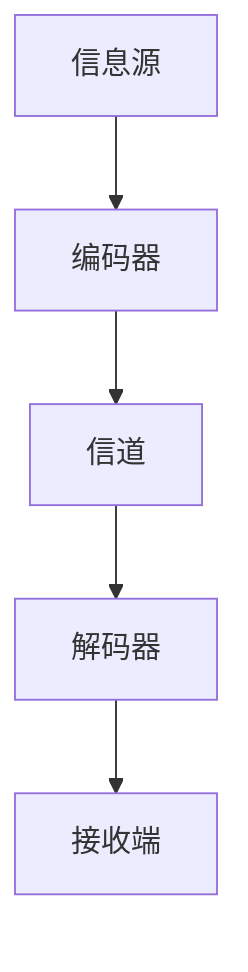

# 110 信息论（Information Theory）

- [1. 引言](#1-引言)
- [2. 核心理论体系](#2-核心理论体系)
- [3. Haskell/Lean代码示例](#3-haskelllean代码示例)
- [4. 数学表达与证明](#4-数学表达与证明)
- [5. 图表与结构图](#5-图表与结构图)
- [6. 工程与应用案例](#6-工程与应用案例)
- [7. 对比分析（Haskell/Rust/Lean）](#7-对比分析haskellrustlean)
- [8. 参考文献](#8-参考文献)

---

## 1. 引言

信息论是研究信息的度量、传输、编码与压缩的理论体系。它为通信、数据压缩、加密、机器学习等领域提供基础理论。

## 2. 核心理论体系

- 信息熵、互信息、条件熵
- 香农编码、霍夫曼编码、信道容量
- 冗余、无失真压缩、误码率
- 信息源、信道模型、编码定理

## 3. Haskell/Lean代码示例

```haskell
-- Haskell: 计算二进制分布的信息熵
import Data.List (group, sort)
import Data.Function (on)
import Data.Maybe (fromMaybe)
import qualified Data.Map as M

entropy :: (Ord a, Floating b) => [a] -> b
entropy xs = negate . sum $ map probLog (M.elems freq)
  where
    freq = M.fromListWith (+) [(x, 1) | x <- xs]
    total = fromIntegral (length xs)
    probLog n = let p = n / total in p * logBase 2 p
```

```lean
-- Lean: 信息熵的定义（伪代码）
def entropy (p : list ℝ) : ℝ :=
  - (list.sum (p.map (λ pi, if pi = 0 then 0 else pi * real.logb 2 pi)))
```

## 4. 数学表达与证明

- 信息熵定义：
  \[
  H(X) = -\sum_{i} p(x_i) \log_2 p(x_i)
  \]
- 互信息、条件熵、信道容量的公式
- 香农编码定理、无失真压缩极限

## 5. 图表与结构图



## 6. 工程与应用案例

- Haskell在数据压缩、熵编码、概率建模中的应用
- Lean在信息论公式的形式化证明中的应用

## 7. 对比分析（Haskell/Rust/Lean）

| 特性         | Haskell           | Rust              | Lean                |
|--------------|-------------------|-------------------|---------------------|
| 信息建模     | 列表、Map、函数   | Vec、HashMap      | list、函数、证明    |
| 工程应用     | 压缩、建模、分析  | 系统、嵌入式      | 形式化建模、证明    |

## 8. 参考文献

- [1] Shannon, C. E. (1948). A Mathematical Theory of Communication.
- [2] Cover, T. M., & Thomas, J. A. (2006). Elements of Information Theory.
- [3] MacKay, D. J. C. (2003). Information Theory, Inference, and Learning Algorithms. 