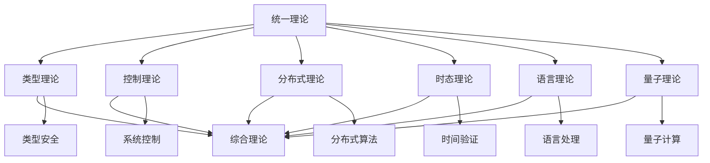

# 02-理论层 (Theory Layer)

## 目录

- [02-理论层 (Theory Layer)](#02-理论层-theory-layer)
  - [目录](#目录)
  - [1. 概述](#1-概述)
    - [1.1 理论层的定位](#11-理论层的定位)
    - [1.2 核心目标](#12-核心目标)
  - [2. 理论体系架构](#2-理论体系架构)
    - [2.1 层次结构](#21-层次结构)
    - [2.2 理论分类](#22-理论分类)
      - [2.2.1 基础理论](#221-基础理论)
      - [2.2.2 系统理论](#222-系统理论)
      - [2.2.3 前沿理论](#223-前沿理论)
  - [3. 核心理论模块](#3-核心理论模块)
    - [3.1 统一理论 (02-01)](#31-统一理论-02-01)
    - [3.2 类型理论 (02-02)](#32-类型理论-02-02)
    - [3.3 控制理论 (02-03)](#33-控制理论-02-03)
    - [3.4 分布式理论 (02-04)](#34-分布式理论-02-04)
    - [3.5 时态理论 (02-05)](#35-时态理论-02-05)
    - [3.6 语言理论 (02-06)](#36-语言理论-02-06)
    - [3.7 量子理论 (02-07)](#37-量子理论-02-07)
    - [3.8 综合理论 (02-08)](#38-综合理论-02-08)
  - [4. 理论间关系](#4-理论间关系)
    - [4.1 理论依赖关系](#41-理论依赖关系)
    - [4.2 理论交叉关系](#42-理论交叉关系)
    - [4.3 理论层次关系](#43-理论层次关系)
  - [5. 形式化表达](#5-形式化表达)
    - [5.1 统一形式化框架](#51-统一形式化框架)
    - [5.2 理论验证框架](#52-理论验证框架)
  - [6. 应用领域](#6-应用领域)
    - [6.1 计算机科学](#61-计算机科学)
    - [6.2 人工智能](#62-人工智能)
    - [6.3 工程应用](#63-工程应用)
    - [6.4 科学研究](#64-科学研究)
  - [总结](#总结)

## 1. 概述

理论层是形式化知识体系的核心层，建立在理念层和形式科学层的基础之上。本层包含各种具体的理论体系，这些理论为具体科学和实际应用提供了理论基础和方法论支撑。

### 1.1 理论层的定位

理论层位于整个知识体系的第三层，具有以下特点：

- **承上启下**: 连接抽象的形式科学和具体的应用领域
- **理论整合**: 将不同学科的理论进行统一和整合
- **方法创新**: 提供新的理论方法和分析工具
- **实践指导**: 为实际应用提供理论指导

### 1.2 核心目标

1. **理论统一**: 建立统一的理论框架
2. **形式化表达**: 使用Haskell进行严格的形式化
3. **跨学科整合**: 融合不同学科的理论
4. **应用导向**: 面向实际应用的理论构建

## 2. 理论体系架构

### 2.1 层次结构

```text
02-理论层/
├── 02-01-统一理论/                    # 统一理论框架
├── 02-02-类型理论/                    # 类型理论体系
├── 02-03-控制理论/                    # 控制理论体系
├── 02-04-分布式理论/                  # 分布式系统理论
├── 02-05-时态理论/                    # 时态逻辑理论
├── 02-06-语言理论/                    # 形式语言理论
├── 02-07-量子理论/                    # 量子系统理论
└── 02-08-综合理论/                    # 理论综合与交叉
```

### 2.2 理论分类

#### 2.2.1 基础理论

- **统一理论**: 提供理论统一的基础框架
- **类型理论**: 类型系统和类型安全的理论基础
- **语言理论**: 形式语言和计算理论

#### 2.2.2 系统理论

- **控制理论**: 系统控制和稳定性理论
- **分布式理论**: 分布式系统和并发理论
- **时态理论**: 时间相关的逻辑和系统理论

#### 2.2.3 前沿理论

- **量子理论**: 量子计算和量子系统理论
- **综合理论**: 多理论交叉和融合

## 3. 核心理论模块

### 3.1 统一理论 (02-01)

**目标**: 建立统一的理论框架，整合各种理论体系

**核心内容**:

- 统一形式理论公理化框架
- 形式语言与编程语言统一理论
- 系统设计形式化统一框架
- 理论间映射和转换机制

**Haskell形式化**:

```haskell
-- 统一理论框架
class UnifiedTheory a where
    -- 理论标识
    theoryId :: a -> TheoryId
    -- 理论公理
    axioms :: a -> [Axiom]
    -- 理论规则
    rules :: a -> [Rule]
    -- 理论模型
    models :: a -> [Model]
    -- 理论映射
    mappings :: a -> [TheoryMapping]
```

### 3.2 类型理论 (02-02)

**目标**: 建立完整的类型理论体系

**核心内容**:

- 基础类型理论
- 依赖类型理论
- 同伦类型理论
- 线性类型理论
- 仿射类型理论
- 时态类型理论
- 量子类型理论

**Haskell形式化**:

```haskell
-- 统一类型系统
data UnifiedType = 
    BaseType String
  | FunctionType UnifiedType UnifiedType
  | ProductType UnifiedType UnifiedType
  | SumType UnifiedType UnifiedType
  | DependentType String UnifiedType
  | LinearType UnifiedType
  | AffineType UnifiedType
  | TemporalType TimeConstraint UnifiedType
  | QuantumType UnifiedType
  deriving (Eq, Show)

-- 类型检查器
class TypeChecker a where
    typeCheck :: Context -> a -> Either TypeError UnifiedType
    typeInfer :: Context -> a -> Either TypeError UnifiedType
    typeSubstitute :: Substitution -> a -> a
```

### 3.3 控制理论 (02-03)

**目标**: 建立系统控制的理论基础

**核心内容**:

- 线性控制系统理论
- 非线性控制系统理论
- 鲁棒控制理论
- 自适应控制理论
- 最优控制理论
- 时变控制系统理论

**Haskell形式化**:

```haskell
-- 控制系统
data ControlSystem = 
    LinearSystem Matrix Matrix Matrix Matrix
  | NonlinearSystem (Vector -> Vector) (Vector -> Vector)
  | HybridSystem [DiscreteState] [ContinuousState] [Transition]
  deriving (Eq, Show)

-- 控制器
data Controller = 
    PIDController Double Double Double
  | StateFeedbackController Matrix
  | AdaptiveController [Parameter] [UpdateRule]
  | RobustController [Uncertainty] [Constraint]
  deriving (Eq, Show)

-- 稳定性分析
class StabilityAnalysis a where
    lyapunovFunction :: a -> Maybe (Vector -> Double)
    stabilityRegion :: a -> StabilityRegion
    robustnessMargin :: a -> Double
```

### 3.4 分布式理论 (02-04)

**目标**: 建立分布式系统的理论基础

**核心内容**:

- 分布式算法理论
- 共识理论
- 容错理论
- 并发控制理论
- 分布式事务理论
- 网络协议理论

**Haskell形式化**:

```haskell
-- 分布式系统
data DistributedSystem = 
    DistributedSystem 
        { nodes :: [Node]
        , topology :: Topology
        , protocols :: [Protocol]
        , faultModel :: FaultModel
        , consistencyModel :: ConsistencyModel
        }
  deriving (Eq, Show)

-- 共识算法
data ConsensusAlgorithm = 
    PaxosAlgorithm
  | RaftAlgorithm
  | ByzantineFaultTolerance
  | ProofOfStake
  | ProofOfWork
  deriving (Eq, Show)

-- 分布式状态
class DistributedState a where
    localState :: a -> LocalState
    globalState :: a -> GlobalState
    stateTransition :: a -> Event -> a
    stateConsistency :: a -> ConsistencyLevel
```

### 3.5 时态理论 (02-05)

**目标**: 建立时间相关逻辑的理论基础

**核心内容**:

- 线性时态逻辑
- 分支时态逻辑
- 实时时态逻辑
- 混合时态逻辑
- 时态模型检查
- 时态控制理论

**Haskell形式化**:

```haskell
-- 时态逻辑公式
data TemporalFormula = 
    Atomic String
  | Not TemporalFormula
  | And TemporalFormula TemporalFormula
  | Or TemporalFormula TemporalFormula
  | Implies TemporalFormula TemporalFormula
  | Next TemporalFormula
  | Until TemporalFormula TemporalFormula
  | Eventually TemporalFormula
  | Always TemporalFormula
  | ExistsPath TemporalFormula
  | AllPaths TemporalFormula
  deriving (Eq, Show)

-- 时态模型
data TemporalModel = 
    KripkeModel [State] [Transition] [Valuation]
  | TimedAutomaton [Location] [Clock] [Guard] [Reset]
  | HybridAutomaton [DiscreteState] [ContinuousState] [Flow] [Jump]
  deriving (Eq, Show)

-- 模型检查器
class ModelChecker a where
    checkFormula :: a -> TemporalFormula -> Bool
    checkPath :: a -> [State] -> TemporalFormula -> Bool
    checkModel :: a -> TemporalFormula -> Bool
    counterExample :: a -> TemporalFormula -> Maybe [State]
```

### 3.6 语言理论 (02-06)

**目标**: 建立形式语言的理论基础

**核心内容**:

- 自动机理论
- 语法分析理论
- 语言层次理论
- 形式语言应用理论
- 计算复杂性理论
- 语言识别理论

**Haskell形式化**:

```haskell
-- 自动机
data Automaton = 
    FiniteAutomaton [State] [Symbol] TransitionFunction State [State]
  | PushdownAutomaton [State] [Symbol] [StackSymbol] TransitionFunction State [State]
  | TuringMachine [State] [Symbol] [TapeSymbol] TransitionFunction State [State]
  deriving (Eq, Show)

-- 语法
data Grammar = 
    RegularGrammar [NonTerminal] [Terminal] [Production]
  | ContextFreeGrammar [NonTerminal] [Terminal] [Production]
  | ContextSensitiveGrammar [NonTerminal] [Terminal] [Production]
  | UnrestrictedGrammar [NonTerminal] [Terminal] [Production]
  deriving (Eq, Show)

-- 语言识别器
class LanguageRecognizer a where
    recognize :: a -> String -> Bool
    parse :: a -> String -> Maybe ParseTree
    generate :: a -> [String]
    complexity :: a -> ComplexityClass
```

### 3.7 量子理论 (02-07)

**目标**: 建立量子系统的理论基础

**核心内容**:

- 量子计算理论
- 量子信息理论
- 量子算法理论
- 量子纠错理论
- 量子密码理论
- 量子机器学习理论

**Haskell形式化**:

```haskell
-- 量子态
data QuantumState = 
    PureState Vector
  | MixedState Matrix
  | EntangledState [Qubit]
  deriving (Eq, Show)

-- 量子门
data QuantumGate = 
    HadamardGate
  | PauliXGate
  | PauliYGate
  | PauliZGate
  | CNOTGate Qubit Qubit
  | PhaseGate Double
  | RotationGate Axis Double
  deriving (Eq, Show)

-- 量子电路
data QuantumCircuit = 
    QuantumCircuit [QuantumGate] [Qubit] [ClassicalBit]
  deriving (Eq, Show)

-- 量子算法
class QuantumAlgorithm a where
    initialize :: a -> QuantumState
    evolve :: a -> QuantumState -> QuantumState
    measure :: a -> QuantumState -> Measurement
    complexity :: a -> QuantumComplexity
```

### 3.8 综合理论 (02-08)

**目标**: 整合和交叉各种理论

**核心内容**:

- 理论交叉与融合
- 跨领域理论应用
- 理论创新与发展
- 理论验证与测试
- 理论教育与传播

**Haskell形式化**:

```haskell
-- 理论交叉
data TheoryIntersection = 
    TheoryIntersection 
        { theory1 :: Theory
        , theory2 :: Theory
        , intersection :: Theory
        , mapping :: TheoryMapping
        }
  deriving (Eq, Show)

-- 理论融合
data TheoryFusion = 
    TheoryFusion 
        { theories :: [Theory]
        , fusionMethod :: FusionMethod
        , fusedTheory :: Theory
        , validation :: ValidationResult
        }
  deriving (Eq, Show)

-- 理论创新
class TheoryInnovation a where
    identifyGap :: a -> [ResearchGap]
    proposeSolution :: a -> [Innovation]
    validateInnovation :: a -> Innovation -> ValidationResult
    impactAssessment :: a -> Innovation -> ImpactAssessment
```

## 4. 理论间关系

### 4.1 理论依赖关系



### 4.2 理论交叉关系

- **类型理论 + 控制理论**: 类型安全的控制系统
- **分布式理论 + 时态理论**: 分布式时态系统
- **语言理论 + 量子理论**: 量子编程语言
- **控制理论 + 分布式理论**: 分布式控制系统

### 4.3 理论层次关系

1. **基础层**: 统一理论、语言理论
2. **系统层**: 控制理论、分布式理论、时态理论
3. **前沿层**: 量子理论、综合理论

## 5. 形式化表达

### 5.1 统一形式化框架

```haskell
-- 理论统一框架
class Theory a where
    -- 理论标识
    theoryId :: a -> TheoryId
    -- 理论公理
    axioms :: a -> [Axiom]
    -- 理论规则
    rules :: a -> [Rule]
    -- 理论模型
    models :: a -> [Model]
    -- 理论证明
    proofs :: a -> [Proof]
    -- 理论应用
    applications :: a -> [Application]

-- 理论映射
class TheoryMapping a b where
    -- 理论间映射
    mapTheory :: a -> b
    -- 映射验证
    validateMapping :: a -> b -> Bool
    -- 映射保持性
    preserveProperties :: a -> b -> [Property]
```

### 5.2 理论验证框架

```haskell
-- 理论验证
class TheoryVerification a where
    -- 一致性验证
    consistencyCheck :: a -> Bool
    -- 完备性验证
    completenessCheck :: a -> Bool
    -- 正确性验证
    correctnessCheck :: a -> Bool
    -- 可判定性验证
    decidabilityCheck :: a -> Bool

-- 理论测试
class TheoryTesting a where
    -- 单元测试
    unitTests :: a -> [Test]
    -- 集成测试
    integrationTests :: a -> [Test]
    -- 性能测试
    performanceTests :: a -> [Test]
    -- 压力测试
    stressTests :: a -> [Test]
```

## 6. 应用领域

### 6.1 计算机科学

- **编程语言设计**: 类型理论、语言理论
- **系统设计**: 控制理论、分布式理论
- **算法设计**: 分布式理论、量子理论
- **软件验证**: 时态理论、语言理论

### 6.2 人工智能

- **机器学习**: 控制理论、量子理论
- **自然语言处理**: 语言理论、时态理论
- **知识表示**: 类型理论、语言理论
- **推理系统**: 时态理论、分布式理论

### 6.3 工程应用

- **控制系统**: 控制理论、时态理论
- **网络系统**: 分布式理论、时态理论
- **安全系统**: 量子理论、分布式理论
- **实时系统**: 时态理论、控制理论

### 6.4 科学研究

- **数学研究**: 类型理论、语言理论
- **物理研究**: 量子理论、控制理论
- **生物研究**: 分布式理论、时态理论
- **经济研究**: 控制理论、分布式理论

## 总结

理论层为整个形式化知识体系提供了坚实的理论基础，通过严格的数学形式化和Haskell实现，确保了理论的正确性和可验证性。各种理论之间的交叉和融合为实际应用提供了丰富的理论工具和方法论支撑。
