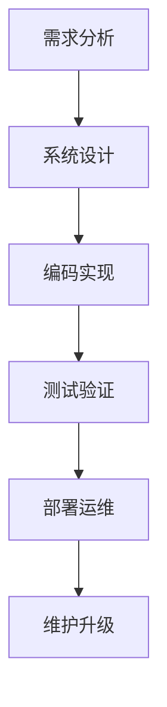

# 301 软件工程基础（Software Engineering Foundations）

- [1. 引言](#1-引言)
- [2. 核心理论体系](#2-核心理论体系)
- [3. 工程实践案例（含Haskell代码）](#3-工程实践案例含haskell代码)
- [4. 数学与形式化表达](#4-数学与形式化表达)
- [5. 图表与结构图](#5-图表与结构图)
- [6. 对比分析（Haskell/Rust/Lean）](#6-对比分析haskellrustlean)
- [7. 参考文献](#7-参考文献)

---

## 1. 引言

软件工程基础涵盖现代软件开发的基本原理、生命周期、质量保障等，是计算科学与工程实践的核心。目标是以系统化、规范化、可度量的方式开发和维护高质量软件。

## 2. 核心理论体系

- 软件生命周期模型：需求分析、系统设计、编码实现、测试验证、部署运维、维护升级
- 质量属性：可维护性、可扩展性、可靠性、安全性
- 典型流程与结构图（见下方Mermaid示例）

## 3. 工程实践案例（含Haskell代码）

```haskell
-- Haskell中的模块化与测试
module Main where

main :: IO ()
main = putStrLn "Hello, Software Engineering!"
```

## 4. 数学与形式化表达

- 形式化需求规范（LaTeX示例）：
  \[
  \forall x \in \text{Input},\ \text{System}(x) \rightarrow \text{Output}(x)
  \]
- 一致性与可追踪性证明思路

## 5. 图表与结构图



## 6. 对比分析（Haskell/Rust/Lean）

| 特性         | Haskell           | Rust              | Lean                |
|--------------|-------------------|-------------------|---------------------|
| 工程生态     | 成熟，社区活跃    | 成熟，系统编程强  | 新兴，形式化为主    |
| 类型系统     | 强，惰性          | 强，所有权/生命周期| 依赖类型，证明辅助  |
| 工具链       | Stack/Cabal       | Cargo             | Lean工具链          |

## 7. 参考文献

- [1] Sommerville, I. (2016). Software Engineering.
- [2] Pressman, R. S. (2014). Software Engineering: A Practitioner's Approach.
