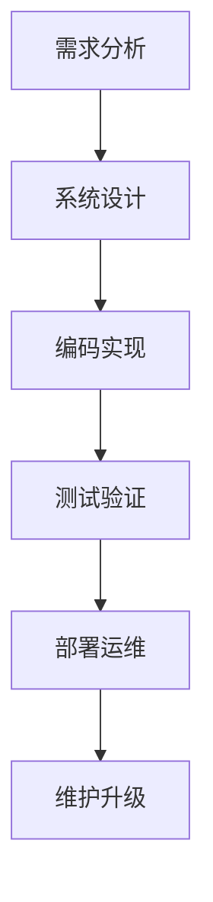

# 302 软件开发方法论（Development Methodologies）

- [1. 引言](#1-引言)
- [2. 主流开发方法论综述](#2-主流开发方法论综述)
- [3. 流程建模与自动化建议](#3-流程建模与自动化建议)
- [4. 工程案例与Haskell代码片段](#4-工程案例与haskell代码片段)
- [5. 对比分析（Haskell/Rust/Lean）](#5-对比分析haskellrustlean)
- [6. 图表与流程图](#6-图表与流程图)
- [7. 参考文献](#7-参考文献)

---

## 1. 引言

软件开发方法论是指导软件开发全过程的理论与实践体系，涵盖从需求获取到系统交付的各类流程、规范与最佳实践。合理选择和应用开发方法论，有助于提升项目质量、效率与团队协作。

## 2. 主流开发方法论综述

- 瀑布模型（Waterfall Model）
- V模型（V-Model）
- 螺旋模型（Spiral Model）
- 敏捷开发（Agile, Scrum, XP, Kanban）
- DevOps与持续交付（CI/CD）

### 方法论对比分析

| 方法论   | 适用场景         | 优点           | 局限           |
|----------|------------------|----------------|----------------|
| 瀑布     | 需求稳定、流程清 | 结构清晰、易管理 | 变更代价高      |
| 敏捷     | 需求易变、创新型 | 快速迭代、响应快 | 依赖团队自律    |
| DevOps   | 自动化、交付频繁 | 自动化高、反馈快 | 工具链复杂      |

## 3. 流程建模与自动化建议

- 各类开发模型的流程图与阶段划分
- 需求、设计、实现、测试、部署、维护的全流程
- 方法论选择的适用场景与优缺点
- 推荐自动化工具链（如CI/CD、自动化测试、代码质量分析等）

## 4. 工程案例与Haskell代码片段

```haskell
-- Haskell项目的敏捷开发实践：快速迭代与单元测试
module Lib where

add :: Int -> Int -> Int
add x y = x + y

-- 测试用例（可用HUnit/QuickCheck等）
```

## 5. 对比分析（Haskell/Rust/Lean）

| 特性         | Haskell           | Rust              | Lean                |
|--------------|-------------------|-------------------|---------------------|
| 方法论支持   | 支持敏捷/瀑布等   | 支持敏捷/DevOps   | 形式化开发流程      |
| 工具链       | Stack/Cabal       | Cargo             | Lean工具链          |
| 主要应用     | 研发、原型、科研  | 系统开发、运维    | 形式化建模、证明    |

## 6. 图表与流程图



## 7. 参考文献

- [1] Beck, K. et al. (2001). Manifesto for Agile Software Development.
- [2] Sommerville, I. (2016). Software Engineering.
- [3] Pressman, R. S. (2014). Software Engineering: A Practitioner's Approach.
