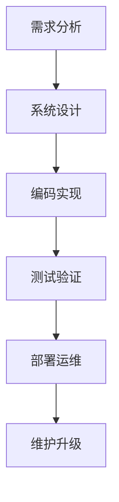

# 302 软件开发方法论（Development Methodologies）

## 1. 概述

软件开发方法论是指导软件开发全过程的理论与实践体系，涵盖从需求获取到系统交付的各类流程、规范与最佳实践。合理选择和应用开发方法论，有助于提升项目质量、效率与团队协作。

## 2. 主要分支/流派/方法

- 瀑布模型（Waterfall Model）
- V模型（V-Model）
- 螺旋模型（Spiral Model）
- 敏捷开发（Agile, Scrum, XP, Kanban）
- DevOps与持续交付（CI/CD）

## 3. 理论体系与工程流程

- 各类开发模型的流程图与阶段划分
- 需求、设计、实现、测试、部署、维护的全流程
- 方法论选择的适用场景与优缺点
- Mermaid流程图示例：



## 4. Haskell工程实践示例

```haskell
-- Haskell项目的敏捷开发实践：快速迭代与单元测试
module Lib where

add :: Int -> Int -> Int
add x y = x + y

-- 测试用例（可用HUnit/QuickCheck等）
```

## 5. 相关证明与形式化表达

- 形式化描述开发流程的正确性与可追踪性
- 需求到实现的可验证映射

## 6. 应用案例与工程经验

- 敏捷开发在Haskell团队中的应用
- 金融、互联网等行业的DevOps实践

## 7. 与Rust/Lean工程对比

| 特性         | Haskell           | Rust              | Lean                |
|--------------|-------------------|-------------------|---------------------|
| 方法论支持   | 支持敏捷/瀑布等   | 支持敏捷/DevOps   | 形式化开发流程      |
| 工具链       | Stack/Cabal       | Cargo             | Lean工具链          |
| 主要应用     | 研发、原型、科研  | 系统开发、运维    | 形式化建模、证明    |

## 8. 参考文献

- [1] Beck, K. et al. (2001). Manifesto for Agile Software Development.
- [2] Sommerville, I. (2016). Software Engineering.
- [3] Pressman, R. S. (2014). Software Engineering: A Practitioner's Approach.
