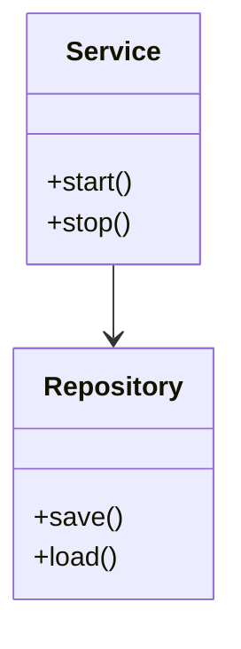

# 303 架构与设计模式（Architecture & Design Patterns）

## 1. 概述

架构与设计模式是软件工程中提升系统可维护性、可扩展性与复用性的核心理论与实践。架构关注系统整体结构与分层，设计模式关注局部结构与通用解决方案。

## 2. 主要分支/流派/方法

- 架构风格：分层架构、微服务、事件驱动、管道-过滤器等
- 设计模式：创建型、结构型、行为型（如单例、工厂、观察者、装饰器、策略等）
- 领域驱动设计（DDD）、架构决策记录（ADR）

## 3. 理论体系与工程流程

- 架构建模与视图（如C4模型、UML）
- 设计模式的分类与适用场景
- 架构决策与权衡分析
- Mermaid/UML结构图示例：



## 4. Haskell工程实践示例

```haskell
-- Haskell中的单例模式实现
module Singleton where
import Data.IORef
import System.IO.Unsafe (unsafePerformIO)

singleton :: IORef Int
singleton = unsafePerformIO (newIORef 0)
```

## 5. 相关证明与形式化表达

- 架构正确性与一致性证明思路
- 设计模式的可复用性与可组合性分析

## 6. 应用案例与工程经验

- Haskell在微服务、事件驱动等架构中的应用
- 典型设计模式在实际项目中的落地经验

## 7. 与Rust/Lean工程对比

| 特性         | Haskell           | Rust              | Lean                |
|--------------|-------------------|-------------------|---------------------|
| 架构支持     | 支持多种架构风格  | 支持微服务/嵌入式 | Lean4支持模块化     |
| 设计模式     | 支持函数式/面向对象| 支持多范式        | 以证明与组合为主    |
| 工具链       | Stack/Cabal       | Cargo             | Lean工具链          |

## 8. 参考文献

- [1] Gamma, E. et al. (1994). Design Patterns: Elements of Reusable Object-Oriented Software.
- [2] Bass, L., Clements, P., & Kazman, R. (2012). Software Architecture in Practice.
- [3] Evans, E. (2003). Domain-Driven Design: Tackling Complexity in the Heart of Software.
