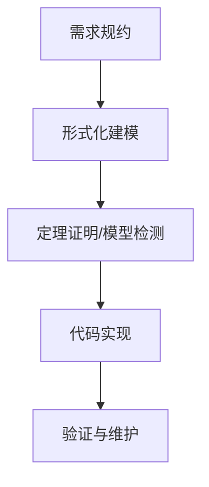

# 304 形式化方法与验证（Formal Methods & Verification）

## 1. 概述

形式化方法是利用数学逻辑和形式化语言对软件和系统进行建模、分析与验证的理论与技术体系。形式化验证可有效提升系统的正确性、安全性和可靠性，是高可信软件工程的重要手段。

## 2. 主要分支/流派/方法

- 规范化建模（Z、VDM、B方法等）
- 形式化规约语言（CSP、TLA+、Alloy等）
- 定理证明与模型检测（Theorem Proving, Model Checking）
- 代码验证与静态分析

## 3. 理论体系与工程流程

- 形式化建模与规约流程
- 定理证明与自动化推理工具（如Lean、Coq、Isabelle）
- 模型检测流程（如CTL、LTL、状态空间搜索）
- Mermaid流程图示例：



## 4. Haskell工程实践示例

```haskell
-- Haskell中的QuickCheck属性测试
import Test.QuickCheck

prop_reverse :: [Int] -> Bool
prop_reverse xs = reverse (reverse xs) == xs

main :: IO ()
main = quickCheck prop_reverse
```

## 5. 相关证明与形式化表达

- 形式化规约的正确性证明思路
- 不变量、前置条件、后置条件的形式化表达
- 代码与规约一致性的可验证映射

## 6. 应用案例与工程经验

- Haskell在金融、航空等高可信领域的形式化验证实践
- 结合Lean/Coq进行定理证明的工程经验

## 7. 与Rust/Lean工程对比

| 特性         | Haskell           | Rust              | Lean                |
|--------------|-------------------|-------------------|---------------------|
| 形式化支持   | QuickCheck、LiquidHaskell | RustHorn、Prusti | Lean/Coq/Isabelle   |
| 自动验证     | 支持属性测试      | 支持静态分析      | 强，支持定理证明    |
| 主要应用     | 高可信软件、测试  | 安全/嵌入式系统   | 形式化建模、证明    |

## 8. 参考文献

- [1] Clarke, E. M., Grumberg, O., & Peled, D. (1999). Model Checking.
- [2] Spivey, J. M. (1992). The Z Notation: A Reference Manual.
- [3] Pierce, B. C. (2002). Types and Programming Languages.
