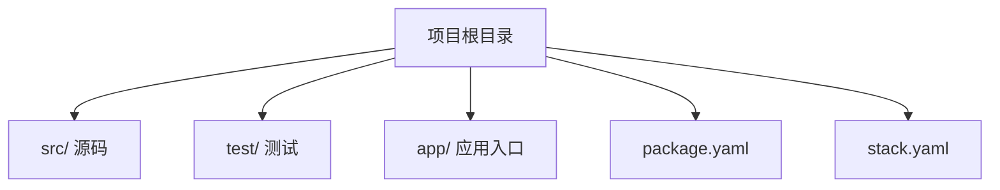

# 305 Haskell工程实践（Haskell Engineering Practice）

## 1. 概述

Haskell工程实践聚焦于Haskell在实际软件开发中的应用方法、工程流程、工具链与最佳实践。强调类型安全、函数式抽象、并发与高可靠性，适用于金融、区块链、编译器等高要求领域。

## 2. 主要分支/领域/方法

- 项目结构与模块化
- 构建与依赖管理（Stack、Cabal、Nix）
- 测试与持续集成（QuickCheck、HUnit、CI/CD）
- 并发与异步编程（STM、Async、Conduit）
- 性能优化与资源管理

## 3. 工程体系与开发流程

- 典型Haskell项目结构
- 依赖管理与版本控制
- 自动化测试与持续集成流程
- 部署与运维实践
- Mermaid项目结构图示例：



## 4. 代码示例与工程实践

```haskell
-- 典型模块结构与主程序
module Lib (add) where
add :: Int -> Int -> Int
add x y = x + y

-- 主程序入口
module Main where
import Lib
main :: IO ()
main = print (add 2 3)
```

## 5. 工程经验与案例

- Haskell在金融风控、区块链智能合约、编译器开发等领域的工程实践
- 典型项目的CI/CD、测试、部署经验
- 性能调优与内存泄漏排查

## 6. 与Rust/Lean工程对比

| 特性         | Haskell           | Rust              | Lean                |
|--------------|-------------------|-------------------|---------------------|
| 工程工具链   | Stack/Cabal/Nix   | Cargo             | Lean工具链          |
| 类型系统     | 强，惰性          | 强，所有权/生命周期| 依赖类型，证明辅助  |
| 并发支持     | STM、Async        | 线程、async/await | Lean4支持并发建模   |
| 主要应用     | 金融、编译器、科研| 系统、嵌入式、Web | 形式化建模、证明    |

## 7. 参考文献

- [1] Lipovaca, M. (2011). Learn You a Haskell for Great Good!
- [2] O'Sullivan, B., Goerzen, J., & Stewart, D. (2014). Real World Haskell.
- [3] Marlow, S. (2013). Parallel and Concurrent Programming in Haskell.
