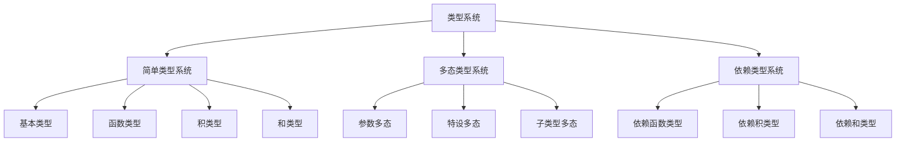
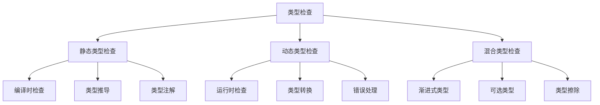

# 类型系统基础概念

## 📋 概述

类型系统是编程语言中用于分类和约束程序构造的机制。它通过静态分析来检测程序错误，提供抽象层次，并支持程序优化。本文档介绍类型系统的基本概念、形式化定义和Haskell实现。

## 🎯 核心概念

### 类型的基本定义

类型是程序构造的分类，用于描述值的集合和可执行的操作。

#### 形式化定义

```haskell
-- 类型的基本定义
data Type = 
    TUnit                    -- 单位类型
  | TBool                    -- 布尔类型
  | TInt                     -- 整数类型
  | TFloat                   -- 浮点类型
  | TString                  -- 字符串类型
  | TArrow Type Type         -- 函数类型
  | TProduct Type Type       -- 积类型
  | TSum Type Type           -- 和类型
  | TList Type               -- 列表类型
  | TMaybe Type              -- 可选类型
  | TTuple [Type]            -- 元组类型
  | TRecord [(String, Type)] -- 记录类型
  deriving (Eq, Show)

-- 类型环境的定义
type TypeEnv = [(String, Type)]

-- 类型推导规则
data TypeJudgment = 
    TypeJudgment TypeEnv Expr Type
  deriving (Show)
```

### 类型推导系统

#### 语法规则

```haskell
-- 表达式的语法
data Expr = 
    EVar String              -- 变量
  | ELit Literal             -- 字面量
  | EApp Expr Expr           -- 函数应用
  | ELam String Type Expr    -- Lambda抽象
  | ELet String Expr Expr    -- Let绑定
  | EIf Expr Expr Expr       -- 条件表达式
  | EOp Op Expr Expr         -- 二元操作
  | ETuple [Expr]            -- 元组构造
  | EProj Expr Int           -- 元组投影
  | ERecord [(String, Expr)] -- 记录构造
  | EField Expr String       -- 字段访问
  deriving (Show)

-- 字面量
data Literal = 
    LUnit
  | LBool Bool
  | LInt Integer
  | LFloat Double
  | LString String
  deriving (Show)

-- 操作符
data Op = 
    Add | Sub | Mul | Div
  | Eq | Lt | Gt | Le | Ge
  | And | Or | Not
  deriving (Show)
```

#### 类型推导规则

```haskell
-- 类型推导函数
typeInfer :: TypeEnv -> Expr -> Either String Type

-- 变量规则
typeInfer env (EVar x) = 
    case lookup x env of
        Just t -> Right t
        Nothing -> Left $ "Unbound variable: " ++ x

-- 字面量规则
typeInfer _ (ELit LUnit) = Right TUnit
typeInfer _ (ELit (LBool _)) = Right TBool
typeInfer _ (ELit (LInt _)) = Right TInt
typeInfer _ (ELit (LFloat _)) = Right TFloat
typeInfer _ (ELit (LString _)) = Right TString

-- 函数应用规则
typeInfer env (EApp e1 e2) = do
    t1 <- typeInfer env e1
    t2 <- typeInfer env e2
    case t1 of
        TArrow t11 t12 | t11 == t2 -> Right t12
        _ -> Left "Type mismatch in function application"

-- Lambda抽象规则
typeInfer env (ELam x t e) = do
    t' <- typeInfer ((x, t) : env) e
    return $ TArrow t t'

-- Let绑定规则
typeInfer env (ELet x e1 e2) = do
    t1 <- typeInfer env e1
    t2 <- typeInfer ((x, t1) : env) e2
    return t2

-- 条件表达式规则
typeInfer env (EIf e1 e2 e3) = do
    t1 <- typeInfer env e1
    t2 <- typeInfer env e2
    t3 <- typeInfer env e3
    case (t1, t2 == t3) of
        (TBool, True) -> Right t2
        (TBool, False) -> Left "Branches must have same type"
        _ -> Left "Condition must be boolean"

-- 二元操作规则
typeInfer env (EOp op e1 e2) = do
    t1 <- typeInfer env e1
    t2 <- typeInfer env e2
    case (op, t1, t2) of
        (Add, TInt, TInt) -> Right TInt
        (Sub, TInt, TInt) -> Right TInt
        (Mul, TInt, TInt) -> Right TInt
        (Div, TInt, TInt) -> Right TInt
        (Add, TFloat, TFloat) -> Right TFloat
        (Sub, TFloat, TFloat) -> Right TFloat
        (Mul, TFloat, TFloat) -> Right TFloat
        (Div, TFloat, TFloat) -> Right TFloat
        (Eq, t1', t2') | t1' == t2' -> Right TBool
        (Lt, TInt, TInt) -> Right TBool
        (Gt, TInt, TInt) -> Right TBool
        (Le, TInt, TInt) -> Right TBool
        (Ge, TInt, TInt) -> Right TBool
        (And, TBool, TBool) -> Right TBool
        (Or, TBool, TBool) -> Right TBool
        _ -> Left "Invalid operation for types"

-- 元组构造规则
typeInfer env (ETuple es) = do
    ts <- mapM (typeInfer env) es
    return $ TTuple ts

-- 元组投影规则
typeInfer env (EProj e i) = do
    t <- typeInfer env e
    case t of
        TTuple ts | i >= 0 && i < length ts -> Right (ts !! i)
        _ -> Left "Invalid tuple projection"

-- 记录构造规则
typeInfer env (ERecord fields) = do
    ts <- mapM (\(f, e) -> (f,) <$> typeInfer env e) fields
    return $ TRecord ts

-- 字段访问规则
typeInfer env (EField e f) = do
    t <- typeInfer env e
    case t of
        TRecord fields -> 
            case lookup f fields of
                Just t' -> Right t'
                Nothing -> Left $ "Field not found: " ++ f
        _ -> Left "Not a record type"
```

### 类型安全

#### 类型安全的定义

类型安全是指程序在类型检查通过后，在执行时不会出现类型错误。

```haskell
-- 运行时值的定义
data Value = 
    VUnit
  | VBool Bool
  | VInt Integer
  | VFloat Double
  | VString String
  | VClosure String Type Expr TypeEnv
  | VTuple [Value]
  | VRecord [(String, Value)]
  deriving (Show)

-- 类型安全定理
typeSafetyTheorem :: TypeEnv -> Expr -> Type -> Bool
typeSafetyTheorem env e t = 
    case typeInfer env e of
        Right t' -> t == t'
        Left _ -> False

-- 类型保持性
typePreservation :: TypeEnv -> Expr -> Expr -> Type -> Bool
typePreservation env e1 e2 t = 
    case (typeInfer env e1, typeInfer env e2) of
        (Right t1, Right t2) -> t1 == t && t2 == t
        _ -> False
```

## 🔧 Haskell实现示例

### 完整的类型检查器

```haskell
-- 类型检查器模块
module TypeChecker where

import Data.Map (Map)
import qualified Data.Map as Map
import Control.Monad.Except

-- 类型检查器状态
data TypeCheckerState = TypeCheckerState
    { typeEnv :: Map String Type
    , typeCounter :: Int
    }

-- 类型检查器单子
type TypeChecker = ExceptT String (State TypeCheckerState)

-- 初始化类型检查器
initTypeChecker :: TypeCheckerState
initTypeChecker = TypeCheckerState
    { typeEnv = Map.empty
    , typeCounter = 0
    }

-- 添加类型绑定
addTypeBinding :: String -> Type -> TypeChecker ()
addTypeBinding name typ = do
    state <- get
    put state { typeEnv = Map.insert name typ (typeEnv state) }

-- 查找类型绑定
lookupType :: String -> TypeChecker (Maybe Type)
lookupType name = do
    state <- get
    return $ Map.lookup name (typeEnv state)

-- 生成新类型变量
newTypeVar :: TypeChecker Type
newTypeVar = do
    state <- get
    put state { typeCounter = typeCounter state + 1 }
    return $ TVar $ "t" ++ show (typeCounter state)

-- 类型检查主函数
checkType :: Expr -> Type -> TypeChecker ()
checkType expr expectedType = do
    actualType <- inferType expr
    unless (actualType == expectedType) $
        throwError $ "Type mismatch: expected " ++ show expectedType ++ 
                    ", got " ++ show actualType

-- 类型推导主函数
inferType :: Expr -> TypeChecker Type
inferType (EVar x) = do
    maybeType <- lookupType x
    case maybeType of
        Just t -> return t
        Nothing -> throwError $ "Unbound variable: " ++ x

inferType (ELit LUnit) = return TUnit
inferType (ELit (LBool _)) = return TBool
inferType (ELit (LInt _)) = return TInt
inferType (ELit (LFloat _)) = return TFloat
inferType (ELit (LString _)) = return TString

inferType (EApp e1 e2) = do
    t1 <- inferType e1
    t2 <- inferType e2
    case t1 of
        TArrow t11 t12 | t11 == t2 -> return t12
        _ -> throwError "Type mismatch in function application"

inferType (ELam x t e) = do
    addTypeBinding x t
    t' <- inferType e
    return $ TArrow t t'

inferType (ELet x e1 e2) = do
    t1 <- inferType e1
    addTypeBinding x t1
    inferType e2

inferType (EIf e1 e2 e3) = do
    t1 <- inferType e1
    t2 <- inferType e2
    t3 <- inferType e3
    case (t1, t2 == t3) of
        (TBool, True) -> return t2
        (TBool, False) -> throwError "Branches must have same type"
        _ -> throwError "Condition must be boolean"

-- 运行类型检查
runTypeChecker :: Expr -> Either String Type
runTypeChecker expr = 
    evalState (runExceptT (inferType expr)) initTypeChecker
```

## 📊 类型系统分类

### 按表达能力分类



### 按类型检查方式分类



## 🎯 应用示例

### 简单类型检查器

```haskell
-- 示例程序
example1 :: Expr
example1 = ELet "x" (ELit (LInt 5)) 
                (EOp Add (EVar "x") (ELit (LInt 3)))

example2 :: Expr
example2 = ELam "x" TInt 
                (EOp Add (EVar "x") (ELit (LInt 1)))

example3 :: Expr
example3 = EApp example2 (ELit (LInt 10))

-- 测试类型检查
testTypeChecker :: IO ()
testTypeChecker = do
    putStrLn "Testing type checker..."
    
    case runTypeChecker example1 of
        Right t -> putStrLn $ "Example 1 type: " ++ show t
        Left e -> putStrLn $ "Example 1 error: " ++ e
    
    case runTypeChecker example2 of
        Right t -> putStrLn $ "Example 2 type: " ++ show t
        Left e -> putStrLn $ "Example 2 error: " ++ e
    
    case runTypeChecker example3 of
        Right t -> putStrLn $ "Example 3 type: " ++ show t
        Left e -> putStrLn $ "Example 3 error: " ++ e
```

## 📚 理论基础

### 类型论基础

类型系统理论基于以下数学基础：

1. **集合论**：类型作为集合的抽象
2. **范畴论**：类型系统作为范畴
3. **逻辑学**：类型作为命题，程序作为证明

### 形式化语义

类型系统的形式化语义包括：

1. **操作语义**：描述类型检查的执行过程
2. **指称语义**：描述类型的数学含义
3. **公理语义**：描述类型系统的公理和规则

### 类型安全定理

类型安全定理保证：

1. **进展性**：类型正确的程序要么终止，要么可以继续执行
2. **保持性**：程序执行过程中类型保持不变
3. **可靠性**：类型检查通过的程序不会出现类型错误

## 🔗 相关链接

- [类型推导](02-Type-Inference.md)
- [类型检查](03-Type-Checking.md)
- [类型安全](04-Type-Safety.md)
- [多态类型系统](../02-Advanced-Type-Systems/01-Polymorphic-Type-Systems.md)

---

*本文档提供了类型系统基础概念的完整介绍，包括形式化定义、Haskell实现和理论基础。*
