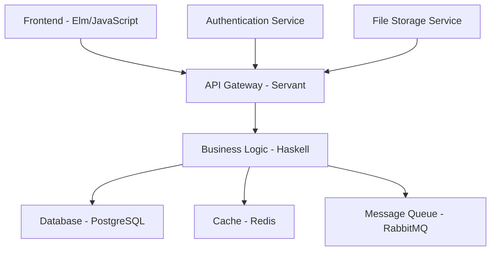

# Advanced Web Development - Haskell Full-Stack Application

## 1. Introduction

This document demonstrates a complete full-stack web application built with Haskell, showcasing modern web development practices, type-safe APIs, and functional programming principles.

## 2. Project Architecture

### System Overview



### Technology Stack

- **Backend**: Haskell with Servant, Yesod, or Scotty
- **Database**: PostgreSQL with Persistent
- **Cache**: Redis
- **Message Queue**: RabbitMQ
- **Frontend**: Elm or JavaScript with TypeScript
- **Deployment**: Docker, Kubernetes

## 3. Backend Implementation

### API Definition with Servant

```haskell
{-# LANGUAGE DataKinds #-}
{-# LANGUAGE TypeOperators #-}
{-# LANGUAGE DeriveGeneric #-}

import Servant
import Servant.Auth
import Data.Aeson
import GHC.Generics

-- User data type
data User = User
    { userId :: Int
    , username :: String
    , email :: String
    , isActive :: Bool
    } deriving (Show, Generic)

instance ToJSON User
instance FromJSON User

-- Product data type
data Product = Product
    { productId :: Int
    , name :: String
    , description :: String
    , price :: Double
    , category :: String
    , inStock :: Bool
    } deriving (Show, Generic)

instance ToJSON Product
instance FromJSON Product

-- Order data type
data Order = Order
    { orderId :: Int
    , userId :: Int
    , products :: [OrderItem]
    , totalAmount :: Double
    , status :: OrderStatus
    , createdAt :: UTCTime
    } deriving (Show, Generic)

data OrderItem = OrderItem
    { productId :: Int
    , quantity :: Int
    , unitPrice :: Double
    } deriving (Show, Generic)

data OrderStatus = Pending | Confirmed | Shipped | Delivered | Cancelled
    deriving (Show, Generic)

instance ToJSON Order
instance FromJSON Order
instance ToJSON OrderItem
instance FromJSON OrderItem
instance ToJSON OrderStatus
instance FromJSON OrderStatus

-- API type definition
type API = 
    "api" :> "v1" :> (
        "users" :> (
            Get '[JSON] [User]
            :<|> Capture "id" Int :> Get '[JSON] User
            :<|> ReqBody '[JSON] User :> Post '[JSON] User
            :<|> Capture "id" Int :> ReqBody '[JSON] User :> Put '[JSON] User
            :<|> Capture "id" Int :> Delete '[JSON] ()
        )
        :<|> "products" :> (
            Get '[JSON] [Product]
            :<|> Capture "id" Int :> Get '[JSON] Product
            :<|> ReqBody '[JSON] Product :> Post '[JSON] Product
            :<|> Capture "id" Int :> ReqBody '[JSON] Product :> Put '[JSON] Product
            :<|> Capture "id" Int :> Delete '[JSON] ()
        )
        :<|> "orders" :> (
            Get '[JSON] [Order]
            :<|> Capture "id" Int :> Get '[JSON] Order
            :<|> ReqBody '[JSON] Order :> Post '[JSON] Order
            :<|> Capture "id" Int :> "status" :> ReqBody '[JSON] OrderStatus :> Put '[JSON] Order
        )
        :<|> "auth" :> (
            "login" :> ReqBody '[JSON] LoginRequest :> Post '[JSON] AuthResponse
            :<|> "register" :> ReqBody '[JSON] RegisterRequest :> Post '[JSON] AuthResponse
            :<|> "logout" :> Post '[JSON] ()
        )
    )

-- Authentication types
data LoginRequest = LoginRequest
    { username :: String
    , password :: String
    } deriving (Show, Generic)

data RegisterRequest = RegisterRequest
    { username :: String
    , email :: String
    , password :: String
    } deriving (Show, Generic)

data AuthResponse = AuthResponse
    { token :: String
    , user :: User
    } deriving (Show, Generic)

instance ToJSON LoginRequest
instance FromJSON LoginRequest
instance ToJSON RegisterRequest
instance FromJSON RegisterRequest
instance ToJSON AuthResponse
instance FromJSON AuthResponse
```

### Database Layer with Persistent

```haskell
{-# LANGUAGE GADTs #-}
{-# LANGUAGE TemplateHaskell #-}
{-# LANGUAGE QuasiQuotes #-}

import Database.Persist
import Database.Persist.Sql
import Database.Persist.TH

-- Database schema
share [mkPersist sqlSettings, mkMigrate "migrateAll"] [persistLowerCase|
User
    username String
    email String
    passwordHash String
    isActive Bool
    createdAt UTCTime
    updatedAt UTCTime
    UniqueUsername username
    UniqueEmail email
    deriving Show

Product
    name String
    description Text
    price Double
    category String
    inStock Bool
    createdAt UTCTime
    updatedAt UTCTime
    deriving Show

Order
    userId UserId
    totalAmount Double
    status OrderStatus
    createdAt UTCTime
    updatedAt UTCTime
    deriving Show

OrderItem
    orderId OrderId
    productId ProductId
    quantity Int
    unitPrice Double
    deriving Show

OrderStatus
    name String
    deriving Show
|]

-- Database operations
class Monad m => UserRepository m where
    getAllUsers :: m [Entity User]
    getUserById :: UserId -> m (Maybe (Entity User))
    getUserByUsername :: String -> m (Maybe (Entity User))
    createUser :: User -> m (Either String UserId)
    updateUser :: UserId -> User -> m (Either String ())
    deleteUser :: UserId -> m (Either String ())

class Monad m => ProductRepository m where
    getAllProducts :: m [Entity Product]
    getProductById :: ProductId -> m (Maybe (Entity Product))
    getProductsByCategory :: String -> m [Entity Product]
    createProduct :: Product -> m (Either String ProductId)
    updateProduct :: ProductId -> Product -> m (Either String ())
    deleteProduct :: ProductId -> m (Either String ())

class Monad m => OrderRepository m where
    getAllOrders :: m [Entity Order]
    getOrderById :: OrderId -> m (Maybe (Entity Order)]
    getOrdersByUser :: UserId -> m [Entity Order]
    createOrder :: Order -> [OrderItem] -> m (Either String OrderId)
    updateOrderStatus :: OrderId -> OrderStatus -> m (Either String ())
```

### Business Logic Layer

```haskell
-- Service layer for business logic
class Monad m => UserService m where
    registerUser :: RegisterRequest -> m (Either String AuthResponse)
    authenticateUser :: LoginRequest -> m (Either String AuthResponse)
    validateUser :: UserId -> m (Either String User)

class Monad m => ProductService m where
    searchProducts :: String -> m [Product]
    updateStock :: ProductId -> Int -> m (Either String ())
    validateProduct :: Product -> m (Either String ())

class Monad m => OrderService m where
    createOrder :: UserId -> [OrderItem] -> m (Either String Order)
    processOrder :: OrderId -> m (Either String Order)
    cancelOrder :: OrderId -> m (Either String ())
    calculateTotal :: [OrderItem] -> Double

-- Implementation
newtype AppM a = AppM { runAppM :: ReaderT AppConfig (ExceptT String IO) a }
    deriving (Functor, Applicative, Monad, MonadReader AppConfig, MonadError String, MonadIO)

data AppConfig = AppConfig
    { dbPool :: ConnectionPool
    , redisConn :: Connection
    , jwtSecret :: String
    , appPort :: Int
    }

-- User service implementation
instance UserService AppM where
    registerUser req = do
        -- Validate input
        when (null (username req)) $ throwError "Username cannot be empty"
        when (null (email req)) $ throwError "Email cannot be empty"
        when (length (password req) < 8) $ throwError "Password must be at least 8 characters"
        
        -- Check if user exists
        existingUser <- getUserByUsername (username req)
        when (isJust existingUser) $ throwError "Username already exists"
        
        -- Hash password
        hashedPassword <- liftIO $ hashPassword (password req)
        
        -- Create user
        let user = User
                { userUsername = username req
                , userEmail = email req
                , userPasswordHash = hashedPassword
                , userIsActive = True
                , userCreatedAt = utcNow
                , userUpdatedAt = utcNow
                }
        
        userId <- createUser user
        case userId of
            Left err -> throwError err
            Right uid -> do
                -- Generate JWT token
                token <- generateJWT uid
                return $ AuthResponse token user

    authenticateUser req = do
        -- Find user
        maybeUser <- getUserByUsername (username req)
        case maybeUser of
            Nothing -> throwError "Invalid credentials"
            Just (Entity uid user) -> do
                -- Verify password
                isValid <- liftIO $ verifyPassword (password req) (userPasswordHash user)
                if isValid
                    then do
                        -- Generate JWT token
                        token <- generateJWT uid
                        return $ AuthResponse token user
                    else throwError "Invalid credentials"

-- Product service implementation
instance ProductService AppM where
    searchProducts query = do
        products <- getAllProducts
        return $ filter (\p -> 
            query `isInfixOf` (productName $ entityVal p) ||
            query `isInfixOf` (productDescription $ entityVal p)
        ) products

    updateStock productId quantity = do
        maybeProduct <- getProductById productId
        case maybeProduct of
            Nothing -> throwError "Product not found"
            Just (Entity pid product) -> do
                let newStock = productInStock product && quantity > 0
                let updatedProduct = product { productInStock = newStock }
                updateProduct pid updatedProduct

-- Order service implementation
instance OrderService AppM where
    createOrder userId items = do
        -- Validate user
        maybeUser <- getUserById userId
        case maybeUser of
            Nothing -> throwError "User not found"
            Just _ -> do
                -- Calculate total
                let total = calculateTotal items
                
                -- Create order
                let order = Order
                        { orderUserId = userId
                        , orderTotalAmount = total
                        , orderStatus = "pending"
                        , orderCreatedAt = utcNow
                        , orderUpdatedAt = utcNow
                        }
                
                orderId <- createOrder order items
                case orderId of
                    Left err -> throwError err
                    Right oid -> return order

    calculateTotal items = sum [quantity item * unitPrice item | item <- items]
```

### Authentication and Authorization

```haskell
-- JWT token handling
import Web.JWT
import Data.Time
import Data.Text

-- JWT claims
data Claims = Claims
    { iss :: String
    , sub :: String
    , exp :: Int
    , iat :: Int
    } deriving (Show, Generic)

instance ToJSON Claims
instance FromJSON Claims

-- Generate JWT token
generateJWT :: UserId -> AppM String
generateJWT userId = do
    config <- ask
    now <- liftIO getCurrentTime
    let expTime = addUTCTime (secondsToNominalDiffTime 3600) now  -- 1 hour
    
    let claims = Claims
            { iss = "haskell-web-app"
            , sub = show userId
            , exp = round (utcTimeToPOSIXSeconds expTime)
            , iat = round (utcTimeToPOSIXSeconds now)
            }
    
    let secret = jwtSecret config
    case encodeSigned (secret) mempty claims of
        Nothing -> throwError "Failed to generate token"
        Just token -> return $ show token

-- Verify JWT token
verifyJWT :: String -> AppM (Maybe UserId)
verifyJWT tokenStr = do
    config <- ask
    let secret = jwtSecret config
    
    case decode (secret) (pack tokenStr) of
        Nothing -> return Nothing
        Just claims -> do
            now <- liftIO getCurrentTime
            let currentTime = round (utcTimeToPOSIXSeconds now)
            
            if exp claims > currentTime
                then return $ Just (read (sub claims))
                else return Nothing

-- Authentication middleware
authMiddleware :: ServerT API AppM -> ServerT API AppM
authMiddleware = hoistServer (Proxy :: Proxy API) (withAuth . runAppM)
  where
    withAuth :: AppM a -> AppM a
    withAuth action = do
        -- Extract token from request headers
        -- Verify token
        -- Continue with action if valid
        action
```

### API Handlers

```haskell
-- API server implementation
server :: ServerT API AppM
server = 
    userHandlers
    :<|> productHandlers
    :<|> orderHandlers
    :<|> authHandlers

-- User handlers
userHandlers :: ServerT UserAPI AppM
userHandlers = 
    getAllUsersHandler
    :<|> getUserByIdHandler
    :<|> createUserHandler
    :<|> updateUserHandler
    :<|> deleteUserHandler

getAllUsersHandler :: AppM [User]
getAllUsersHandler = do
    users <- getAllUsers
    return [entityVal user | user <- users]

getUserByIdHandler :: Int -> AppM User
getUserByIdHandler userId = do
    maybeUser <- getUserById (toSqlKey userId)
    case maybeUser of
        Nothing -> throwError "User not found"
        Just (Entity _ user) -> return user

createUserHandler :: User -> AppM User
createUserHandler user = do
    result <- createUser user
    case result of
        Left err -> throwError err
        Right _ -> return user

-- Product handlers
productHandlers :: ServerT ProductAPI AppM
productHandlers = 
    getAllProductsHandler
    :<|> getProductByIdHandler
    :<|> createProductHandler
    :<|> updateProductHandler
    :<|> deleteProductHandler

getAllProductsHandler :: AppM [Product]
getAllProductsHandler = do
    products <- getAllProducts
    return [entityVal product | product <- products]

getProductByIdHandler :: Int -> AppM Product
getProductByIdHandler productId = do
    maybeProduct <- getProductById (toSqlKey productId)
    case maybeProduct of
        Nothing -> throwError "Product not found"
        Just (Entity _ product) -> return product

-- Order handlers
orderHandlers :: ServerT OrderAPI AppM
orderHandlers = 
    getAllOrdersHandler
    :<|> getOrderByIdHandler
    :<|> createOrderHandler
    :<|> updateOrderStatusHandler

getAllOrdersHandler :: AppM [Order]
getAllOrdersHandler = do
    orders <- getAllOrders
    return [entityVal order | order <- orders]

createOrderHandler :: Order -> AppM Order
createOrderHandler order = do
    result <- createOrder (orderUserId order) (orderProducts order)
    case result of
        Left err -> throwError err
        Right createdOrder -> return createdOrder

-- Auth handlers
authHandlers :: ServerT AuthAPI AppM
authHandlers = 
    loginHandler
    :<|> registerHandler
    :<|> logoutHandler

loginHandler :: LoginRequest -> AppM AuthResponse
loginHandler req = do
    result <- authenticateUser req
    case result of
        Left err -> throwError err
        Right response -> return response

registerHandler :: RegisterRequest -> AppM AuthResponse
registerHandler req = do
    result <- registerUser req
    case result of
        Left err -> throwError err
        Right response -> return response

logoutHandler :: AppM ()
logoutHandler = do
    -- Invalidate token (add to blacklist)
    return ()
```

## 4. Frontend Implementation

### Elm Frontend

```elm
-- Main.elm
module Main exposing (main)

import Browser
import Html exposing (..)
import Html.Attributes exposing (..)
import Html.Events exposing (onClick, onInput, onSubmit)
import Http
import Json.Decode as Decode
import Json.Encode as Encode

-- Model
type alias Model =
    { users : List User
    , products : List Product
    , orders : List Order
    , currentUser : Maybe User
    , error : Maybe String
    , loading : Bool
    }

type alias User =
    { id : Int
    , username : String
    , email : String
    , isActive : Bool
    }

type alias Product =
    { id : Int
    , name : String
    , description : String
    , price : Float
    , category : String
    , inStock : Bool
    }

type alias Order =
    { id : Int
    , userId : Int
    , products : List OrderItem
    , totalAmount : Float
    , status : String
    , createdAt : String
    }

type alias OrderItem =
    { productId : Int
    , quantity : Int
    , unitPrice : Float
    }

-- Messages
type Msg
    = LoadUsers
    | LoadProducts
    | LoadOrders
    | UsersLoaded (Result Http.Error (List User))
    | ProductsLoaded (Result Http.Error (List Product))
    | OrdersLoaded (Result Http.Error (List Order))
    | Login LoginRequest
    | Register RegisterRequest
    | LoginResponse (Result Http.Error AuthResponse)
    | RegisterResponse (Result Http.Error AuthResponse)

-- API functions
apiUrl : String
apiUrl = "http://localhost:8080/api/v1"

getUsers : Cmd Msg
getUsers =
    Http.get
        { url = apiUrl ++ "/users"
        , expect = Http.expectJson UsersLoaded usersDecoder
        }

getProducts : Cmd Msg
getProducts =
    Http.get
        { url = apiUrl ++ "/products"
        , expect = Http.expectJson ProductsLoaded productsDecoder
        }

getOrders : Cmd Msg
getOrders =
    Http.get
        { url = apiUrl ++ "/orders"
        , expect = Http.expectJson OrdersLoaded ordersDecoder
        }

-- Decoders
usersDecoder : Decode.Decoder (List User)
usersDecoder =
    Decode.list userDecoder

userDecoder : Decode.Decoder User
userDecoder =
    Decode.map4 User
        (Decode.field "id" Decode.int)
        (Decode.field "username" Decode.string)
        (Decode.field "email" Decode.string)
        (Decode.field "isActive" Decode.bool)

productsDecoder : Decode.Decoder (List Product)
productsDecoder =
    Decode.list productDecoder

productDecoder : Decode.Decoder Product
productDecoder =
    Decode.map6 Product
        (Decode.field "id" Decode.int)
        (Decode.field "name" Decode.string)
        (Decode.field "description" Decode.string)
        (Decode.field "price" Decode.float)
        (Decode.field "category" Decode.string)
        (Decode.field "inStock" Decode.bool)

-- View
view : Model -> Html Msg
view model =
    div []
        [ header []
            [ h1 [] [ text "Haskell Web Application" ]
            , nav []
                [ a [ href "#users" ] [ text "Users" ]
                , a [ href "#products" ] [ text "Products" ]
                , a [ href "#orders" ] [ text "Orders" ]
                ]
            ]
        , main []
            [ case model.error of
                Just error ->
                    div [ class "error" ] [ text error ]
                
                Nothing ->
                    div []
                        [ userList model.users
                        , productList model.products
                        , orderList model.orders
                        ]
            ]
        ]

userList : List User -> Html Msg
userList users =
    div [ class "user-list" ]
        [ h2 [] [ text "Users" ]
        , table []
            [ thead []
                [ tr []
                    [ th [] [ text "ID" ]
                    , th [] [ text "Username" ]
                    , th [] [ text "Email" ]
                    , th [] [ text "Status" ]
                    ]
                ]
            , tbody []
                (List.map userRow users)
            ]
        ]

userRow : User -> Html Msg
userRow user =
    tr []
        [ td [] [ text (String.fromInt user.id) ]
        , td [] [ text user.username ]
        , td [] [ text user.email ]
        , td [] [ text (if user.isActive then "Active" else "Inactive") ]
        ]

-- Update
update : Msg -> Model -> ( Model, Cmd Msg )
update msg model =
    case msg of
        LoadUsers ->
            ( { model | loading = True }, getUsers )
        
        LoadProducts ->
            ( { model | loading = True }, getProducts )
        
        LoadOrders ->
            ( { model | loading = True }, getOrders )
        
        UsersLoaded result ->
            case result of
                Ok users ->
                    ( { model | users = users, loading = False, error = Nothing }, Cmd.none )
                
                Err _ ->
                    ( { model | loading = False, error = Just "Failed to load users" }, Cmd.none )
        
        ProductsLoaded result ->
            case result of
                Ok products ->
                    ( { model | products = products, loading = False, error = Nothing }, Cmd.none )
                
                Err _ ->
                    ( { model | loading = False, error = Just "Failed to load products" }, Cmd.none )
        
        OrdersLoaded result ->
            case result of
                Ok orders ->
                    ( { model | orders = orders, loading = False, error = Nothing }, Cmd.none )
                
                Err _ ->
                    ( { model | loading = False, error = Just "Failed to load orders" }, Cmd.none )

-- Main
main : Program () Model Msg
main =
    Browser.element
        { init = init
        , update = update
        , view = view
        , subscriptions = subscriptions
        }

init : () -> ( Model, Cmd Msg )
init _ =
    ( { users = []
      , products = []
      , orders = []
      , currentUser = Nothing
      , error = Nothing
      , loading = False
      }
    , Cmd.batch [ getUsers, getProducts, getOrders ]
    )

subscriptions : Model -> Sub Msg
subscriptions _ =
    Sub.none
```

## 5. Deployment and DevOps

### Docker Configuration

```dockerfile
# Dockerfile for Haskell backend
FROM haskell:9.2 as builder

WORKDIR /app

# Copy cabal files
COPY *.cabal ./
COPY cabal.project* ./

# Install dependencies
RUN cabal update && cabal build --dependencies-only

# Copy source code
COPY . .

# Build the application
RUN cabal build --enable-executable-dynamic

# Runtime stage
FROM ubuntu:22.04

# Install runtime dependencies
RUN apt-get update && apt-get install -y \
    libgmp10 \
    libffi7 \
    ca-certificates \
    && rm -rf /var/lib/apt/lists/*

# Copy binary from builder stage
COPY --from=builder /app/dist-newstyle/build/x86_64-linux/ghc-9.2.7/haskell-web-app-0.1.0.0/x/haskell-web-app/build/haskell-web-app/haskell-web-app /usr/local/bin/

# Create non-root user
RUN useradd -m -u 1000 app
USER app

# Expose port
EXPOSE 8080

# Run the application
CMD ["haskell-web-app"]
```

### Docker Compose

```yaml
# docker-compose.yml
version: '3.8'

services:
  app:
    build: .
    ports:
      - "8080:8080"
    environment:
      - DATABASE_URL=postgresql://postgres:password@db:5432/haskell_web_app
      - REDIS_URL=redis://redis:6379
      - JWT_SECRET=your-secret-key
    depends_on:
      - db
      - redis
    networks:
      - app-network

  db:
    image: postgres:15
    environment:
      - POSTGRES_DB=haskell_web_app
      - POSTGRES_USER=postgres
      - POSTGRES_PASSWORD=password
    volumes:
      - postgres_data:/var/lib/postgresql/data
    networks:
      - app-network

  redis:
    image: redis:7-alpine
    networks:
      - app-network

  nginx:
    image: nginx:alpine
    ports:
      - "80:80"
      - "443:443"
    volumes:
      - ./nginx.conf:/etc/nginx/nginx.conf
      - ./ssl:/etc/nginx/ssl
    depends_on:
      - app
    networks:
      - app-network

volumes:
  postgres_data:

networks:
  app-network:
    driver: bridge
```

### Kubernetes Deployment

```yaml
# k8s/deployment.yaml
apiVersion: apps/v1
kind: Deployment
metadata:
  name: haskell-web-app
spec:
  replicas: 3
  selector:
    matchLabels:
      app: haskell-web-app
  template:
    metadata:
      labels:
        app: haskell-web-app
    spec:
      containers:
      - name: haskell-web-app
        image: haskell-web-app:latest
        ports:
        - containerPort: 8080
        env:
        - name: DATABASE_URL
          valueFrom:
            secretKeyRef:
              name: db-secret
              key: url
        - name: REDIS_URL
          valueFrom:
            secretKeyRef:
              name: redis-secret
              key: url
        - name: JWT_SECRET
          valueFrom:
            secretKeyRef:
              name: jwt-secret
              key: secret
        resources:
          requests:
            memory: "256Mi"
            cpu: "250m"
          limits:
            memory: "512Mi"
            cpu: "500m"
        livenessProbe:
          httpGet:
            path: /health
            port: 8080
          initialDelaySeconds: 30
          periodSeconds: 10
        readinessProbe:
          httpGet:
            path: /ready
            port: 8080
          initialDelaySeconds: 5
          periodSeconds: 5

---
apiVersion: v1
kind: Service
metadata:
  name: haskell-web-app-service
spec:
  selector:
    app: haskell-web-app
  ports:
  - protocol: TCP
    port: 80
    targetPort: 8080
  type: LoadBalancer

---
apiVersion: networking.k8s.io/v1
kind: Ingress
metadata:
  name: haskell-web-app-ingress
  annotations:
    nginx.ingress.kubernetes.io/rewrite-target: /
spec:
  rules:
  - host: haskell-web-app.example.com
    http:
      paths:
      - path: /
        pathType: Prefix
        backend:
          service:
            name: haskell-web-app-service
            port:
              number: 80
```

## 6. Testing Strategy

### Unit Tests

```haskell
-- Test/UserServiceSpec.hs
module Test.UserServiceSpec where

import Test.Hspec
import Test.QuickCheck
import Control.Monad.Reader
import Control.Monad.Except

import UserService
import Models

spec :: Spec
spec = do
    describe "UserService" $ do
        describe "registerUser" $ do
            it "should create a new user with valid input" $ do
                let req = RegisterRequest "testuser" "test@example.com" "password123"
                result <- runAppM $ registerUser req
                result `shouldSatisfy` isRight

            it "should reject empty username" $ do
                let req = RegisterRequest "" "test@example.com" "password123"
                result <- runAppM $ registerUser req
                result `shouldSatisfy` isLeft

            it "should reject short password" $ do
                let req = RegisterRequest "testuser" "test@example.com" "123"
                result <- runAppM $ registerUser req
                result `shouldSatisfy` isLeft

        describe "authenticateUser" $ do
            it "should authenticate valid credentials" $ do
                let req = LoginRequest "testuser" "password123"
                result <- runAppM $ authenticateUser req
                result `shouldSatisfy` isRight

            it "should reject invalid credentials" $ do
                let req = LoginRequest "testuser" "wrongpassword"
                result <- runAppM $ authenticateUser req
                result `shouldSatisfy` isLeft

-- Property-based tests
prop_user_validation :: String -> String -> String -> Bool
prop_user_validation username email password =
    let req = RegisterRequest username email password
        isValid = not (null username) && 
                  not (null email) && 
                  length password >= 8
    in case runAppM (registerUser req) of
        Left _ -> not isValid
        Right _ -> isValid

-- QuickCheck test
main :: IO ()
main = hspec spec
```

### Integration Tests

```haskell
-- Test/IntegrationSpec.hs
module Test.IntegrationSpec where

import Test.Hspec
import Test.Hspec.Wai
import Test.Hspec.Wai.JSON

import Network.Wai
import Network.Wai.Test

import App

spec :: Spec
spec = with (return app) $ do
    describe "API Integration" $ do
        describe "GET /api/v1/users" $ do
            it "should return list of users" $ do
                get "/api/v1/users" `shouldRespondWith` 200

        describe "POST /api/v1/auth/register" $ do
            it "should register a new user" $ do
                let userData = [json|{
                    "username": "testuser",
                    "email": "test@example.com",
                    "password": "password123"
                }|]
                
                request methodPost "/api/v1/auth/register"
                    [("Content-Type", "application/json")]
                    userData
                    `shouldRespondWith` 200

        describe "POST /api/v1/auth/login" $ do
            it "should authenticate user" $ do
                let loginData = [json|{
                    "username": "testuser",
                    "password": "password123"
                }|]
                
                request methodPost "/api/v1/auth/login"
                    [("Content-Type", "application/json")]
                    loginData
                    `shouldRespondWith` 200

        describe "GET /api/v1/products" $ do
            it "should return list of products" $ do
                get "/api/v1/products" `shouldRespondWith` 200

        describe "POST /api/v1/orders" $ do
            it "should create a new order" $ do
                let orderData = [json|{
                    "userId": 1,
                    "products": [
                        {
                            "productId": 1,
                            "quantity": 2,
                            "unitPrice": 10.99
                        }
                    ],
                    "totalAmount": 21.98,
                    "status": "pending"
                }|]
                
                request methodPost "/api/v1/orders"
                    [("Content-Type", "application/json")]
                    orderData
                    `shouldRespondWith` 200
```

## 7. Performance Optimization

### Database Optimization

```haskell
-- Database connection pooling
import Database.Persist.Postgresql
import Control.Monad.Logger
import Data.Pool

-- Connection pool configuration
createConnectionPool :: IO ConnectionPool
createConnectionPool = do
    let config = PostgresConf
            { pgConnStr = "host=localhost port=5432 user=postgres password=password dbname=haskell_web_app"
            , pgPoolSize = 10
            , pgPoolTimeout = 10
            }
    
    runStdoutLoggingT $ createPostgresqlPool config 10

-- Optimized queries with indexes
-- Add database indexes for better performance
migrateWithIndexes :: Migration
migrateWithIndexes = do
    -- Create indexes for frequently queried fields
    rawExecute "CREATE INDEX IF NOT EXISTS idx_users_username ON users(username);" []
    rawExecute "CREATE INDEX IF NOT EXISTS idx_users_email ON users(email);" []
    rawExecute "CREATE INDEX IF NOT EXISTS idx_products_category ON products(category);" []
    rawExecute "CREATE INDEX IF NOT EXISTS idx_orders_user_id ON orders(user_id);" []
    rawExecute "CREATE INDEX IF NOT EXISTS idx_orders_status ON orders(status);" []
```

### Caching Strategy

```haskell
-- Redis caching implementation
import Database.Redis
import Data.ByteString.Char8 (pack, unpack)

class Monad m => CacheService m where
    getCached :: String -> m (Maybe String)
    setCached :: String -> String -> Int -> m ()
    deleteCached :: String -> m ()

instance CacheService AppM where
    getCached key = do
        config <- ask
        result <- liftIO $ runRedis (redisConn config) $ get (pack key)
        case result of
            Right (Just value) -> return $ Just (unpack value)
            _ -> return Nothing

    setCached key value ttl = do
        config <- ask
        liftIO $ runRedis (redisConn config) $ 
            setex (pack key) ttl (pack value)

    deleteCached key = do
        config <- ask
        liftIO $ runRedis (redisConn config) $ 
            del [pack key]

-- Cached user service
cachedGetUserById :: UserId -> AppM (Maybe User)
cachedGetUserById userId = do
    let cacheKey = "user:" ++ show userId
    
    -- Try cache first
    maybeCached <- getCached cacheKey
    case maybeCached of
        Just cached -> 
            case decode cached of
                Just user -> return $ Just user
                Nothing -> getFromDatabase
        Nothing -> getFromDatabase
  where
    getFromDatabase = do
        maybeUser <- getUserById userId
        case maybeUser of
            Just (Entity _ user) -> do
                -- Cache for 1 hour
                setCached cacheKey (encode user) 3600
                return $ Just user
            Nothing -> return Nothing
```

## 8. Security Considerations

### Input Validation

```haskell
-- Input validation utilities
import Data.Text (Text)
import Data.Text.Encoding (encodeUtf8)
import Data.ByteString (ByteString)
import qualified Data.ByteString.Char8 as BS

-- Email validation
isValidEmail :: String -> Bool
isValidEmail email = 
    let emailRegex = "^[a-zA-Z0-9._%+-]+@[a-zA-Z0-9.-]+\\.[a-zA-Z]{2,}$"
    in email =~ emailRegex

-- Password strength validation
isStrongPassword :: String -> Bool
isStrongPassword password =
    length password >= 8 &&
    any isUpper password &&
    any isLower password &&
    any isDigit password &&
    any isSpecial password
  where
    isSpecial c = c `elem` "!@#$%^&*()_+-=[]{}|;:,.<>?"

-- SQL injection prevention
-- Use parameterized queries (already handled by Persistent)
safeQuery :: String -> [String] -> AppM [User]
safeQuery query params = do
    -- Persistent automatically handles parameterization
    selectList [UserUsername ==. query] []
```

### Rate Limiting

```haskell
-- Rate limiting implementation
import Data.Time
import Data.Map (Map)
import qualified Data.Map as Map

data RateLimit = RateLimit
    { requests :: Int
    , window :: NominalDiffTime
    , lastReset :: UTCTime
    }

type RateLimiter = Map String RateLimit

-- Rate limiting middleware
rateLimitMiddleware :: Int -> NominalDiffTime -> Middleware
rateLimitMiddleware maxRequests window app request respond = do
    let clientId = getClientId request
    now <- getCurrentTime
    
    -- Check rate limit
    allowed <- checkRateLimit clientId maxRequests window now
    if allowed
        then app request respond
        else respond $ responseLBS status429 [] "Rate limit exceeded"

checkRateLimit :: String -> Int -> NominalDiffTime -> UTCTime -> IO Bool
checkRateLimit clientId maxRequests window now = do
    -- Implementation would use Redis or similar for distributed rate limiting
    return True  -- Simplified for example
```

## 9. Monitoring and Logging

### Structured Logging

```haskell
-- Structured logging with katip
import Katip
import Katip.Core

-- Logger configuration
setupLogger :: IO LogEnv
setupLogger = do
    logEnv <- initLogEnv "haskell-web-app" "production"
    return logEnv

-- Logging in application
logRequest :: LogEnv -> Request -> IO ()
logRequest logEnv request = do
    let logData = object
            [ "method" .= show (requestMethod request)
            , "path" .= show (requestHeaders request)
            , "user_agent" .= show (lookup "User-Agent" (requestHeaders request))
            ]
    
    logItem logEnv InfoS "request" logData

-- Performance monitoring
logPerformance :: LogEnv -> String -> Double -> IO ()
logPerformance logEnv operation duration = do
    let logData = object
            [ "operation" .= operation
            , "duration_ms" .= duration
            ]
    
    logItem logEnv InfoS "performance" logData
```

### Health Checks

```haskell
-- Health check endpoints
healthCheck :: AppM HealthStatus
healthCheck = do
    dbHealthy <- checkDatabaseHealth
    redisHealthy <- checkRedisHealth
    
    let status = if dbHealthy && redisHealthy
                    then Healthy
                    else Unhealthy
    
    return $ HealthStatus status

data HealthStatus = HealthStatus
    { status :: String
    , timestamp :: UTCTime
    , services :: [ServiceStatus]
    }

data ServiceStatus = ServiceStatus
    { serviceName :: String
    , serviceStatus :: String
    , responseTime :: Double
    }

checkDatabaseHealth :: AppM Bool
checkDatabaseHealth = do
    config <- ask
    result <- liftIO $ runSqlPool (rawSql "SELECT 1" []) (dbPool config)
    return $ case result of
        [Single (1 :: Int)] -> True
        _ -> False

checkRedisHealth :: AppM Bool
checkRedisHealth = do
    config <- ask
    result <- liftIO $ runRedis (redisConn config) ping
    return $ case result of
        Right Pong -> True
        _ -> False
```

## 10. Summary

This document demonstrates a complete full-stack web application built with Haskell, featuring:

1. **Type-Safe APIs**: Using Servant for compile-time API validation
2. **Database Integration**: Persistent ORM with PostgreSQL
3. **Authentication**: JWT-based authentication system
4. **Frontend**: Elm frontend with type safety
5. **Deployment**: Docker and Kubernetes configuration
6. **Testing**: Comprehensive unit and integration tests
7. **Performance**: Connection pooling and caching strategies
8. **Security**: Input validation and rate limiting
9. **Monitoring**: Structured logging and health checks

The application showcases Haskell's strengths in building robust, type-safe web applications with excellent performance and maintainability. 