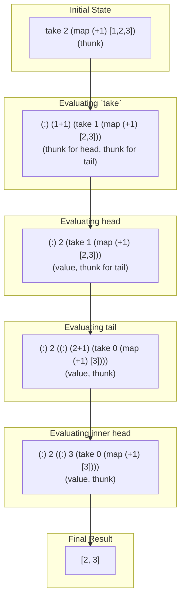

# 3. Haskell's Execution Model

## 3.1. Lazy Evaluation by Default

Haskell's execution model is fundamentally different from strict (eagerly evaluated) languages. The core concept is **lazy evaluation** (also known as call-by-need). This means that an expression is not evaluated until its result is actually required.

This has profound implications:

- **Efficiency**: Unnecessary computations are avoided.
- **Compositionality**: It's possible to compose programs in a more modular way.
- **Infinite Data Structures**: We can define and work with conceptually infinite data structures, as only the parts we inspect will be computed.

## 3.2. Thunks: The Heart of Laziness

When an expression is encountered, the Haskell runtime system does not immediately compute its value. Instead, it creates a **thunk**, which is essentially a promise to evaluate the expression later. A thunk contains two things:

1. The expression to be computed.
2. The environment (bindings for any variables) in which the expression exists.

When the value of the thunk is needed, the runtime system:

1. Evaluates the expression.
2. Replaces the thunk with the computed value (in Weak Head Normal Form).

This ensures that the computation is performed at most once. All future requests for the value will receive the already-computed result directly.

### Example: Working with an Infinite List

```haskell
-- `ones` is an infinite list of 1s.
-- This is only possible due to lazy evaluation.
ones :: [Int]
ones = 1 : ones

-- We can still work with it, because only the
-- necessary parts will be evaluated.
main :: IO ()
main = print (take 5 ones)

-- Output: [1,1,1,1,1]
```

### 3.3. Visualizing Thunk Evaluation

Let's visualize the evaluation of `take 2 (map (+1) [1,2,3])`.



This shows how the structure is built and evaluated piece by piece, only as needed. The `map` and `take` functions work in lockstep, rather than `map` processing the entire list first. This is the essence of Haskell's efficient, lazy execution model.
