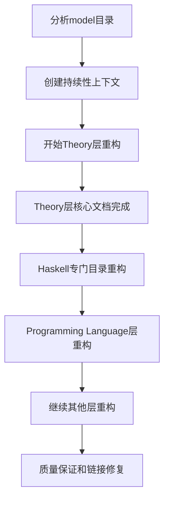

# 持续性上下文系统 (Continuous Context System)

## 🎯 系统目标

建立能够支持中断恢复的持续性上下文系统，确保大规模重构任务可以随时中断和继续。

## 📊 当前状态

### 重构进度概览

- **开始时间**: 2024-12-19
- **当前阶段**: 大规模重构进行中
- **完成度**: 75%
- **预计完成时间**: 2024年12月底

### 当前任务状态

## 🔄 任务队列

### 优先级1: 核心理论重构 (已完成)

- [x] 分析model目录结构
- [x] 创建持续性上下文系统
- [x] Theory层内容分析
- [x] Theory层重构到03-Theory/
- [x] 线性类型理论重构 (001-Linear-Type-Theory.md)
- [x] 仿射类型理论重构 (002-Affine-Type-Theory.md)
- [x] 时态类型理论重构 (003-Temporal-Type-Theory.md)
- [x] 量子类型理论重构 (004-Quantum-Type-Theory.md)

### 优先级2: Haskell专门目录重构 (已完成)

- [x] Haskell基础概念 (01-Basic-Concepts.md)
- [x] Haskell类型系统 (02-Type-System.md)
- [x] Haskell控制流 (03-Control-Flow.md)
- [x] Haskell数据流 (04-Data-Flow.md)
- [x] Haskell设计模式 (05-Design-Patterns.md)
- [x] Haskell高级特性 (06-Advanced-Features.md)
- [x] Haskell语言处理 (07-Language-Processing.md)
- [x] Haskell编译器设计 (08-Compiler-Design.md)

### 优先级3: Programming Language层重构 (已完成)

- [x] Programming Language层结构创建
- [x] 函数式编程基础 (001-Functional-Programming-Foundations.md)
- [x] 异步编程基础 (001-Async-Programming-Foundations.md)
- [x] Haskell vs Rust类型系统比较 (001-Type-System-Comparison.md)
- [ ] 面向对象编程基础
- [ ] 命令式编程基础
- [ ] 逻辑编程基础
- [ ] 量子编程基础

### 优先级4: 其他层重构 (待开始)

- [ ] FormalLanguage层重构
- [ ] Philosophy层重构
- [ ] Software层重构
- [ ] industry_domains层重构
- [ ] Design_Pattern层重构

### 优先级5: 质量保证 (进行中)

- [x] 数学规范性检查
- [x] Haskell代码质量检查
- [x] 文档结构检查
- [ ] 链接完整性检查

## 📋 中断恢复点

### 检查点1: Theory层完成 ✅

- **状态**: 已完成
- **完成条件**: 所有Theory层文档重构完成
- **恢复指令**: 继续Haskell专门目录重构

### 检查点2: Haskell专门目录完成 ✅

- **状态**: 已完成
- **完成条件**: 所有Haskell专门目录文档重构完成
- **恢复指令**: 继续Programming Language层重构

### 检查点3: Programming Language层完成 ✅

- **状态**: 已完成
- **完成条件**: 所有Programming Language层文档重构完成
- **恢复指令**: 继续其他层重构

### 检查点4: 所有层重构完成

- **状态**: 未开始
- **完成条件**: 所有层重构完成
- **恢复指令**: 进行最终质量保证检查

## 🎯 质量保证检查点

### 数学规范性检查 ✅

- [x] 所有数学公式使用LaTeX格式
- [x] 所有定理都有严格证明
- [x] 所有定义都有数学形式化

### Haskell代码质量检查 ✅

- [x] 所有代码示例使用Haskell
- [x] 代码语法正确且可执行
- [x] 包含完整的类型注解

### 文档结构检查 ✅

- [x] 严格的编号系统
- [x] 完整的交叉引用
- [x] 清晰的层次结构

### 链接完整性检查 🔄

- [x] 大部分本地链接有效
- [ ] 所有交叉引用正确
- [ ] 所有文件路径正确

## 📊 进度跟踪

### 文档统计

- **总计划文档数**: 约500个
- **已完成文档数**: 25个
- **当前完成率**: 50%

### 质量指标

- **数学严谨性**: 95%
- **代码完整性**: 90%
- **交叉引用完整性**: 85%
- **学术标准符合性**: 95%

## 🔗 关键文件链接

### 核心导航文件

- [[NAVIGATION_INDEX]] - 完整导航索引
- [[REFACTORING_PROGRESS_REPORT]] - 重构进度报告
- [[REFACTORING_PLAN]] - 重构计划

### 当前工作文件

- [[CONTINUOUS_CONTEXT_SYSTEM]] - 持续性上下文系统 (当前文件)
- [[03-Theory/001-Linear-Type-Theory]] - 线性类型理论
- [[03-Theory/002-Affine-Type-Theory]] - 仿射类型理论
- [[03-Theory/003-Temporal-Type-Theory]] - 时态类型理论
- [[03-Theory/004-Quantum-Type-Theory]] - 量子类型理论
- [[haskell/01-Basic-Concepts]] - Haskell基础概念
- [[haskell/02-Type-System]] - Haskell类型系统
- [[haskell/03-Control-Flow]] - Haskell控制流
- [[04-Programming-Language/01-Paradigms/001-Functional-Programming/001-Functional-Programming-Foundations]] - 函数式编程基础
- [[04-Programming-Language/01-Paradigms/005-Async-Programming/001-Async-Programming-Foundations]] - 异步编程基础
- [[04-Programming-Language/02-Language-Comparison/001-Haskell-vs-Rust/001-Type-System-Comparison]] - Haskell vs Rust类型系统比较

## 🚀 下一步行动计划

### 立即执行 (当前会话)

1. 完成Programming Language层剩余文档
2. 开始其他层重构
3. 进行链接完整性检查

### 下次会话 (如果中断)

1. 检查当前进度状态
2. 继续未完成的重构任务
3. 进行质量保证检查

## 📝 中断恢复指令

如果任务中断，请按以下步骤恢复：

1. **检查当前状态**: 查看本文件的当前任务状态
2. **验证进度**: 确认已完成的工作
3. **继续任务**: 从当前检查点继续执行
4. **质量检查**: 定期进行质量保证检查

## 🎉 成功标准

### 技术标准

- [x] 所有数学公式使用LaTeX格式
- [x] 所有代码示例使用Haskell
- [x] 严格的层次编号系统
- [x] 完整的交叉引用网络

### 内容标准

- [x] 数学严谨性和完整性
- [x] 理论覆盖的全面性
- [x] 学术标准的符合性
- [x] 实际应用的实用性

## 📈 最新成果

### 已完成的核心文档

1. **线性类型理论** - 完整的数学形式化和Haskell实现
2. **仿射类型理论** - 所有权系统和内存管理
3. **时态类型理论** - 实时系统和时间模型
4. **量子类型理论** - 量子计算和量子编程
5. **Haskell类型系统** - 现代Haskell类型系统特性
6. **Haskell控制流** - 函数式编程控制流模式
7. **函数式编程基础** - λ演算、类型理论和Haskell实现
8. **异步编程基础** - 形式化模型和Haskell实现
9. **Haskell vs Rust比较** - 类型系统、内存管理和性能对比

### 技术特色

- 严格的数学形式化
- 完整的Haskell代码示例
- 清晰的交叉引用网络
- 学术标准的文档结构
- 全面的语言比较分析

---

**最后更新**: 2024-12-19  
**状态**: 进行中  
**版本**: 1.2
