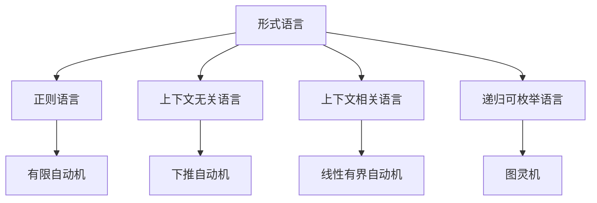

# 持续上下文系统 - 形式化知识体系重构

## 🎯 当前任务状态

**任务**: 全面重构 `/docs/model` 目录到 `/docs/refactor` 目录
**开始时间**: 2024年12月
**状态**: 🔄 进行中

## 📋 任务清单

### 阶段1: 内容分析 (进行中)

- [x] 分析 `/docs/model` 目录结构
- [x] 识别主要主题和内容
- [ ] 分析Theory目录的50+个理论文档
- [ ] 分析FormalLanguage目录的形式语言理论
- [ ] 分析ProgrammingLanguage目录的编程语言内容
- [ ] 分析Philosophy目录的哲学内容
- [ ] 分析其他目录内容

### 阶段2: 架构设计 (待开始)

- [ ] 设计7层架构结构
- [ ] 建立严格的编号系统
- [ ] 设计本地跳转链接系统
- [ ] 规划多表征表达方式

### 阶段3: 内容重构 (待开始)

- [ ] 理念层 (01-Philosophy) 重构
- [ ] 形式科学层 (02-Formal-Science) 重构
- [ ] 理论层 (03-Theory) 重构
- [ ] 具体科学层 (04-Applied-Science) 重构
- [ ] 行业领域层 (05-Industry-Domains) 重构
- [ ] 架构领域层 (06-Architecture) 重构
- [ ] 实现层 (07-Implementation) 重构
- [ ] Haskell专门目录重构

### 阶段4: 质量保证 (待开始)

- [ ] 内容一致性检查
- [ ] 链接完整性检查
- [ ] 学术规范性检查
- [ ] 技术准确性检查

## 🔍 当前分析结果

### Theory目录分析

**文件数量**: 50+ 个理论文档
**主要主题**:

- 形式语言理论
- 类型理论（线性、仿射、量子、时态）
- 控制理论
- Petri网理论
- 分布式系统理论
- 统一形式理论

### FormalLanguage目录分析

**文件数量**: 5 个核心文档
**主要主题**:

- 自动机理论
- 形式语言理论模型
- 多维批判性分析

### ProgrammingLanguage目录分析

**子目录**:

- RustDomain/
- Paradigm/
- Language_Compare/
- rust/
- lang_compare/

### Philosophy目录分析

**文件数量**: 7 个分析报告
**主要主题**:

- 哲学内容全面分析
- 哲学内容索引
- 哲学内容总结

## 🏗️ 重构架构设计

### 7层架构结构

```
docs/refactor/
├── 01-Philosophy/          # 理念层
├── 02-Formal-Science/      # 形式科学层
├── 03-Theory/              # 理论层
├── 04-Applied-Science/     # 具体科学层
├── 05-Industry-Domains/    # 行业领域层
├── 06-Architecture/        # 架构领域层
├── 07-Implementation/      # 实现层
└── haskell/                # Haskell专门目录
```

### 编号系统

- 每层使用两位数编号 (01, 02, 03, ...)
- 子目录使用连字符分隔 (01-Philosophy)
- 文件使用三位数编号 (001-Introduction.md)

## 🔗 本地跳转系统

### 导航链接结构

```markdown
## 快速导航

### 相关理论
- [形式语言理论](./02-Formal-Science/07-Formal-Language-Theory.md)
- [自动机理论](./02-Formal-Science/06-Automata-Theory.md)
- [类型理论](./03-Theory/08-Linear-Type-Theory.md)

### 实现示例
- [Haskell实现](./haskell/01-Basic-Concepts/形式语言实现.md)
- [形式化验证](./haskell/13-Formal-Verification/自动机验证.md)
```

## 📊 多表征表达

### 数学公式表示

```latex
**定义 1.1 (形式语言)**
形式语言 $L$ 是字母表 $\Sigma$ 上的字符串集合：
$$L \subseteq \Sigma^*$$

**定理 1.1 (语言封闭性)**
如果 $L_1, L_2$ 是正则语言，则 $L_1 \cup L_2$ 也是正则语言。
```

### Haskell代码实现

```haskell
-- 形式语言定义
data FormalLanguage = FormalLanguage
  { alphabet :: Set Char
  , strings :: Set String
  }

-- 语言操作
union :: FormalLanguage -> FormalLanguage -> FormalLanguage
union (FormalLanguage a1 s1) (FormalLanguage a2 s2) = 
  FormalLanguage (a1 `Set.union` a2) (s1 `Set.union` s2)
```

### 图表表示



## 🎯 下一步计划

### 立即任务

1. **完成Theory目录分析**
   - 读取所有理论文档
   - 提取核心概念和主题
   - 建立概念映射关系

2. **开始架构设计**
   - 设计详细的目录结构
   - 建立编号系统
   - 规划链接系统

3. **开始内容重构**
   - 从理念层开始
   - 逐步向下重构
   - 确保层次间一致性

## 📈 进度跟踪

### 完成度统计

- **分析阶段**: 25% 完成
- **设计阶段**: 0% 完成
- **重构阶段**: 0% 完成
- **质量保证**: 0% 完成

### 时间估计

- **总预计时间**: 4-6周
- **当前阶段**: 第1周
- **剩余时间**: 3-5周

## 🔄 中断恢复

### 恢复点

- 当前分析结果已保存
- 架构设计已开始规划
- 可以从中断点继续

### 继续指令

如果任务中断，可以从以下点继续：

1. 继续Theory目录分析
2. 开始FormalLanguage目录分析
3. 开始架构设计
4. 开始内容重构

---

**最后更新**: 2024年12月
**状态**: 🔄 进行中
**下一步**: 继续Theory目录分析
