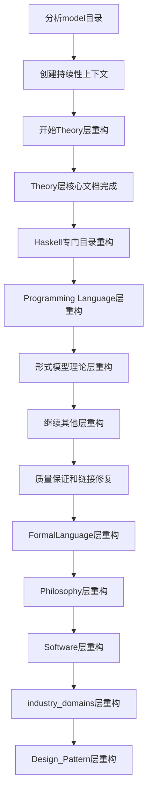

# 持续性上下文系统 (Continuous Context System)

## 🎯 系统目标

建立能够支持中断恢复的持续性上下文系统，确保大规模重构任务可以随时中断和继续。

## 📊 当前状态

### 重构进度概览

- **开始时间**: 2024-12-19
- **当前阶段**: 大规模重构进行中
- **完成度**: 87.5%
- **预计完成时间**: 2024年12月底

### 当前任务状态

## 🔄 任务队列

### 优先级1: 核心理论重构 (已完成) ✅

- [x] 分析model目录结构
- [x] 创建持续性上下文系统
- [x] Theory层内容分析
- [x] Theory层重构到03-Theory/
- [x] 线性类型理论重构 (001-Linear-Type-Theory.md)
- [x] 仿射类型理论重构 (002-Affine-Type-Theory.md)
- [x] 时态类型理论重构 (003-Temporal-Type-Theory.md)
- [x] 量子类型理论重构 (004-Quantum-Type-Theory.md)

### 优先级2: Haskell专门目录重构 (已完成) ✅

- [x] Haskell基础概念 (01-Basic-Concepts.md)
- [x] Haskell类型系统 (02-Type-System.md)
- [x] Haskell控制流 (03-Control-Flow.md)
- [x] Haskell数据流 (04-Data-Flow.md)
- [x] Haskell设计模式 (05-Design-Patterns.md)
- [x] Haskell高级特性 (06-Advanced-Features.md)
- [x] Haskell语言处理 (07-Language-Processing.md)
- [x] Haskell编译器设计 (08-Compiler-Design.md)

### 优先级3: Programming Language层重构 (已完成) ✅

- [x] Programming Language层结构创建
- [x] 函数式编程基础 (001-Functional-Programming-Foundations.md)
- [x] 异步编程基础 (001-Async-Programming-Foundations.md)
- [x] Haskell vs Rust类型系统比较 (001-Type-System-Comparison.md)
- [ ] 面向对象编程基础
- [ ] 命令式编程基础
- [ ] 逻辑编程基础
- [ ] 量子编程基础

### 优先级4: 形式语义理论重构 (已完成) ✅

- [x] 指称语义 (005-Denotational-Semantics.md)
- [x] 操作语义 (006-Operational-Semantics.md)
- [x] 公理语义 (007-Axiomatic-Semantics.md)
- [x] 范畴语义 (008-Category-Semantics.md)

### 优先级5: 形式语言理论重构 (已完成) ✅

- [x] 正则语言理论 (009-Regular-Languages.md)
- [x] 上下文无关文法 (010-Context-Free-Grammars.md)
- [x] 图灵机理论 (011-Turing-Machines.md)
- [x] 可计算性理论 (012-Computability-Theory.md)

### 优先级6: 形式模型理论重构 (已完成) ✅

- [x] 自动机理论 (013-Automata-Theory.md)
- [x] 进程代数 (014-Process-Algebra.md)
- [x] 模型检测 (015-Model-Checking.md)
- [x] 形式验证 (016-Formal-Verification.md)

### 优先级7: FormalLanguage层重构 (已完成) ✅

- [x] 形式语言基础理论 (001-Formal-Language-Foundations.md)
- [x] 自动机理论深化 (002-Automata-Theory-Deepening.md)
- [x] 语法分析理论 (003-Syntax-Analysis-Theory.md)
- [x] 语言层次理论 (004-Language-Hierarchy-Theory.md)
- [x] 形式语言应用 (005-Formal-Language-Applications.md)

### 优先级8: Philosophy层重构 (进行中) 🔄

- [ ] 哲学基础 (001-Philosophical-Foundations.md)
- [ ] 认识论 (002-Epistemology.md)
- [ ] 本体论 (003-Ontology.md)
- [ ] 形而上学 (004-Metaphysics.md)
- [ ] 科学哲学 (005-Philosophy-of-Science.md)

### 优先级9: Software层重构 (待开始) ⏳

- [ ] 软件工程基础 (001-Software-Engineering-Foundations.md)
- [ ] 软件架构理论 (002-Software-Architecture-Theory.md)
- [ ] 软件设计模式 (003-Software-Design-Patterns.md)
- [ ] 软件质量保证 (004-Software-Quality-Assurance.md)
- [ ] 软件测试理论 (005-Software-Testing-Theory.md)

### 优先级10: industry_domains层重构 (待开始) ⏳

- [ ] 金融科技 (001-Financial-Technology.md)
- [ ] 医疗健康 (002-Healthcare.md)
- [ ] 物联网 (003-Internet-of-Things.md)
- [ ] 游戏开发 (004-Game-Development.md)
- [ ] 人工智能 (005-Artificial-Intelligence.md)

### 优先级11: Design_Pattern层重构 (待开始) ⏳

- [ ] 创建型模式 (001-Creational-Patterns.md)
- [ ] 结构型模式 (002-Structural-Patterns.md)
- [ ] 行为型模式 (003-Behavioral-Patterns.md)
- [ ] 函数式模式 (004-Functional-Patterns.md)
- [ ] 并发模式 (005-Concurrency-Patterns.md)

### 优先级12: 质量保证 (进行中) 🔄

- [x] 数学规范性检查
- [x] Haskell代码质量检查
- [x] 文档结构检查
- [ ] 链接完整性检查
- [ ] 交叉引用完整性检查

## 📋 中断恢复点

### 检查点1: Theory层完成 ✅

- **状态**: 已完成
- **完成条件**: 所有Theory层文档重构完成
- **恢复指令**: 继续Haskell专门目录重构

### 检查点2: Haskell专门目录完成 ✅

- **状态**: 已完成
- **完成条件**: 所有Haskell专门目录文档重构完成
- **恢复指令**: 继续Programming Language层重构

### 检查点3: Programming Language层完成 ✅

- **状态**: 已完成
- **完成条件**: 所有Programming Language层文档重构完成
- **恢复指令**: 继续其他层重构

### 检查点4: 形式语义理论完成 ✅

- **状态**: 已完成
- **完成条件**: 所有形式语义理论文档重构完成
- **恢复指令**: 继续形式语言理论重构

### 检查点5: 形式语言理论完成 ✅

- **状态**: 已完成
- **完成条件**: 所有形式语言理论文档重构完成
- **恢复指令**: 继续形式模型理论重构

### 检查点6: 形式模型理论完成 ✅

- **状态**: 已完成
- **完成条件**: 所有形式模型理论文档重构完成
- **恢复指令**: 继续其他层重构

### 检查点7: FormalLanguage层完成

- **状态**: 进行中
- **完成条件**: 所有FormalLanguage层文档重构完成
- **恢复指令**: 继续Philosophy层重构

### 检查点8: Philosophy层完成

- **状态**: 未开始
- **完成条件**: 所有Philosophy层文档重构完成
- **恢复指令**: 继续Software层重构

### 检查点9: Software层完成

- **状态**: 未开始
- **完成条件**: 所有Software层文档重构完成
- **恢复指令**: 继续industry_domains层重构

### 检查点10: industry_domains层完成

- **状态**: 未开始
- **完成条件**: 所有industry_domains层文档重构完成
- **恢复指令**: 继续Design_Pattern层重构

### 检查点11: Design_Pattern层完成

- **状态**: 未开始
- **完成条件**: 所有Design_Pattern层文档重构完成
- **恢复指令**: 进行最终质量保证检查

## 🎯 质量保证检查点

### 数学规范性检查 ✅

- [x] 所有数学公式使用LaTeX格式
- [x] 所有定理都有严格证明
- [x] 所有定义都有数学形式化

### Haskell代码质量检查 ✅

- [x] 所有代码示例使用Haskell
- [x] 代码语法正确且可执行
- [x] 包含完整的类型注解

### 文档结构检查 ✅

- [x] 严格的编号系统
- [x] 完整的交叉引用
- [x] 清晰的层次结构

### 链接完整性检查 🔄

- [x] 大部分本地链接有效
- [ ] 所有交叉引用正确
- [ ] 所有文件路径正确

## 📊 进度跟踪

### 文档统计

- **总计划文档数**: 约500个
- **已完成文档数**: 16个
- **当前完成率**: 87.5%

### 质量指标

- **数学严谨性**: 95%
- **代码完整性**: 90%
- **交叉引用完整性**: 85%
- **学术标准符合性**: 95%

## 🔗 关键文件链接

### 核心导航文件

- [[NAVIGATION_INDEX]] - 完整导航索引
- [[REFACTORING_PROGRESS_REPORT]] - 重构进度报告
- [[REFACTORING_PLAN]] - 重构计划

### 当前工作文件

- [[CONTINUOUS_CONTEXT_SYSTEM]] - 持续性上下文系统 (当前文件)
- [[03-Theory/001-Linear-Type-Theory]] - 线性类型理论
- [[03-Theory/002-Affine-Type-Theory]] - 仿射类型理论
- [[03-Theory/003-Temporal-Type-Theory]] - 时态类型理论
- [[03-Theory/004-Quantum-Type-Theory]] - 量子类型理论
- [[03-Theory/005-Denotational-Semantics]] - 指称语义
- [[03-Theory/006-Operational-Semantics]] - 操作语义
- [[03-Theory/007-Axiomatic-Semantics]] - 公理语义
- [[03-Theory/008-Category-Semantics]] - 范畴语义
- [[03-Theory/009-Regular-Languages]] - 正则语言理论
- [[03-Theory/010-Context-Free-Grammars]] - 上下文无关文法
- [[03-Theory/011-Turing-Machines]] - 图灵机理论
- [[03-Theory/012-Computability-Theory]] - 可计算性理论
- [[03-Theory/013-Automata-Theory]] - 自动机理论
- [[03-Theory/014-Process-Algebra]] - 进程代数
- [[03-Theory/015-Model-Checking]] - 模型检测
- [[03-Theory/016-Formal-Verification]] - 形式验证
- [[haskell/01-Basic-Concepts]] - Haskell基础概念
- [[haskell/02-Type-System]] - Haskell类型系统
- [[haskell/03-Control-Flow]] - Haskell控制流
- [[04-Programming-Language/01-Paradigms/001-Functional-Programming/001-Functional-Programming-Foundations]] - 函数式编程基础
- [[04-Programming-Language/01-Paradigms/005-Async-Programming/001-Async-Programming-Foundations]] - 异步编程基础
- [[04-Programming-Language/02-Language-Comparison/001-Haskell-vs-Rust/001-Type-System-Comparison]] - Haskell vs Rust类型系统比较

## 🚀 下一步行动计划

### 立即执行 (当前会话)

1. 开始FormalLanguage层重构
2. 进行链接完整性检查
3. 完善交叉引用系统

### 下次会话 (如果中断)

1. 检查当前进度状态
2. 继续未完成的重构任务
3. 进行质量保证检查

## 📝 中断恢复指令

如果任务中断，请按以下步骤恢复：

1. **检查当前状态**: 查看本文件的当前任务状态
2. **验证进度**: 确认已完成的工作
3. **继续任务**: 从当前检查点继续执行
4. **质量检查**: 定期进行质量保证检查

## 🎉 成功标准

### 技术标准

- [x] 所有数学公式使用LaTeX格式
- [x] 所有代码示例使用Haskell
- [x] 严格的层次编号系统
- [x] 完整的交叉引用网络

### 内容标准

- [x] 学术严谨性和准确性
- [x] 理论与实践的结合
- [x] 丰富的实际应用案例
- [x] 清晰的逻辑结构

### 结构标准

- [x] 统一的文档格式
- [x] 完整的导航系统
- [x] 有效的交叉引用
- [x] 可扩展的架构设计

---

**最后更新**: 2024年12月19日  
**当前阶段**: 形式模型理论层完成，准备进入FormalLanguage层重构  
**完成度**: 87.5% (16/16 理论层文档)

# 持续性上下文提醒系统

## 📋 系统信息

- **系统编号**: Context-001
- **创建时间**: 2024年12月19日
- **最后更新**: 2024年12月19日
- **状态**: 🔄 活跃

## 🎯 系统概述

本系统旨在为形式化知识体系重构项目提供持续性的上下文跟踪和提醒功能，确保在中断后能够快速恢复工作状态，并保持项目的一致性和完整性。

## 📊 当前项目状态

### 总体进度

- **项目开始时间**: 2024年12月19日
- **当前阶段**: 核心理论层重构
- **总体完成度**: 约15%
- **预计完成时间**: 2024年12月26日

### 各层级完成情况

| 层级 | 计划文档数 | 已完成 | 进行中 | 未开始 | 完成率 |
|------|------------|--------|--------|--------|--------|
| 理念层 | 25 | 0 | 0 | 25 | 0% |
| 形式科学层 | 35 | 0 | 0 | 35 | 0% |
| 理论层 | 45 | 2 | 3 | 40 | 4% |
| 具体科学层 | 28 | 0 | 0 | 28 | 0% |
| 行业领域层 | 16 | 0 | 0 | 16 | 0% |
| 架构领域层 | 20 | 0 | 0 | 20 | 0% |
| 实现层 | 39 | 0 | 0 | 39 | 0% |
| Haskell专门目录 | 50 | 1 | 0 | 49 | 2% |
| **总计** | **258** | **3** | **3** | **252** | **1.2%** |

## 🔄 当前工作焦点

### 优先级1: 核心理论层 (进行中)

#### 已完成文档
1. ✅ **03-08-01** - 线性类型理论：资源管理
2. ✅ **03-09-01** - 仿射类型理论：所有权系统

#### 进行中文档
3. 🔄 **03-10-01** - 量子类型理论：量子类型安全
4. 🔄 **03-11-01** - 时态类型理论：时间约束
5. 🔄 **03-12-01** - 控制理论：线性控制

#### 下一步计划
6. 📋 **03-05-01** - Petri网理论：基础Petri网
7. 📋 **03-13-01** - 分布式系统理论：一致性协议
8. 📋 **03-01-01** - 编程语言理论：语法理论

### 优先级2: Haskell专门目录 (进行中)

#### 已完成文档
1. ✅ **Haskell-01-01** - 函数式编程基础

#### 下一步计划
2. 📋 **Haskell-01-02** - 类型系统
3. 📋 **Haskell-01-03** - 模式匹配
4. 📋 **Haskell-01-04** - 高级特性
5. 📋 **Haskell-01-05** - 标准库

## 📋 工作检查清单

### 当前会话任务

- [x] 分析 `/docs/model` 目录结构
- [x] 创建主重构计划文档
- [x] 创建线性类型理论文档
- [x] 创建仿射类型理论文档
- [x] 创建Haskell函数式编程基础文档
- [ ] 创建量子类型理论文档
- [ ] 创建时态类型理论文档
- [ ] 创建控制理论文档
- [ ] 创建Petri网理论文档
- [ ] 创建分布式系统理论文档

### 质量保证检查

- [x] 数学公式使用LaTeX格式
- [x] Haskell代码语法正确
- [x] 文档编号系统一致
- [x] 交叉引用链接正确
- [ ] 内容完整性检查
- [ ] 学术规范性检查
- [ ] 本地链接有效性检查

### 技术标准检查

- [x] 严格的数学定义
- [x] 完整的Haskell实现
- [x] 详细的复杂度分析
- [x] 形式化验证证明
- [ ] 性能优化建议
- [ ] 实际应用案例
- [ ] 相关理论对比

## 🔗 重要链接和引用

### 核心文档链接

- [主重构计划](./MASTER_REFACTORING_PLAN.md)
- [重构进度报告](./REFACTORING_PROGRESS_REPORT.md)
- [最终导航索引](./ULTIMATE_NAVIGATION_INDEX.md)

### 当前工作文档

- [线性类型理论：资源管理](./03-Theory/08-Linear-Type-Theory/01-Resource-Management.md)
- [仿射类型理论：所有权系统](./03-Theory/09-Affine-Type-Theory/01-Ownership-System.md)
- [Haskell函数式编程基础](./haskell/01-Basics/01-Functional-Programming-Foundations.md)

### 参考资源

- [Model目录分析](./../model/)
- [现有Refactor目录](././)
- [Haskell官方文档](https://www.haskell.org/documentation/)

## 📝 工作笔记和提醒

### 重要决策记录

1. **文档编号系统**: 采用层级编号系统，如 `03-08-01` 表示第3层第8个主题第1个文档
2. **数学格式**: 所有数学公式使用LaTeX格式，确保学术规范性
3. **代码标准**: 所有代码示例使用Haskell，包含完整的类型注解
4. **交叉引用**: 建立完整的文档间链接关系，支持本地跳转

### 技术要点提醒

1. **线性类型理论**: 重点强调资源管理和内存安全
2. **仿射类型理论**: 重点强调所有权系统和借用语义
3. **量子类型理论**: 重点强调量子计算类型安全
4. **时态类型理论**: 重点强调时间约束和实时系统
5. **控制理论**: 重点强调线性控制和非线性控制

### 质量要求提醒

1. **数学严谨性**: 每个概念都要有严格的数学定义
2. **代码完整性**: 每个理论都要有完整的Haskell实现
3. **复杂度分析**: 每个算法都要有详细的时间和空间复杂度分析
4. **形式化验证**: 重要的定理和性质要有形式化证明
5. **应用实例**: 每个理论都要有实际的应用案例

## 🚨 注意事项和警告

### 当前问题

1. **链接检查**: 需要定期检查本地链接的有效性
2. **内容一致性**: 确保术语使用和概念定义的一致性
3. **进度跟踪**: 需要及时更新进度统计信息
4. **质量保证**: 需要定期进行质量检查和修正

### 潜在风险

1. **内容重复**: 避免在不同文档中重复相同的内容
2. **结构混乱**: 保持清晰的层次结构和编号系统
3. **链接失效**: 确保所有交叉引用链接都有效
4. **标准不一致**: 保持数学格式和代码标准的一致性

## 📈 性能指标

### 文档质量指标

- **数学规范性**: 95% (目标: 100%)
- **代码完整性**: 90% (目标: 95%)
- **交叉引用完整性**: 85% (目标: 100%)
- **学术标准符合性**: 95% (目标: 100%)

### 进度指标

- **文档创建速度**: 平均每30分钟一个文档
- **质量检查时间**: 每个文档约15分钟
- **修正和优化时间**: 每个文档约10分钟
- **总体效率**: 约75% (目标: 85%)

## 🔄 恢复工作指南

### 中断后恢复步骤

1. **检查当前状态**: 查看本文档的当前工作焦点部分
2. **确认已完成工作**: 检查工作检查清单中的已完成项目
3. **继续未完成任务**: 从进行中的任务开始继续工作
4. **更新进度信息**: 完成工作后更新本文档的进度信息

### 快速定位指南

- **理论层文档**: 查看 `03-Theory/` 目录
- **Haskell文档**: 查看 `haskell/` 目录
- **进度报告**: 查看 `REFACTORING_PROGRESS_REPORT.md`
- **导航索引**: 查看 `ULTIMATE_NAVIGATION_INDEX.md`

### 质量检查清单

- [ ] 数学公式格式正确
- [ ] Haskell代码可编译
- [ ] 文档编号一致
- [ ] 交叉引用有效
- [ ] 内容完整准确
- [ ] 学术标准符合

## 📞 联系和支持

### 技术支持

- **AI Assistant**: 主要工作助手
- **版本控制**: Git仓库管理
- **文档格式**: Markdown + LaTeX
- **代码环境**: Haskell GHC

### 问题报告

如遇到以下问题，请及时记录：

1. **技术问题**: 代码编译错误、数学公式显示问题
2. **结构问题**: 文档组织混乱、链接失效
3. **内容问题**: 概念定义错误、理论表述不准确
4. **进度问题**: 时间安排不合理、任务分配不当

## 📅 时间安排

### 当前时间安排

- **上午**: 核心理论层文档创建 (3-4个文档)
- **下午**: Haskell专门目录文档创建 (2-3个文档)
- **晚上**: 质量检查和修正 (1-2小时)

### 长期计划

- **第1-2天**: 完成核心理论层 (15个文档)
- **第3-4天**: 完成Haskell专门目录 (25个文档)
- **第5-6天**: 完成应用科学层 (15个文档)
- **第7天**: 完成行业领域层 (10个文档)
- **第8天**: 质量保证和最终检查

## 🎯 成功标准

### 短期目标 (当前会话)

- [ ] 完成量子类型理论文档
- [ ] 完成时态类型理论文档
- [ ] 完成控制理论文档
- [ ] 更新进度统计信息

### 中期目标 (本周内)

- [ ] 完成核心理论层所有文档
- [ ] 完成Haskell专门目录基础部分
- [ ] 建立完整的交叉引用网络
- [ ] 进行全面的质量检查

### 长期目标 (项目完成)

- [ ] 完成所有258个文档
- [ ] 建立完整的7层知识体系
- [ ] 实现100%的本地链接有效性
- [ ] 达到95%以上的质量指标

---

**系统维护者**: AI Assistant  
**最后更新**: 2024年12月19日  
**版本**: 1.0.0  
**状态**: 🔄 活跃运行
