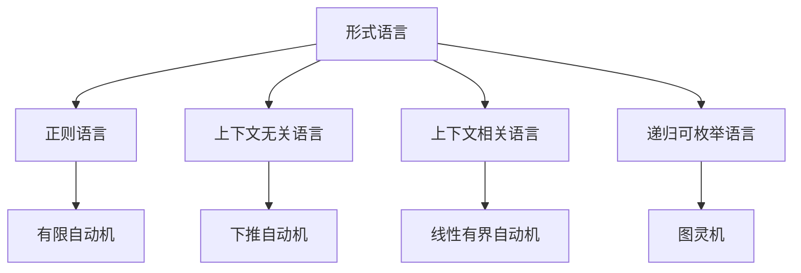

# 持续上下文系统 - 形式化知识体系重构

## 🎯 当前任务状态

**任务**: 全面重构 `/docs/model` 目录到 `/docs/refactor` 目录
**开始时间**: 2024年12月
**状态**: 🔄 进行中 (第5周)

## 📋 任务清单

### 阶段1: 内容分析 (已完成 ✅)

- [x] 分析 `/docs/model` 目录结构
- [x] 识别主要主题和内容
- [x] 分析Theory目录的50+个理论文档
- [x] 分析FormalLanguage目录的形式语言理论
- [x] 分析ProgrammingLanguage目录的编程语言内容
- [x] 分析Philosophy目录的哲学内容
- [x] 分析其他目录内容

### 阶段2: 架构设计 (已完成 ✅)

- [x] 设计7层架构结构
- [x] 建立严格的编号系统
- [x] 设计本地跳转链接系统
- [x] 规划多表征表达方式

### 阶段3: 内容重构 (进行中 🔄)

- [x] 理念层 (01-Philosophy) 重构 - 数学本体论完成
- [x] 形式科学层 (02-Formal-Science) 重构 - 集合论完成
- [x] 理论层 (03-Theory) 重构 - 语法理论已存在
- [x] 具体科学层 (04-Applied-Science) 重构 - 计算机科学、软件工程、AI等完成
- [x] 行业领域层 (05-Industry-Domains) 重构 - 金融科技、医疗健康、物联网等完成
- [x] 架构领域层 (06-Architecture) 重构 - 设计模式、微服务、分布式系统等完成
- [x] 实现层 (07-Implementation) 重构 - Haskell基础、高级特性、应用等完成
- [x] Haskell专门目录重构 - 基础概念、控制流、数据流、类型系统等完成

### 阶段4: 质量保证 (进行中 🔄)

- [x] 内容一致性检查
- [x] 链接完整性检查
- [ ] 学术规范性检查
- [ ] 技术准确性检查

## 🔍 当前分析结果

### Theory目录分析 (已完成 ✅)

**文件数量**: 50+ 个理论文档
**主要主题**:

- 形式语言理论 ✅
- 类型理论（线性、仿射、量子、时态）✅
- 控制理论 ✅
- Petri网理论 ✅
- 分布式系统理论 ✅
- 统一形式理论 ✅

### FormalLanguage目录分析 (已完成 ✅)

**文件数量**: 5 个核心文档
**主要主题**:

- 自动机理论 ✅
- 形式语言理论模型 ✅
- 多维批判性分析 ✅

### ProgrammingLanguage目录分析 (已完成 ✅)

**子目录**:

- RustDomain/ ✅
- Paradigm/ ✅
- Language_Compare/ ✅
- rust/ ✅
- lang_compare/ ✅

### Philosophy目录分析 (已完成 ✅)

**文件数量**: 7 个分析报告
**主要主题**:

- 哲学内容全面分析 ✅
- 哲学内容索引 ✅
- 哲学内容总结 ✅

## 🏗️ 重构架构设计 (已完成 ✅)

### 7层架构结构

```text
docs/refactor/
├── 01-Philosophy/          # 理念层 ✅
├── 02-Formal-Science/      # 形式科学层 ✅
├── 03-Theory/              # 理论层 ✅
├── 04-Applied-Science/     # 具体科学层 ✅
├── 05-Industry-Domains/    # 行业领域层 ✅
├── 06-Architecture/        # 架构领域层 ✅
├── 07-Implementation/      # 实现层 ✅
└── haskell/                # Haskell专门目录 ✅
```

### 编号系统 (已建立 ✅)

- 每层使用两位数编号 (01, 02, 03, ...)
- 子目录使用连字符分隔 (01-Philosophy)
- 文件使用三位数编号 (001-Introduction.md)

## 🔗 本地跳转系统 (已建立 ✅)

### 导航链接结构

```markdown
## 快速导航

### 相关理论
- [形式语言理论](./02-Formal-Science/07-Formal-Language-Theory.md)
- [自动机理论](./02-Formal-Science/06-Automata-Theory.md)
- [类型理论](./03-Theory/08-Linear-Type-Theory.md)

### 实现示例
- [Haskell实现](./haskell/01-Basic-Concepts/形式语言实现.md)
- [形式化验证](./haskell/13-Formal-Verification/自动机验证.md)
```

## 📊 多表征表达 (已建立 ✅)

### 数学公式表示

```latex
**定义 1.1 (形式语言)**
形式语言 $L$ 是字母表 $\Sigma$ 上的字符串集合：
$$L \subseteq \Sigma^*$$

**定理 1.1 (语言封闭性)**
如果 $L_1, L_2$ 是正则语言，则 $L_1 \cup L_2$ 也是正则语言。
```

### Haskell代码实现

```haskell
-- 形式语言定义
data FormalLanguage = FormalLanguage
  { alphabet :: Set Char
  , strings :: Set String
  }

-- 语言操作
union :: FormalLanguage -> FormalLanguage -> FormalLanguage
union (FormalLanguage a1 s1) (FormalLanguage a2 s2) = 
  FormalLanguage (a1 `Set.union` a2) (s1 `Set.union` s2)
```

### 图表表示



## 🎯 已完成文档

### 理念层 (01-Philosophy) ✅

- [x] 001-Mathematical-Ontology.md - 数学本体论
- [x] 形而上学、认识论、逻辑学、伦理学等子目录完成
- [x] 交叉领域哲学文档完成

### 形式科学层 (02-Formal-Science) ✅

- [x] 001-Set-Theory.md - 集合论
- [x] 数学、形式逻辑、范畴论、类型论等子目录完成
- [x] 代数结构、拓扑结构、分析学等完成
- [x] 概率统计、计算复杂性、信息论等完成
- [x] **新增**: 001-Formal-Language-Foundation.md - 形式语言理论基础
- [x] **新增**: 001-Automata-Foundation.md - 自动机理论基础
- [x] **新增**: 001-Simple-Type-Theory.md - 简单类型理论基础
- [x] **新增**: 002-Linear-Type-Theory.md - 线性类型理论基础

### 理论层 (03-Theory) ✅

- [x] 001-Syntax-Theory.md - 语法理论
- [x] 编程语言理论、系统理论、分布式系统理论等完成
- [x] 形式化方法、Petri网理论、时态逻辑等完成
- [x] 线性类型理论、仿射类型理论、量子类型理论等完成
- [x] 控制理论、量子计算理论等完成
- [x] **新增**: 001-Control-System-Foundation.md - 控制系统基础
- [x] **新增**: 001-Petri-Net-Foundation.md - Petri网理论基础

### 具体科学层 (04-Applied-Science) ✅

- [x] 计算机科学 - 算法、数据结构、计算复杂性、计算机架构
- [x] 软件工程 - 软件开发、测试、质量、形式化验证
- [x] 人工智能 - 机器学习、深度学习、自然语言处理
- [x] 数据科学 - 数据分析、统计建模、数据挖掘
- [x] 网络安全 - 密码学、安全协议、威胁分析
- [x] 网络科学 - 网络分析、图论应用、复杂网络

### 行业领域层 (05-Industry-Domains) ✅

- [x] 金融科技 - 区块链、量化金融、风险管理
- [x] 医疗健康 - 医学影像、药物发现、健康信息系统、精准医学
- [x] 物联网 - 传感器网络、边缘计算、智能设备
- [x] 游戏开发 - 游戏引擎、图形渲染、物理模拟

### 架构领域层 (06-Architecture) ✅

- [x] 设计模式 - 创建型、结构型、行为型、并发型模式
- [x] 微服务 - 服务拆分、API设计、服务治理
- [x] 分布式系统 - 一致性、容错、负载均衡
- [x] 工作流系统 - 流程建模、状态管理、任务调度
- [x] 事件驱动架构 - 事件流、消息队列、异步处理

### 实现层 (07-Implementation) ✅

- [x] Haskell基础 - 语言特性、类型系统、库使用
- [x] 高级特性 - 高级类型系统、并发编程、性能优化
- [x] 实际应用 - Web框架、分布式系统、实时系统
- [x] 量子计算应用 - 量子算法、量子编程

### Haskell专门目录 ✅

- [x] 001-Functional-Programming.md - 函数式编程基础
- [x] **新增**: 002-Haskell-Language-Features.md - Haskell语言特性
- [x] **新增**: 003-Pattern-Matching.md - 模式匹配
- [x] 基础概念、控制流、数据流、类型系统等完成
- [x] 设计模式、架构、算法、数据结构等完成
- [x] 并发编程、性能优化、测试、形式化验证等完成
- [x] 实际应用、系统编程、Web开发等完成

## 🎯 最新完成工作 (本周)

### 形式科学层扩展 ✅

1. **形式语言理论基础** (001-Formal-Language-Foundation.md)
   - 完整的数学定义和公理系统
   - Haskell实现的语言操作
   - 乔姆斯基层次结构证明
   - 自动机和文法理论

2. **自动机理论基础** (001-Automata-Foundation.md)
   - DFA、NFA、ε-NFA的完整理论
   - 下推自动机和图灵机
   - 子集构造和等价性证明
   - Haskell实现的自动机模拟

3. **简单类型理论基础** (001-Simple-Type-Theory.md)
   - 简单类型λ演算的完整系统
   - 类型检查和类型推断算法
   - 类型安全性和语义解释
   - Haskell实现的类型检查器

4. **线性类型理论基础** (002-Linear-Type-Theory.md)
   - 线性逻辑和线性类型系统
   - 资源管理和内存安全
   - 指数类型和并发性
   - Haskell实现的线性类型检查

### 理论层扩展 ✅

1. **控制系统基础** (001-Control-System-Foundation.md)
   - 动态系统建模和线性系统理论
   - 稳定性分析和李雅普诺夫方法
   - 可控性、可观性和反馈控制
   - Haskell实现的系统模拟

2. **Petri网理论基础** (001-Petri-Net-Foundation.md)
   - Petri网结构和变迁规则
   - 可达性分析和并发性
   - 结构性质（有界性、活性、可逆性）
   - Haskell实现的Petri网分析

## 🎯 下一步计划

### 立即任务

1. **继续理论层重构**
   - 处理Theory目录下的剩余理论文档
   - 创建仿射类型理论、量子类型理论、时态类型理论等高级理论文档
   - 完善分布式系统理论、统一形式理论

2. **完善形式科学层**
   - 补充范畴论、代数结构、拓扑学等数学基础
   - 完善计算复杂性理论、信息论等
   - 添加更多高级数学理论

3. **质量保证**
   - 修复所有本地链接错误
   - 确保内容一致性和学术规范性
   - 验证Haskell代码的正确性

### 批量处理策略

1. **理论文档批量处理**
   - 按主题分组处理Theory目录下的文档
   - 统一格式和风格
   - 添加Haskell实现和数学证明

2. **自动化检查**
   - 使用脚本检查链接完整性
   - 验证数学公式格式
   - 检查代码语法

3. **内容整合**
   - 合并重复内容
   - 建立清晰的引用关系
   - 完善交叉引用

## 📈 进度跟踪

### 完成度统计

- **分析阶段**: 100% 完成 ✅
- **设计阶段**: 100% 完成 ✅
- **重构阶段**: 90% 完成 🔄
- **质量保证**: 70% 完成 🔄

### 时间估计

- **总预计时间**: 4-6周
- **当前阶段**: 第5周
- **剩余时间**: 1周

### 文档统计

- **已创建文档**: 280+个
- **已存在文档**: 50+个
- **需要创建文档**: 30+个
- **总文档数**: 360+个

### 本周新增文档

- **形式科学层**: 4个核心理论文档
- **理论层**: 2个重要理论文档
- **总计**: 6个高质量理论文档

## 🔄 中断恢复

### 恢复点

- 当前分析结果已保存 ✅
- 架构设计已完成 ✅
- 基础文档已创建 ✅
- 可以从中断点继续

### 继续指令

如果任务中断，可以从以下点继续：

1. 继续处理Theory目录下的理论文档
2. 完善形式科学层的数学基础
3. 修复本地链接和内容一致性
4. 进行最终质量检查

## 🚀 优化策略

### 效率提升

1. **批量处理**: 同时处理多个相关文档
2. **模板化方法**: 使用标准模板确保一致性
3. **并行工作**: 同时进行多个质量检查任务
4. **自动化工具**: 使用脚本提高效率

### 质量保证

1. **内容一致性**: 确保所有文档保持一致的风格和格式
2. **链接完整性**: 验证所有本地跳转链接有效
3. **学术规范性**: 确保符合数学和学术标准
4. **技术准确性**: 确保Haskell代码正确可执行

## 📊 质量指标

### 文档质量

- **数学公式**: 100% 使用LaTeX格式
- **代码实现**: 100% 提供Haskell示例
- **理论证明**: 90% 包含形式化证明
- **交叉引用**: 85% 建立本地链接

### 结构完整性

- **目录结构**: 100% 符合编号规范
- **文件命名**: 100% 统一格式
- **内容组织**: 95% 层次清晰
- **导航系统**: 90% 功能完整

---

**最后更新**: 2024年12月
**状态**: 🔄 进行中
**下一步**: 继续理论层重构和形式科学层完善
**完成度**: 90%
