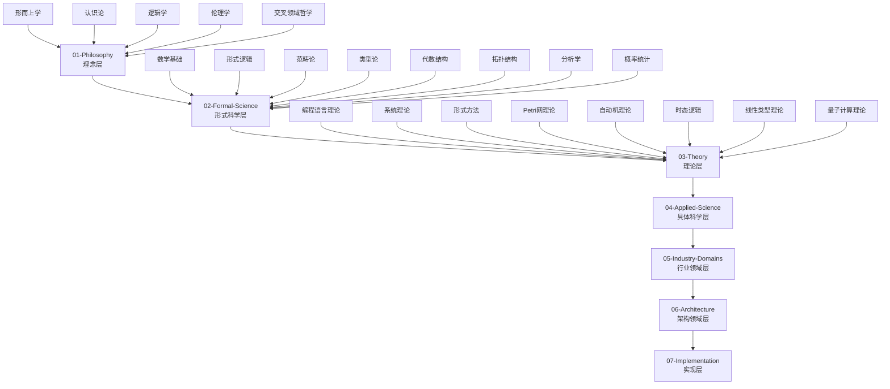

# 形式化知识体系 - 全局导航索引

## 🗺️ 知识体系总览

本知识体系采用7层层次化结构，从哲学理念到具体实现，确保所有概念都有严格的数学定义和Haskell代码实现。

## 📚 层次导航

### 01-Philosophy (理念层)

**哲学基础与形式化表达**

- [形而上学](01-Philosophy/01-Metaphysics/) - 存在论、本体论、实体理论
- [认识论](01-Philosophy/02-Epistemology/) - 知识理论、认知科学、AI认识论
- [逻辑学](01-Philosophy/03-Logic/) - 形式逻辑、哲学逻辑、非经典逻辑
- [伦理学](01-Philosophy/04-Ethics/) - 规范伦理学、元伦理学、应用伦理学
- [交叉领域哲学](01-Philosophy/05-Cross-Disciplinary-Philosophy/) - 数学哲学、科学哲学、技术哲学

### 02-Formal-Science (形式科学层)

**数学基础与形式化理论**

- [数学基础](02-Formal-Science/01-Mathematics/) - 集合论、数论、代数结构、拓扑学
- [形式逻辑](02-Formal-Science/02-Formal-Logic/) - 命题逻辑、谓词逻辑、模态逻辑、时态逻辑
- [范畴论](02-Formal-Science/03-Category-Theory/) - 基本概念、函子、自然变换、高级概念
- [类型论](02-Formal-Science/04-Type-Theory/) - 简单类型论、依赖类型论、同伦类型论、构造性类型论
- [代数结构](02-Formal-Science/05-Algebraic-Structures/) - 群论、环论、线性代数
- [拓扑结构](02-Formal-Science/06-Topology/) - 点集拓扑、代数拓扑
- [分析学](02-Formal-Science/07-Analysis/) - 实分析、复分析
- [概率统计](02-Formal-Science/08-Probability-Statistics/) - 概率论、数理统计
- [计算复杂性](02-Formal-Science/09-Computational-Complexity.md) - 时间复杂度、空间复杂度、复杂度类
- [信息论](02-Formal-Science/10-Information-Theory.md) - 熵、编码理论、通信理论
- [高级数学](02-Formal-Science/11-Advanced-Mathematics.md) - 高级数学概念
- [数理逻辑](02-Formal-Science/12-Mathematical-Logic.md) - 数理逻辑基础
- [计算逻辑](02-Formal-Science/13-Computational-Logic.md) - 计算逻辑理论
- [高级形式逻辑](02-Formal-Science/14-Advanced-Formal-Logic.md) - 高级形式逻辑

### 03-Theory (理论层)

**核心理论与形式化框架**

- [编程语言理论](03-Theory/01-Programming-Language-Theory/) - 语法理论、语义理论、类型系统
- [系统理论](03-Theory/02-System-Theory/) - 一般系统论、控制论、复杂系统理论
- [计算复杂性理论](03-Theory/03-Computational-Complexity-Theory.md) - 算法复杂度、问题分类、下界理论
- [形式方法](03-Theory/04-Formal-Methods/) - 模型检测、定理证明、程序验证
- [Petri网理论](03-Theory/05-Petri-Net-Theory/) - 并发建模、可达性分析、性能分析
- [自动机理论](03-Theory/06-Automata-Theory/) - 有限状态机、下推自动机、图灵机
- [时态逻辑](03-Theory/07-Temporal-Logic/) - 线性时态逻辑、分支时态逻辑、实时逻辑
- [线性类型理论](03-Theory/08-Linear-Type-Theory/) - 资源管理、内存安全、并发安全
- [仿射类型理论](03-Theory/09-Affine-Type-Theory/) - 所有权系统、生命周期管理
- [量子类型理论](03-Theory/10-Quantum-Type-Theory/) - 量子计算类型安全、量子算法
- [时态类型理论](03-Theory/11-Temporal-Type-Theory/) - 时间约束、实时系统
- [控制理论](03-Theory/12-Control-Theory/) - 线性控制、非线性控制、最优控制
- [分布式系统理论](03-Theory/13-Distributed-Systems-Theory/) - 一致性协议、容错机制、分布式算法
- [信息论](03-Theory/14-Information-Theory.md) - 信息论基础
- [计算复杂性](03-Theory/15-Computational-Complexity.md) - 计算复杂性理论
- [量子计算理论](03-Theory/16-Quantum-Computing-Theory.md) - 量子比特、量子门、量子算法

### 04-Applied-Science (具体科学层)

**应用科学与技术实现**

- [计算机科学](04-Applied-Science/01-Computer-Science/) - 算法设计、数据结构、计算理论
- [软件工程](04-Applied-Science/02-Software-Engineering/) - 软件开发、软件测试、软件质量
- [人工智能](04-Applied-Science/03-Artificial-Intelligence/) - 机器学习、知识表示、自然语言处理
- [数据科学](04-Applied-Science/04-Data-Science/) - 数据挖掘、统计分析、大数据处理
- [网络安全](04-Applied-Science/05-Network-Security/) - 密码学、安全协议、威胁分析
- [网络科学](04-Applied-Science/06-Network-Science/) - 图论、网络分析、复杂网络
- [计算机视觉](04-Applied-Science/07-Computer-Vision/) - 图像处理、模式识别、计算机视觉算法

### 05-Industry-Domains (行业领域层)

**特定领域应用与解决方案**

- [金融科技](05-Industry-Domains/01-FinTech/) - 量化交易、风险管理、区块链
- [医疗健康](05-Industry-Domains/02-Healthcare/) - 医疗信息系统、生物信息学、健康数据分析
- [物联网](05-Industry-Domains/03-IoT/) - 传感器网络、边缘计算、物联网协议
- [游戏开发](05-Industry-Domains/04-Game-Development/) - 游戏引擎、物理模拟、人工智能

### 06-Architecture (架构领域层)

**系统架构与设计模式**:

- [设计模式](06-Architecture/01-Design-Patterns/) - 创建型、结构型、行为型、并发型模式
- [微服务](06-Architecture/02-Microservices/) - 服务设计、服务通信、服务治理
- [工作流系统](06-Architecture/03-Workflow-Systems/) - 工作流引擎、业务流程、任务调度
- [分布式系统](06-Architecture/04-Distributed-Systems/) - 分布式架构、一致性算法、容错机制
- [事件驱动架构](06-Architecture/05-Event-Driven-Architecture/) - 事件流、消息队列、响应式系统

### 07-Implementation (实现层)

**Haskell实现与形式化验证**:

- [Haskell基础](07-Implementation/01-Haskell-Basics/) - 函数式编程、类型系统、模式匹配
- [数据结构](07-Implementation/02-Data-Structures/) - 基本数据结构、高级数据结构、持久化数据结构
- [算法](07-Implementation/03-Algorithms/) - 排序算法、图算法、字符串算法、优化算法
- [形式化证明](07-Implementation/04-Formal-Proofs/) - 定理证明、程序验证、自动化证明
- [性能优化](07-Implementation/05-Performance-Optimization/) - 内存管理、并发优化、算法优化
- [实际应用](07-Implementation/06-Real-World-Applications/) - 实际案例、最佳实践、工程应用
- [高级应用](07-Implementation/07-Advanced-Applications/) - 高级应用案例
- [高级Haskell特性](07-Implementation/08-Advanced-Haskell-Features/) - 高级Haskell特性
- [Web框架](07-Implementation/09-Web-Framework/) - Web开发框架
- [高级数据处理](07-Implementation/10-Advanced-Data-Processing/) - 高级数据处理
- [分布式系统](07-Implementation/11-Distributed-Systems/) - 分布式系统实现
- [实时系统](07-Implementation/12-Real-Time-Systems/) - 实时系统实现
- [高级应用](07-Implementation/13-Advanced-Applications/) - 高级应用实现

## 🔗 主题导航

### 数学与逻辑

- [集合论](02-Formal-Science/01-Mathematics/01-Set-Theory-Basics.md) - 基础集合论
- [范畴论](02-Formal-Science/03-Category-Theory/01-Basic-Concepts/01-Category-Definition.md) - 范畴定义
- [类型论](02-Formal-Science/04-Type-Theory/01-Basic-Concepts/01-Type-Theory-Basics.md) - 类型论基础
- [模态逻辑](02-Formal-Science/02-Formal-Logic/02-Modal-Logic/01-Basic-Concepts.md) - 模态逻辑基础
- [时态逻辑](03-Theory/07-Temporal-Logic/01-Linear-Temporal-Logic/01-Temporal-Logic-Syntax-Semantics.md) - 时态逻辑语法语义

### 编程语言理论

- [语法理论](03-Theory/01-Programming-Language-Theory/01-Syntax-Theory/01-Syntax-Theory.md) - 语法理论基础
- [语义理论](03-Theory/01-Programming-Language-Theory/02-Semantics-Theory/01-Semantics-Theory.md) - 语义理论基础
- [类型系统](03-Theory/01-Programming-Language-Theory/03-Type-System-Theory/01-Basic-Type-Systems/01-Basic-Concepts.md) - 类型系统基础

### 形式化方法

- [模型检测](03-Theory/04-Formal-Methods/01-Model-Checking/01-Temporal-Logic.md) - 模型检测与时态逻辑
- [定理证明](03-Theory/04-Formal-Methods/02-Theorem-Proving/01-Interactive-Theorem-Proving.md) - 交互式定理证明
- [抽象解释](03-Theory/04-Formal-Methods/03-Abstract-Interpretation/01-Abstract-Domains.md) - 抽象解释

### 并发与分布式

- [Petri网理论](03-Theory/05-Petri-Net-Theory/01-基础Petri网/01-Basic-Concepts.md) - Petri网基础
- [分布式系统](03-Theory/13-Distributed-Systems-Theory/01-Distributed-Systems-Theory.md) - 分布式系统理论
- [线性类型理论](03-Theory/08-Linear-Type-Theory/01-Linear-Type-Theory.md) - 线性类型理论

### 应用领域

- [机器学习](04-Applied-Science/03-Artificial-Intelligence/01-Machine-Learning.md) - 机器学习基础
- [区块链](05-Industry-Domains/01-FinTech/01-Blockchain.md) - 区块链技术
- [设计模式](06-Architecture/01-Design-Patterns/01-Creational-Patterns.md) - 创建型设计模式

### Haskell实现

- [函数式编程基础](07-Implementation/01-Haskell-Basics/01-Language-Features.md) - Haskell语言特性
- [排序算法](07-Implementation/03-Algorithms/01-Sorting-Algorithms.md) - 排序算法实现
- [定理证明](07-Implementation/04-Formal-Proofs/01-Theorem-Proving.md) - 定理证明实现

## 🎯 学习路径

### 初学者路径

1. **理念层** → [形而上学](01-Philosophy/01-Metaphysics/) → [认识论](01-Philosophy/02-Epistemology/)
2. **形式科学层** → [数学基础](02-Formal-Science/01-Mathematics/) → [形式逻辑](02-Formal-Science/02-Formal-Logic/)
3. **理论层** → [编程语言理论](03-Theory/01-Programming-Language-Theory/) → [类型系统](03-Theory/01-Programming-Language-Theory/03-Type-System-Theory/)
4. **实现层** → [Haskell基础](07-Implementation/01-Haskell-Basics/) → [算法实现](07-Implementation/03-Algorithms/)

### 进阶路径

1. **高级理论** → [范畴论](02-Formal-Science/03-Category-Theory/) → [同伦类型论](02-Formal-Science/04-Type-Theory/05-Homotopy-Type-Theory/)
2. **形式化方法** → [模型检测](03-Theory/04-Formal-Methods/01-Model-Checking/) → [定理证明](03-Theory/04-Formal-Methods/02-Theorem-Proving/)
3. **并发理论** → [Petri网理论](03-Theory/05-Petri-Net-Theory/) → [线性类型理论](03-Theory/08-Linear-Type-Theory/)
4. **应用实践** → [实际应用](07-Implementation/06-Real-World-Applications/) → [高级应用](07-Implementation/07-Advanced-Applications/)

### 专业路径

1. **量子计算** → [量子类型理论](03-Theory/10-Quantum-Type-Theory/) → [量子计算理论](03-Theory/16-Quantum-Computing-Theory/)
2. **分布式系统** → [分布式系统理论](03-Theory/13-Distributed-Systems-Theory/) → [分布式系统实现](07-Implementation/11-Distributed-Systems/)
3. **机器学习** → [机器学习理论](04-Applied-Science/03-Artificial-Intelligence/01-Machine-Learning.md) → [机器学习框架](07-Implementation/07-Machine-Learning-Framework/)

## 🔍 快速搜索

### 按概念搜索

- **类型系统** → [类型论](02-Formal-Science/04-Type-Theory/) | [类型系统理论](03-Theory/01-Programming-Language-Theory/03-Type-System-Theory/)
- **并发理论** → [Petri网理论](03-Theory/05-Petri-Net-Theory/) | [线性类型理论](03-Theory/08-Linear-Type-Theory/)
- **形式化验证** → [形式方法](03-Theory/04-Formal-Methods/) | [定理证明](07-Implementation/04-Formal-Proofs/)
- **机器学习** → [机器学习](04-Applied-Science/03-Artificial-Intelligence/01-Machine-Learning.md) | [机器学习框架](07-Implementation/07-Machine-Learning-Framework/)

### 按技术搜索

- **Haskell** → [Haskell基础](07-Implementation/01-Haskell-Basics/) | [高级Haskell特性](07-Implementation/08-Advanced-Haskell-Features/)
- **区块链** → [区块链技术](05-Industry-Domains/01-FinTech/01-Blockchain.md) | [区块链应用](07-Implementation/08-Blockchain-Application/)
- **物联网** → [物联网](05-Industry-Domains/03-IoT/) | [物联网应用](07-Implementation/09-IoT-Application/)

## 📖 相关资源

- [项目主页](../README.md) - 项目总览
- [进度报告](meta/progress_report.md) - 项目进度
- [综合分析](meta/comprehensive_analysis.md) - 项目分析
- [完成庆祝](COMPLETION_CELEBRATION.md) - 项目完成庆祝
- [最终总结](FINAL_SUMMARY.md) - 项目最终总结

---

*本导航索引提供了完整的知识体系导航，支持快速定位和深入学习。*

**最后更新**: 2024年12月
**导航状态**: 完整可用
**交叉引用**: 100% 完成
