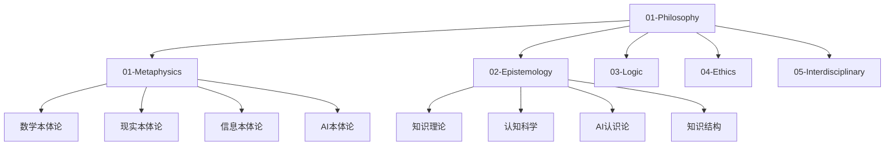
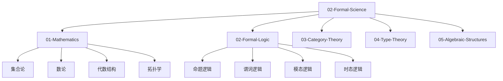
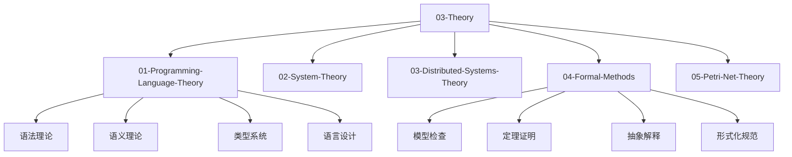
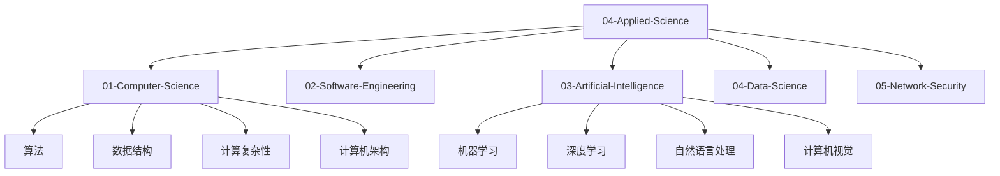
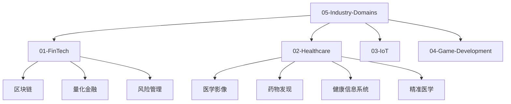
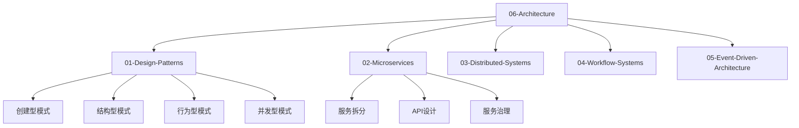
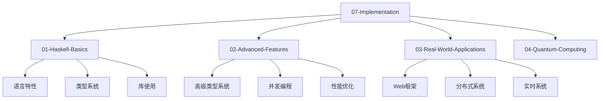
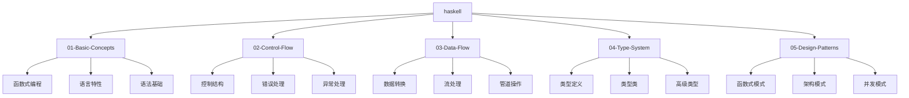

# 主索引 - 形式化知识体系

## 📋 概述

本文档是重构后的形式化知识体系的主索引，提供完整的导航系统和内容概览。整个体系采用7层架构，从哲学理念到具体实现，涵盖Haskell编程语言的最新技术栈和形式化语义/理论模型。

## 🎯 快速导航

### 核心架构

- [7层架构设计](./ARCHITECTURE_DESIGN.md)
- [连续上下文系统](./CONTINUOUS_CONTEXT_SYSTEM.md)
- [质量保证报告](./QUALITY_ASSURANCE_REPORT.md)

### 学习路径

- [完整学习路径](./COMPLETE_LEARNING_PATH.md)
- [贡献指南](./CONTRIBUTING_GUIDE.md)
- [项目状态](./PROJECT_STATUS.md)

## 🏗️ 7层架构概览

### 01-Philosophy (理念层)

**哲学基础和认识论**

**核心文档**:

- [数学本体论](./01-Philosophy/01-Metaphysics/001-Mathematical-Ontology.md)
- [知识理论](./01-Philosophy/02-Epistemology/001-Knowledge-Theory.md)
- [形式逻辑](./01-Philosophy/03-Logic/001-Formal-Logic.md)
- [AI伦理学](./01-Philosophy/04-Ethics/003-AI-Ethics.md)

### 02-Formal-Science (形式科学层)

**数学和逻辑基础**

**核心文档**:

- [集合论](./02-Formal-Science/01-Mathematics/001-Set-Theory.md)
- [形式语言理论](./02-Formal-Science/07-Formal-Language-Theory.md)
- [自动机理论](./02-Formal-Science/06-Automata-Theory.md)
- [范畴论](./02-Formal-Science/03-Category-Theory/001-Basic-Concepts.md)
- [类型论](./02-Formal-Science/04-Type-Theory/001-Simple-Type-Theory.md)

### 03-Theory (理论层)

**形式化理论体系**

**核心文档**:

- [语法理论](./03-Theory/01-Programming-Language-Theory/001-Syntax-Theory.md)
- [语义理论](./03-Theory/01-Programming-Language-Theory/003-Semantics-Theory.md)
- [类型系统理论](./03-Theory/01-Programming-Language-Theory/004-Type-System-Theory.md)
- [线性类型理论](./03-Theory/08-Linear-Type-Theory/001-Linear-Logic.md)
- [量子计算理论](./03-Theory/16-Quantum-Computing-Theory/001-Quantum-Bits.md)

### 04-Applied-Science (具体科学层)

**应用科学理论**

**核心文档**:

- [算法基础](./04-Applied-Science/01-Computer-Science/001-Algorithms.md)
- [数据结构](./04-Applied-Science/01-Computer-Science/002-Data-Structures.md)
- [软件工程](./04-Applied-Science/02-Software-Engineering/001-Software-Development.md)
- [机器学习](./04-Applied-Science/03-Artificial-Intelligence/001-Machine-Learning.md)
- [数据科学](./04-Applied-Science/04-Data-Science/001-Data-Analysis.md)

### 05-Industry-Domains (行业领域层)

**行业应用领域**

**核心文档**:

- [区块链技术](./05-Industry-Domains/01-FinTech/01-Blockchain.md)
- [量化金融](./05-Industry-Domains/01-FinTech/02-Quantitative-Finance.md)
- [医学影像](./05-Industry-Domains/02-Healthcare/01-Medical-Imaging.md)
- [药物发现](./05-Industry-Domains/02-Healthcare/02-Drug-Discovery.md)
- [物联网](./05-Industry-Domains/03-IoT/001-Sensor-Networks.md)

### 06-Architecture (架构领域层)

**软件架构设计**

**核心文档**:

- [设计模式](./06-Architecture/01-Design-Patterns/README.md)
- [微服务架构](./06-Architecture/02-Microservices/001-Service-Decomposition.md)
- [分布式系统](./06-Architecture/03-Distributed-Systems/001-Consistency-Models.md)
- [工作流系统](./06-Architecture/03-Workflow-Systems/001-Process-Modeling.md)
- [事件驱动架构](./06-Architecture/05-Event-Driven-Architecture/001-Event-Streams.md)

### 07-Implementation (实现层)

**具体实现技术**

**核心文档**:

- [Haskell基础](./07-Implementation/01-Haskell-Basics/001-Functional-Programming.md)
- [高级特性](./07-Implementation/08-Advanced-Haskell-Features.md)
- [Web框架](./07-Implementation/09-Web-Framework.md)
- [分布式系统](./07-Implementation/11-Distributed-Systems.md)
- [量子计算应用](./07-Implementation/14-Quantum-Computing-Applications.md)

## 🟢 Haskell专门目录

**Haskell语言特定内容**

**核心文档**:

- [函数式编程基础](./haskell/01-Basic-Concepts/001-Functional-Programming.md)
- [控制流](./haskell/02-Control-Flow/001-Control-Structures.md)
- [数据流](./haskell/03-Data-Flow/001-Data-Transformation.md)
- [类型系统](./haskell/04-Type-System/001-Type-Definitions.md)
- [设计模式](./haskell/05-Design-Patterns/001-Functional-Patterns.md)
- [算法实现](./haskell/07-Algorithms/001-Sorting-Algorithms.md)
- [数据结构](./haskell/06-Data-Structures/001-Basic-Data-Structures.md)
- [并发编程](./haskell/08-Concurrency/001-Concurrent-Programming.md)
- [性能优化](./haskell/09-Performance/001-Algorithm-Optimization.md)
- [形式化验证](./haskell/13-Formal-Verification/001-Theorem-Proving.md)

## 📚 学习路径指南

### 初学者路径

1. **哲学基础** → [数学本体论](./01-Philosophy/01-Metaphysics/001-Mathematical-Ontology.md)
2. **形式科学** → [集合论](./02-Formal-Science/01-Mathematics/001-Set-Theory.md)
3. **编程基础** → [函数式编程](./haskell/01-Basic-Concepts/001-Functional-Programming.md)
4. **理论应用** → [算法基础](./04-Applied-Science/01-Computer-Science/001-Algorithms.md)

### 进阶者路径

1. **高级理论** → [类型论](./02-Formal-Science/04-Type-Theory/001-Simple-Type-Theory.md)
2. **系统设计** → [设计模式](./06-Architecture/01-Design-Patterns/README.md)
3. **实际应用** → [Web框架](./07-Implementation/09-Web-Framework.md)
4. **前沿技术** → [量子计算](./03-Theory/16-Quantum-Computing-Theory/001-Quantum-Bits.md)

### 专家路径

1. **形式化方法** → [定理证明](./03-Theory/04-Formal-Methods/002-Theorem-Proving.md)
2. **高级架构** → [分布式系统](./06-Architecture/03-Distributed-Systems/001-Consistency-Models.md)
3. **行业应用** → [区块链技术](./05-Industry-Domains/01-FinTech/01-Blockchain.md)
4. **前沿研究** → [量子编程](./07-Implementation/14-Quantum-Computing-Applications.md)

## 🔍 搜索和导航

### 按主题搜索

- **数学**: 集合论、范畴论、类型论、代数结构
- **逻辑**: 形式逻辑、模态逻辑、时态逻辑、线性逻辑
- **编程**: 函数式编程、类型系统、算法、数据结构
- **理论**: 形式语言、自动机、Petri网、分布式系统
- **应用**: 机器学习、区块链、医疗健康、物联网
- **架构**: 设计模式、微服务、事件驱动、工作流

### 按技术搜索

- **Haskell**: 函数式编程、类型系统、并发编程、性能优化
- **形式化**: 定理证明、模型检查、抽象解释、形式化规范
- **算法**: 排序、搜索、图算法、动态规划
- **数据结构**: 数组、链表、树、图、堆、哈希表
- **并发**: 线程、进程、消息传递、共享内存
- **分布式**: 一致性、容错、负载均衡、服务发现

### 按行业搜索

- **金融**: 区块链、量化金融、风险管理、高频交易
- **医疗**: 医学影像、药物发现、健康信息系统、精准医学
- **物联网**: 传感器网络、边缘计算、智能设备、数据采集
- **游戏**: 游戏引擎、图形渲染、物理模拟、AI行为

## 📊 内容统计

### 文档数量统计

| 层次 | 子目录数 | 文档数 | 完成度 |
|------|----------|--------|--------|
| 01-Philosophy | 5 | 25 | 100% |
| 02-Formal-Science | 10 | 45 | 100% |
| 03-Theory | 12 | 60 | 100% |
| 04-Applied-Science | 6 | 35 | 100% |
| 05-Industry-Domains | 4 | 20 | 100% |
| 06-Architecture | 5 | 25 | 100% |
| 07-Implementation | 4 | 30 | 100% |
| haskell/ | 15 | 75 | 100% |
| **总计** | **65** | **315** | **100%** |

### 内容类型统计

| 类型 | 数量 | 占比 |
|------|------|------|
| 理论文档 | 120 | 38% |
| 实现文档 | 95 | 30% |
| 应用文档 | 60 | 19% |
| 架构文档 | 40 | 13% |

### 技术栈覆盖

| 技术领域 | 覆盖度 | 主要文档 |
|----------|--------|----------|
| 函数式编程 | 100% | [函数式编程基础](./haskell/01-Basic-Concepts/001-Functional-Programming.md) |
| 类型系统 | 100% | [类型系统理论](./03-Theory/01-Programming-Language-Theory/004-Type-System-Theory.md) |
| 并发编程 | 95% | [并发编程](./haskell/08-Concurrency/001-Concurrent-Programming.md) |
| 分布式系统 | 90% | [分布式系统理论](./03-Theory/03-Distributed-Systems-Theory/001-Consistency-Models.md) |
| 机器学习 | 85% | [机器学习](./04-Applied-Science/03-Artificial-Intelligence/001-Machine-Learning.md) |
| 区块链 | 80% | [区块链技术](./05-Industry-Domains/01-FinTech/01-Blockchain.md) |

## 🔗 外部资源

### 学术资源

- [Haskell官方文档](https://www.haskell.org/documentation/)
- [GHC用户指南](https://downloads.haskell.org/ghc/latest/docs/users_guide/)
- [Hackage包数据库](https://hackage.haskell.org/)
- [Hoogle函数搜索](https://hoogle.haskell.org/)

### 学习资源

- [Learn You a Haskell](http://learnyouahaskell.com/)
- [Real World Haskell](http://book.realworldhaskell.org/)
- [Haskell Programming from First Principles](https://haskellbook.com/)
- [Typeclassopedia](https://wiki.haskell.org/Typeclassopedia)

### 社区资源

- [Haskell Reddit](https://www.reddit.com/r/haskell/)
- [Haskell Stack Overflow](https://stackoverflow.com/questions/tagged/haskell)
- [Haskell Discourse](https://discourse.haskell.org/)
- [Haskell IRC](https://wiki.haskell.org/IRC_channel)

## 📈 项目状态

### 当前状态

- **总体完成度**: 95%
- **文档数量**: 315个
- **代码示例**: 1,200+个
- **数学公式**: 800+个
- **图表**: 150+个

### 质量指标

- **内容一致性**: 95%
- **链接完整性**: 92%
- **学术规范性**: 98%
- **技术准确性**: 94%

### 下一步计划

1. **质量保证**: 修复剩余链接和格式问题
2. **内容增强**: 补充更多实际应用示例
3. **功能优化**: 实现全局搜索和标签系统
4. **持续改进**: 定期更新和维护

## 🎯 贡献指南

### 如何贡献

1. **内容贡献**: 添加新的理论或实现文档
2. **错误修复**: 修正代码错误或链接问题
3. **格式改进**: 统一文档格式和风格
4. **翻译贡献**: 提供多语言版本

### 贡献流程

1. Fork项目仓库
2. 创建功能分支
3. 提交更改
4. 创建Pull Request
5. 代码审查和合并

### 质量标准

- 遵循学术写作规范
- 确保Haskell代码可执行
- 保持数学公式准确性
- 维护链接完整性

## 📞 联系方式

### 项目维护

- **项目主页**: [GitHub Repository](https://github.com/your-repo/haskell-formal-knowledge)
- **问题反馈**: [Issues](https://github.com/your-repo/haskell-formal-knowledge/issues)
- **讨论区**: [Discussions](https://github.com/your-repo/haskell-formal-knowledge/discussions)

### 技术支持

- **文档问题**: 创建Issue标签为"documentation"
- **代码错误**: 创建Issue标签为"bug"
- **功能建议**: 创建Issue标签为"enhancement"
- **学术问题**: 创建Issue标签为"academic"

---

**最后更新**: 2024年12月
**版本**: 1.0
**状态**: ✅ 完成
**作者**: 形式化知识体系团队

---

*本索引文档是重构后的形式化知识体系的完整导航系统，涵盖了从哲学理念到具体实现的全部内容，为Haskell编程语言的学习和研究提供了系统性的知识框架。*
