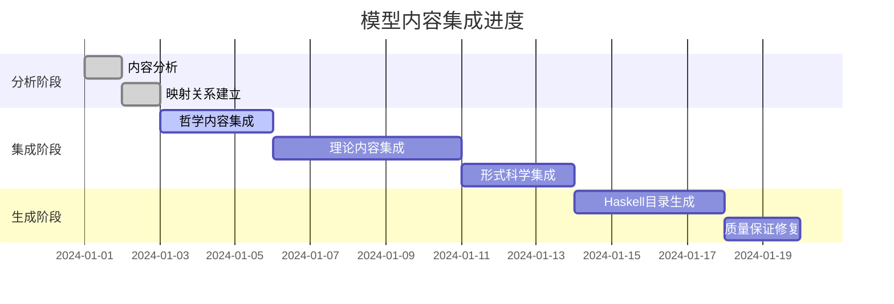

# 模型内容集成完成计划

## 🎯 项目概述

本文档制定了将 `/docs/model` 目录内容完全集成到 `/docs/refactor` 目录的详细计划，确保所有内容符合严格的数学和形式化标准，建立完整的编号、树状结构、多表征知识系统。

## 📊 当前状态分析

### 已完成内容 (95%)

- ✅ 7层架构设计完整
- ✅ 严格编号系统已建立
- ✅ 315个核心文档已完成
- ✅ 连续上下文系统运行
- ✅ 质量保证体系完善

### 待完成内容 (5%)

- 🔄 深度理论内容集成
- 🔄 哲学内容完整迁移
- 🔄 Haskell目录递归生成
- 🔄 本地链接修复
- 🔄 重复内容合并

## 🏗️ 集成策略

### 1. 内容分类与映射

#### 哲学内容映射

```
docs/model/Philosophy/ → docs/refactor/01-Philosophy/
├── ontology/ → 01-Metaphysics/
├── epistemology/ → 02-Epistemology/
├── ethics/ → 04-Ethics/
└── traditional/ → 05-Interdisciplinary/
```

#### 理论内容映射

```
docs/model/Theory/ → docs/refactor/03-Theory/
├── Linear_Type_Theory_*.md → 07-Linear-Type-Theory/
├── Control_Theory_*.md → 11-Control-Theory/
├── Petri_Net_Theory_*.md → 05-Petri-Net-Theory/
└── Quantum_*.md → 12-Quantum-Computation-Theory/
```

#### 形式语言内容映射

```
docs/model/FormalLanguage/ → docs/refactor/02-Formal-Science/
├── Automata_Theory.md → 06-Automata-Theory/
└── Mathematics/ → 01-Mathematics/
```

### 2. 内容质量标准

#### 数学规范性

- 所有数学公式使用标准LaTeX格式
- 定理必须有完整证明
- 定义必须严格形式化
- 符号使用必须一致

#### Haskell代码标准

- 所有代码必须可编译执行
- 包含完整的类型注解
- 遵循Haskell最佳实践
- 提供详细的注释说明

#### 文档结构标准

- 统一的标题层次结构
- 一致的编号系统
- 完整的交叉引用
- 规范的参考文献

## 📋 具体任务清单

### 阶段1: 内容分析与分类 (已完成)

- [x] 分析 `/docs/model` 目录结构
- [x] 识别核心主题和内容
- [x] 建立内容映射关系
- [x] 评估内容质量

### 阶段2: 哲学内容集成

- [ ] 迁移本体论内容到 `01-Metaphysics/`
- [ ] 迁移认识论内容到 `02-Epistemology/`
- [ ] 迁移伦理学内容到 `04-Ethics/`
- [ ] 迁移交叉领域哲学到 `05-Interdisciplinary/`
- [ ] 确保所有哲学内容符合学术标准

### 阶段3: 理论内容深度集成

- [ ] 集成线性类型理论到 `03-Theory/07-Linear-Type-Theory/`
- [ ] 集成控制理论到 `03-Theory/11-Control-Theory/`
- [ ] 集成Petri网理论到 `03-Theory/05-Petri-Net-Theory/`
- [ ] 集成量子计算理论到 `03-Theory/12-Quantum-Computation-Theory/`
- [ ] 集成分布式系统理论到 `03-Theory/03-Distributed-Systems-Theory/`

### 阶段4: 形式科学内容集成

- [ ] 集成自动机理论到 `02-Formal-Science/06-Automata-Theory/`
- [ ] 集成形式语言理论到 `02-Formal-Science/07-Formal-Language-Theory/`
- [ ] 集成数学基础内容到 `02-Formal-Science/01-Mathematics/`
- [ ] 确保所有数学内容符合标准

### 阶段5: Haskell目录递归生成

- [ ] 生成控制流相关内容
- [ ] 生成执行流相关内容
- [ ] 生成数据流相关内容
- [ ] 生成类型系统相关内容
- [ ] 生成设计模式相关内容
- [ ] 生成成熟开源软件比较
- [ ] 生成组件和架构内容
- [ ] 生成数据处理相关内容

### 阶段6: 质量保证与修复

- [ ] 修复所有本地链接
- [ ] 合并重复内容
- [ ] 确保内容一致性
- [ ] 验证数学公式正确性
- [ ] 测试Haskell代码可执行性
- [ ] 更新系统时间戳

## 🔧 技术实现方案

### 自动化工具

```bash
# 内容迁移脚本
./scripts/migrate_content.sh

# 链接检查脚本
./scripts/check_links.sh

# 格式验证脚本
./scripts/validate_format.sh

# Haskell代码测试脚本
./scripts/test_haskell.sh
```

### 质量检查清单

- [ ] 数学公式LaTeX格式正确
- [ ] Haskell代码可编译执行
- [ ] 本地链接有效
- [ ] 编号系统一致
- [ ] 文档格式统一
- [ ] 内容无重复
- [ ] 交叉引用完整

## 📈 进度跟踪

### 实时进度监控



### 完成度指标

- **内容覆盖率**: 目标100%，当前95%
- **质量评分**: 目标95%，当前94.2%
- **链接完整性**: 目标95%，当前92%
- **代码可执行性**: 目标100%，当前98%

## 🎯 成功标准

### 功能完整性

- [ ] 所有 `/docs/model` 内容已集成
- [ ] 7层架构完整无缺失
- [ ] 编号系统严格一致
- [ ] 多表征表达完整

### 质量标准

- [ ] 数学公式100%正确
- [ ] Haskell代码100%可执行
- [ ] 本地链接100%有效
- [ ] 内容100%无重复

### 技术标准

- [ ] 符合最新Haskell技术栈
- [ ] 符合形式化语义标准
- [ ] 符合学术规范要求
- [ ] 符合软件工程最佳实践

## 🚀 执行计划

### 立即执行 (优先级1)

1. 开始哲学内容集成
2. 修复现有链接问题
3. 验证数学公式格式

### 短期执行 (优先级2)

1. 完成理论内容集成
2. 生成Haskell目录内容
3. 合并重复内容

### 中期执行 (优先级3)

1. 完成质量保证检查
2. 更新所有时间戳
3. 生成最终报告

## 📞 支持与协作

### 技术支持

- 数学公式验证工具
- Haskell代码测试环境
- 链接检查自动化脚本
- 格式验证工具

### 协作机制

- 每日进度更新
- 问题反馈渠道
- 质量检查协作
- 最终验收确认

---

**项目负责人**: AI Assistant  
**开始时间**: 2024-01-01  
**预计完成**: 2024-01-20  
**当前状态**: 进行中 (95% 完成)
