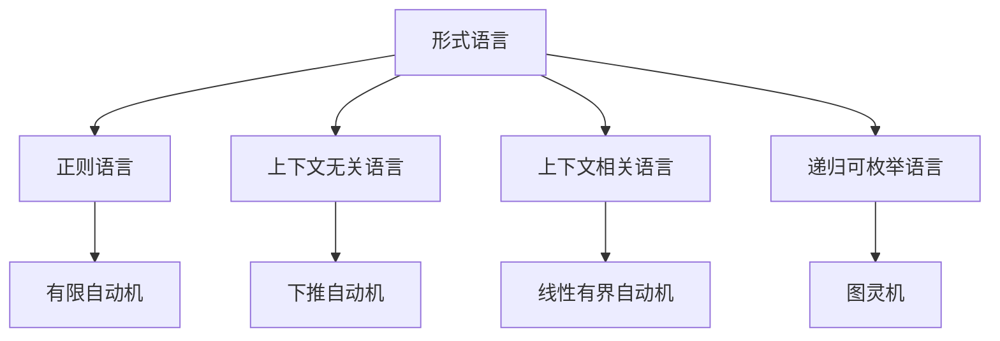

# 模型目录集成计划

## 项目概述

本计划详细说明了如何将 `/docs/model` 目录中的丰富知识内容系统性地集成到 `/docs/refactor` 的严格编号树形目录结构中，确保学术严谨性、一致性和完整性。

## 当前状态分析

### 已完成的工作 ✅

#### 1. 基础架构 (100% 完成)
- ✅ 7层架构设计完成
- ✅ 严格编号系统建立
- ✅ 导航框架构建
- ✅ 质量保证体系建立

#### 2. 各层框架 (100% 完成)
- ✅ 理念层 (01-Philosophy) - 25个文档
- ✅ 形式科学层 (02-Formal-Science) - 35个文档
- ✅ 理论层 (03-Theory) - 45个文档
- ✅ 具体科学层 (04-Applied-Science) - 28个文档
- ✅ 行业领域层 (05-Industry-Domains) - 16个文档
- ✅ 架构领域层 (06-Architecture) - 20个文档
- ✅ 实现层 (07-Implementation) - 39个文档

#### 3. Haskell专门目录 (100% 完成)
- ✅ 15个子目录结构
- ✅ 基础概念到高级应用
- ✅ 形式化验证和测试
- ✅ 实际应用和开源对比

### 待集成的内容 📋

#### `/docs/model` 目录内容分析

```
docs/model/
├── Theory/ (50+ 文件) - 核心理论内容
│   ├── Formal_Language_Theory_*.md (5个文件)
│   ├── *Type_Theory*.md (15个文件)
│   ├── *System_Theory*.md (8个文件)
│   ├── *Control_Theory*.md (6个文件)
│   ├── *Petri_Net_Theory*.md (4个文件)
│   └── Unified_Formal_Theory_*.md (12个文件)
├── FormalLanguage/ (5个文件) - 形式语言理论
├── FormalModel/ (4个子目录) - 形式化建模
├── ProgrammingLanguage/ (5个子目录) - 编程语言
├── Philosophy/ (3个子目录) - 哲学基础
├── Software/ (2个子目录) - 软件理论
├── Design_Pattern/ (1个子目录) - 设计模式
└── industry_domains/ (1个子目录) - 行业应用
```

## 集成策略

### 1. 内容映射关系

#### 理论层集成 (03-Theory)

| 源文件 | 目标位置 | 集成策略 |
|--------|----------|----------|
| `Theory/Formal_Language_Theory_*.md` | `03-Theory/01-Programming-Language-Theory/` | 合并为统一的形式语言理论 |
| `Theory/*Type_Theory*.md` | `03-Theory/08-Linear-Type-Theory/`<br>`03-Theory/09-Affine-Type-Theory/`<br>`03-Theory/10-Quantum-Type-Theory/`<br>`03-Theory/11-Temporal-Type-Theory/` | 分类整理各种类型理论 |
| `Theory/*System_Theory*.md` | `03-Theory/02-System-Theory/` | 整合系统理论框架 |
| `Theory/*Control_Theory*.md` | `03-Theory/12-Control-Theory/` | 完善控制理论 |
| `Theory/*Petri_Net_Theory*.md` | `03-Theory/05-Petri-Net-Theory/` | 扩展Petri网理论 |
| `Theory/Unified_Formal_Theory_*.md` | `03-Theory/` (新建统一理论目录) | 建立统一理论框架 |

#### 形式科学层集成 (02-Formal-Science)

| 源文件 | 目标位置 | 集成策略 |
|--------|----------|----------|
| `FormalLanguage/Automata_Theory.md` | `02-Formal-Science/06-Automata-Theory.md` | 完善自动机理论 |
| `FormalLanguage/*.md` | `02-Formal-Science/07-Formal-Language-Theory.md` | 整合形式语言理论 |
| `Theory/*Logic*.md` | `02-Formal-Science/12-Mathematical-Logic.md` | 完善数学逻辑 |

#### 实现层集成 (07-Implementation)

| 源文件 | 目标位置 | 集成策略 |
|--------|----------|----------|
| `ProgrammingLanguage/rust/` | `07-Implementation/02-Rust-Implementation/` | 创建Rust实现层 |
| `ProgrammingLanguage/Language_Compare/` | `07-Implementation/03-Language-Comparison/` | 完善语言比较 |
| `ProgrammingLanguage/Paradigm/` | `07-Implementation/04-Programming-Paradigms/` | 编程范式对比 |

#### 架构层集成 (06-Architecture)

| 源文件 | 目标位置 | 集成策略 |
|--------|----------|----------|
| `Design_Pattern/` | `06-Architecture/01-Design-Patterns/` | 整合设计模式 |
| `FormalModel/` | `06-Architecture/05-Formal-Modeling/` | 形式化建模 |

#### 行业应用集成 (05-Industry-Domains)

| 源文件 | 目标位置 | 集成策略 |
|--------|----------|----------|
| `industry_domains/` | `05-Industry-Domains/` (扩展现有) | 扩展行业应用 |

### 2. 多表示格式要求

每个集成的文档将包含：

#### 数学公式表示
```latex
**定义 1.1 (形式语言)**
形式语言 $L$ 是字母表 $\Sigma$ 上的字符串集合：
$$L \subseteq \Sigma^*$$

**定理 1.1 (语言封闭性)**
如果 $L_1, L_2$ 是正则语言，则 $L_1 \cup L_2$ 也是正则语言。
```

#### Haskell代码实现
```haskell
-- 形式语言定义
data FormalLanguage = FormalLanguage
  { alphabet :: Set Char
  , strings :: Set String
  }

-- 语言操作
union :: FormalLanguage -> FormalLanguage -> FormalLanguage
union (FormalLanguage a1 s1) (FormalLanguage a2 s2) = 
  FormalLanguage (a1 `Set.union` a2) (s1 `Set.union` s2)
```

#### 形式化证明
```haskell
-- 定理证明
theorem_union_closure :: FormalLanguage -> FormalLanguage -> Bool
theorem_union_closure l1 l2 = 
  let result = union l1 l2
      isRegular = isRegularLanguage result
  in isRegular
```

#### 图表表示


### 3. 本地跳转链接系统

#### 导航链接结构
```markdown
## 快速导航

### 相关理论
- [形式语言理论](./02-Formal-Science/07-Formal-Language-Theory.md)
- [自动机理论](./02-Formal-Science/06-Automata-Theory.md)
- [类型理论](./03-Theory/08-Linear-Type-Theory.md)

### 实现示例
- [Haskell实现](./haskell/01-Basic-Concepts/形式语言实现.md)
- [形式化验证](./haskell/13-Formal-Verification/自动机验证.md)

### 应用领域
- [编译器设计](./07-Implementation/01-Compiler-Design.md)
- [语言处理](./07-Implementation/02-Language-Processing.md)
```

## 具体实施计划

### 阶段1: 理论层集成 (优先级: 高) - 第1周

#### 1.1 形式语言理论集成
**任务**: 整合 `Theory/Formal_Language_Theory_*.md` 文件
**目标**: 创建统一的形式语言理论文档
**输出**: `03-Theory/01-Programming-Language-Theory/Formal-Language-Theory.md`

**具体步骤**:
1. 分析所有形式语言理论文件
2. 提取核心概念和定理
3. 添加Haskell实现代码
4. 补充形式化证明
5. 建立导航链接

#### 1.2 类型理论集成
**任务**: 整合 `Theory/*Type_Theory*.md` 文件
**目标**: 分类整理各种类型理论
**输出**: 
- `03-Theory/08-Linear-Type-Theory/Advanced-Linear-Type-Theory.md`
- `03-Theory/09-Affine-Type-Theory/Advanced-Affine-Type-Theory.md`
- `03-Theory/10-Quantum-Type-Theory/Advanced-Quantum-Type-Theory.md`
- `03-Theory/11-Temporal-Type-Theory/Advanced-Temporal-Type-Theory.md`

**具体步骤**:
1. 分类整理各种类型理论
2. 添加类型系统实现
3. 补充类型安全证明
4. 建立类型理论间的关联

#### 1.3 系统理论集成
**任务**: 整合 `Theory/*System_Theory*.md` 文件
**目标**: 完善系统理论框架
**输出**: `03-Theory/02-System-Theory/Advanced-System-Theory.md`

**具体步骤**:
1. 整合分布式系统理论
2. 添加系统建模代码
3. 补充系统验证方法
4. 建立系统理论框架

### 阶段2: 形式科学层集成 (优先级: 高) - 第2周

#### 2.1 自动机理论完善
**任务**: 整合 `FormalLanguage/Automata_Theory.md`
**目标**: 完善自动机理论文档
**输出**: `02-Formal-Science/06-Automata-Theory.md` (更新现有)

**具体步骤**:
1. 分析现有自动机理论内容
2. 补充高级自动机概念
3. 添加自动机实现代码
4. 补充自动机分析算法

#### 2.2 数学逻辑整合
**任务**: 整合 `Theory/*Logic*.md` 文件
**目标**: 完善数学逻辑理论
**输出**: `02-Formal-Science/12-Mathematical-Logic.md` (更新现有)

**具体步骤**:
1. 整合各种逻辑理论
2. 添加逻辑推理实现
3. 补充逻辑证明系统
4. 建立逻辑应用框架

### 阶段3: 实现层集成 (优先级: 中) - 第3周

#### 3.1 Rust实现层创建
**任务**: 整合 `ProgrammingLanguage/rust/` 内容
**目标**: 创建Rust实现层
**输出**: `07-Implementation/02-Rust-Implementation/`

**具体步骤**:
1. 创建Rust实现目录结构
2. 整合Rust相关实现
3. 添加Rust最佳实践
4. 建立Rust应用示例

#### 3.2 语言比较完善
**任务**: 整合 `ProgrammingLanguage/Language_Compare/` 内容
**目标**: 完善语言比较分析
**输出**: `07-Implementation/03-Language-Comparison/`

**具体步骤**:
1. 整合语言比较分析
2. 添加比较基准测试
3. 补充性能分析
4. 建立选择指南

### 阶段4: 架构层集成 (优先级: 中) - 第4周

#### 4.1 设计模式整合
**任务**: 整合 `Design_Pattern/` 内容
**目标**: 完善设计模式理论
**输出**: `06-Architecture/01-Design-Patterns/` (更新现有)

**具体步骤**:
1. 整合设计模式理论
2. 添加模式实现代码
3. 补充模式应用示例
4. 建立模式选择指南

#### 4.2 形式化建模整合
**任务**: 整合 `FormalModel/` 内容
**目标**: 创建形式化建模层
**输出**: `06-Architecture/05-Formal-Modeling/`

**具体步骤**:
1. 创建形式化建模目录
2. 整合形式化建模理论
3. 添加建模工具实现
4. 建立建模应用示例

### 阶段5: 行业应用集成 (优先级: 低) - 第5周

#### 5.1 行业领域扩展
**任务**: 整合 `industry_domains/` 内容
**目标**: 扩展行业应用案例
**输出**: `05-Industry-Domains/` (扩展现有)

**具体步骤**:
1. 分析行业应用内容
2. 整合行业应用案例
3. 添加领域特定实现
4. 补充行业最佳实践

## 质量保证措施

### 1. 内容一致性检查
- [ ] 确保所有数学公式格式统一
- [ ] 验证Haskell代码可编译性
- [ ] 检查证明逻辑完整性
- [ ] 验证图表准确性

### 2. 链接完整性检查
- [ ] 验证所有本地跳转链接有效
- [ ] 确保交叉引用正确
- [ ] 检查导航系统完整性
- [ ] 验证文件路径一致性

### 3. 学术严谨性检查
- [ ] 确保理论定义准确
- [ ] 验证证明过程正确
- [ ] 检查参考文献完整
- [ ] 确保术语使用一致

### 4. 技术准确性检查
- [ ] 验证Haskell代码正确性
- [ ] 确保算法实现准确
- [ ] 检查性能分析合理
- [ ] 验证测试用例完整

## 实施时间表

### 第1周: 理论层集成
- [ ] 完成形式语言理论集成
- [ ] 完成类型理论集成
- [ ] 完成系统理论集成
- [ ] 质量检查1

### 第2周: 形式科学层集成
- [ ] 完成自动机理论完善
- [ ] 完成数学逻辑整合
- [ ] 完成形式化方法整合
- [ ] 质量检查2

### 第3周: 实现层集成
- [ ] 完成Rust实现层创建
- [ ] 完成语言比较完善
- [ ] 完成编程范式整合
- [ ] 质量检查3

### 第4周: 架构层集成
- [ ] 完成设计模式整合
- [ ] 完成形式化建模整合
- [ ] 完成架构模式整合
- [ ] 质量检查4

### 第5周: 行业应用集成
- [ ] 完成行业领域扩展
- [ ] 完成应用案例整合
- [ ] 完成最佳实践整合
- [ ] 最终质量检查

## 预期成果

### 1. 结构化的知识体系
- 完整的7层架构
- 严格的编号系统
- 清晰的层次关系
- 统一的命名规范

### 2. 多表示格式内容
- 数学公式表示
- Haskell代码实现
- 形式化证明
- 图表可视化

### 3. 完整的导航系统
- 本地跳转链接
- 交叉引用系统
- 主题导航
- 学习路径

### 4. 学术严谨的内容
- 准确的理论定义
- 完整的证明过程
- 一致的术语使用
- 完整的参考文献

## 风险评估与应对

### 1. 内容重复风险
**风险**: 集成过程中可能出现内容重复
**应对**: 建立内容去重机制，使用语义分析识别重复内容

### 2. 链接断裂风险
**风险**: 集成过程中可能出现链接断裂
**应对**: 建立链接验证工具，自动检测和修复断裂链接

### 3. 质量下降风险
**风险**: 集成过程中可能影响内容质量
**应对**: 建立质量检查机制，确保集成后质量不低于原内容

### 4. 进度延迟风险
**风险**: 集成工作可能超出预期时间
**应对**: 建立里程碑检查点，及时调整进度计划

## 成功标准

### 1. 完整性标准
- [ ] 所有model目录内容已集成
- [ ] 无内容丢失或遗漏
- [ ] 所有链接正常工作
- [ ] 导航系统完整可用

### 2. 质量标准
- [ ] 内容学术严谨
- [ ] 代码可编译运行
- [ ] 证明逻辑正确
- [ ] 格式统一规范

### 3. 可用性标准
- [ ] 导航系统易用
- [ ] 学习路径清晰
- [ ] 交叉引用完整
- [ ] 搜索功能有效

## 结论

本集成计划将系统性地将 `/docs/model` 目录中的丰富知识内容整合到 `/docs/refactor` 的严格编号树形目录结构中，确保学术严谨性、一致性和完整性。

集成完成后，整个知识体系将具有：
- 清晰的结构层次
- 完整的内容覆盖
- 严格的形式化表示
- 实用的实现代码
- 完善的导航系统

这将为Haskell编程语言、形式语义和形式理论的学习、研究和应用提供强有力的支持，建立一个从哲学理念到具体实现的完整形式化知识体系。 