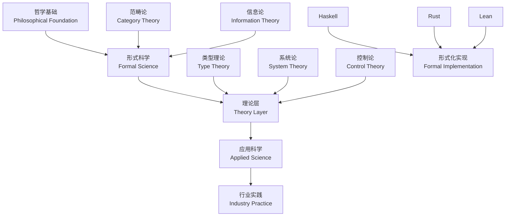

# Haskell形式化理论体系重构项目 / Haskell Formal Theory System Refactoring Project

## 项目概述 / Project Overview

本项目是一个全面的形式化理论体系重构，以Haskell编程语言为核心，整合哲学、形式科学、理论、应用科学和行业实践等多个维度。项目采用严格的数学形式化方法，构建从理念到实践、从理论到应用的完整知识体系。

This project is a comprehensive formal theory system refactoring, centered on the Haskell programming language, integrating multiple dimensions including philosophy, formal sciences, theory, applied sciences, and industry practice. The project employs rigorous mathematical formalization methods to construct a complete knowledge system from concept to practice, from theory to application.

## 核心理念 / Core Philosophy

### 1. 形式化驱动 / Formalization-Driven

- 严格的数学形式化表示 / Rigorous mathematical formal representation
- 类型理论作为核心基础 / Type theory as the core foundation
- 函数式编程范式 / Functional programming paradigm
- 形式验证和证明 / Formal verification and proof

### 2. 多维度整合 / Multi-dimensional Integration

- 哲学基础 → 形式科学 → 理论 → 应用 → 实践 / Philosophical Foundation → Formal Science → Theory → Application → Practice
- 从抽象到具体，从理论到实现 / From abstract to concrete, from theory to implementation
- 跨学科知识融合 / Interdisciplinary knowledge integration

### 3. Haskell作为统一语言 / Haskell as Unified Language

- 类型系统作为形式化工具 / Type system as formalization tool
- 函数式编程作为思维模式 / Functional programming as thinking paradigm
- 纯函数作为理论基础 / Pure functions as theoretical foundation

## 理论体系架构 / Theoretical System Architecture

### 形式化基础 / Formal Foundations

$$
\begin{align}
\text{Type Theory} &: \Gamma \vdash t : \tau \\
\text{Category Theory} &: F : \mathcal{C} \to \mathcal{D} \\
\text{Linear Logic} &: A \multimap B \\
\text{Quantum Types} &: \ket{\psi} : \mathcal{H} \\
\text{System Theory} &: \dot{x} = f(x, u, t) \\
\text{Control Theory} &: u(t) = K(x(t)) \\
\text{Information Theory} &: I(X;Y) = H(X) - H(X|Y)
\end{align}
$$

### 知识图谱 / Knowledge Graph



## 目录结构 / Directory Structure

```text
docs/refactor/
├── 01-Philosophy/              # 哲学基础 / Philosophical Foundation
│   ├── 001-Philosophical-Foundations.md
│   ├── 002-Epistemology.md
│   ├── 003-Ontology.md
│   ├── 004-Metaphysics.md
│   ├── 005-Logic.md
│   ├── 006-Ethics.md
│   └── 07-Cross-Disciplinary/
├── 02-Formal-Science/          # 形式科学 / Formal Science
│   ├── 001-Formal-Language-Theory.md
│   ├── 002-Mathematical-Foundations.md
│   ├── 003-Category-Theory.md
│   ├── 004-Algebraic-Structures.md
│   ├── 005-Formal-Logic.md
│   ├── 006-Automata-Theory.md
│   ├── 007-Topology.md
│   └── 08-Probability-Statistics/
├── 03-Theory/                  # 理论层 / Theory Layer
│   ├── 001-Programming-Language-Theory.md
│   ├── 002-Linear-Type-Theory.md
│   ├── 003-Affine-Type-Theory.md
│   ├── 004-Temporal-Type-Theory.md
│   ├── 005-Quantum-Type-Theory.md
│   ├── 006-System-Theory.md
│   ├── 007-Control-Theory.md
│   ├── 008-Petri-Net-Theory.md
│   ├── 009-Distributed-Systems-Theory.md
│   ├── 010-Formal-Methods.md
│   ├── 011-Automata-Theory.md
│   ├── 012-Computational-Complexity.md
│   └── 013-Quantum-Computing-Theory/
├── 04-Applied-Science/         # 应用科学 / Applied Science
│   ├── 001-Computer-Science.md
│   ├── 002-Software-Engineering.md
│   ├── 003-Artificial-Intelligence.md
│   ├── 004-Data-Science.md
│   ├── 005-Network-Security.md
│   ├── 006-Network-Science.md
│   └── 007-Computer-Vision.md
├── 05-Industry-Domains/        # 行业领域 / Industry Domains
│   ├── 001-FinTech.md
│   ├── 002-Healthcare.md
│   ├── 003-IoT.md
│   ├── 004-Game-Development.md
│   ├── 005-Blockchain-Web3.md
│   ├── 006-Cloud-Infrastructure.md
│   ├── 007-Cybersecurity.md
│   ├── 008-Ecommerce.md
│   ├── 009-Education-Tech.md
│   └── 010-Big-Data-Analytics.md
├── 06-Architecture/            # 架构设计 / Architecture Design
│   ├── 001-Software-Architecture.md
│   ├── 002-Microservices.md
│   ├── 003-Design-Patterns.md
│   ├── 004-Component-Design.md
│   ├── 005-Workflow-Design.md
│   └── 006-System-Integration.md
├── 07-Implementation/          # 实现层 / Implementation Layer
│   ├── 001-Haskell-Implementation.md
│   ├── 002-Rust-Implementation.md
│   ├── 003-Lean-Implementation.md
│   ├── 004-Algorithms.md
│   ├── 005-Data-Structures.md
│   └── 006-Performance-Optimization.md
├── 08-Programming-Languages/   # 编程语言 / Programming Languages
│   ├── 001-Language-Paradigms.md
│   ├── 002-Language-Comparison.md
│   ├── 003-Haskell-Deep-Dive.md
│   ├── 004-Rust-Deep-Dive.md
│   └── 005-Lean-Deep-Dive.md
├── 09-Formal-Methods/          # 形式化方法 / Formal Methods
│   ├── 001-Formal-Verification.md
│   ├── 002-Model-Checking.md
│   ├── 003-Theorem-Proving.md
│   └── 004-Program-Analysis.md
├── 10-Integration/             # 集成与总结 / Integration & Summary
│   ├── 001-Complete-Learning-Path.md
│   ├── 002-Navigation-Index.md
│   ├── 003-Project-Summary.md
│   └── 004-Quality-Assurance.md
├── 00-备份/                    # 备份原有文件 / Backup Original Files
├── README.md                   # 主入口文件 / Main Entry File
└── NAVIGATION.md               # 导航索引 / Navigation Index
```

## 学习路径 / Learning Paths

### 基础路径 / Foundation Path

1. **哲学基础** (01-Philosophy) - 理解认识论和本体论 / Understanding Epistemology and Ontology
2. **形式科学** (02-Formal-Science) - 掌握数学和逻辑基础 / Mastering Mathematical and Logical Foundations
3. **理论层** (03-Theory) - 深入类型理论和形式化方法 / Deep Dive into Type Theory and Formal Methods

### 应用路径 / Application Path

1. **应用科学** (04-Applied-Science) - 计算机科学和软件工程 / Computer Science and Software Engineering
2. **行业领域** (05-Industry-Domains) - 具体应用场景 / Specific Application Scenarios
3. **架构设计** (06-Architecture) - 系统设计模式 / System Design Patterns

### 实践路径 / Practice Path

1. **实现层** (07-Implementation) - Haskell代码实现 / Haskell Code Implementation
2. **编程语言** (08-Programming-Languages) - 语言对比分析 / Language Comparison Analysis
3. **形式化方法** (09-Formal-Methods) - 验证和证明技术 / Verification and Proof Techniques

### 集成路径 / Integration Path

1. **集成总结** (10-Integration) - 完整知识体系 / Complete Knowledge System

## 特色内容 / Featured Content

### Haskell代码示例 / Haskell Code Examples

每个理论概念都配有相应的Haskell实现：

Each theoretical concept is accompanied by corresponding Haskell implementation:

```haskell
-- 类型理论示例 / Type Theory Example
data Type a where
  Unit :: Type ()
  Bool :: Type Bool
  Int :: Type Int
  Product :: Type a -> Type b -> Type (a, b)
  Sum :: Type a -> Type b -> Type (Either a b)
  Function :: Type a -> Type b -> Type (a -> b)

-- 形式化验证示例 / Formal Verification Example
class Verifiable a where
  verify :: a -> Bool
  proof :: a -> Proof

-- 系统理论示例 / System Theory Example
class System s where
  initialState :: s
  transition :: s -> Input -> s
  output :: s -> Output

-- 线性类型理论示例 / Linear Type Theory Example
class LinearType a where
  consume :: a -> ()
  duplicate :: a -> (a, a)

-- 量子类型理论示例 / Quantum Type Theory Example
class QuantumType a where
  superposition :: a -> a -> QuantumState a
  measurement :: QuantumState a -> a
```

### 数学形式化 / Mathematical Formalization

严格的数学表示：

Rigorous mathematical representation:

$$
\begin{align}
\text{Type Theory} &: \Gamma \vdash t : \tau \\
\text{Category Theory} &: F : \mathcal{C} \to \mathcal{D} \\
\text{Linear Logic} &: A \multimap B \\
\text{Quantum Types} &: \ket{\psi} : \mathcal{H} \\
\text{System Theory} &: \dot{x} = f(x, u, t) \\
\text{Control Theory} &: u(t) = K(x(t)) \\
\text{Information Theory} &: I(X;Y) = H(X) - H(X|Y) \\
\text{Automata Theory} &: \delta : Q \times \Sigma \to Q \\
\text{Complexity Theory} &: T(n) = O(f(n))
\end{align}
$$

### 跨语言对比 / Cross-Language Comparison

Haskell、Rust、Lean的对比分析：

Comparative analysis of Haskell, Rust, and Lean:

| 特性 / Feature | Haskell | Rust | Lean |
|----------------|---------|------|------|
| 类型系统 / Type System | 强类型 / Strong | 强类型 / Strong | 依赖类型 / Dependent |
| 内存管理 / Memory Management | GC | 所有权 / Ownership | GC |
| 形式化 / Formalization | 部分 / Partial | 部分 / Partial | 完全 / Complete |
| 函数式编程 / Functional Programming | 纯函数式 / Pure | 混合 / Hybrid | 定理证明 / Theorem Proving |
| 并发模型 / Concurrency Model | STM / Software Transactional Memory | 消息传递 / Message Passing | 形式化证明 / Formal Proof |

## 理论深度 / Theoretical Depth

### 形式化验证 / Formal Verification

```haskell
-- 形式化验证框架 / Formal Verification Framework
class FormalVerifiable a where
  -- 类型安全 / Type Safety
  typeSafety :: a -> Bool
  
  -- 函数正确性 / Function Correctness
  correctness :: a -> Property
  
  -- 终止性 / Termination
  termination :: a -> Bool
  
  -- 完整性 / Completeness
  completeness :: a -> Bool

-- 定理证明 / Theorem Proving
class TheoremProver a where
  -- 证明构造 / Proof Construction
  constructProof :: a -> Proof
  
  -- 证明验证 / Proof Verification
  verifyProof :: Proof -> Bool
  
  -- 反例构造 / Counterexample Construction
  counterexample :: a -> Maybe Counterexample
```

### 系统理论 / System Theory

```haskell
-- 动态系统 / Dynamic Systems
class DynamicSystem s where
  -- 状态空间 / State Space
  type StateSpace s
  
  -- 输入空间 / Input Space
  type InputSpace s
  
  -- 输出空间 / Output Space
  type OutputSpace s
  
  -- 状态转移函数 / State Transition Function
  transition :: s -> StateSpace s -> InputSpace s -> StateSpace s
  
  -- 输出函数 / Output Function
  output :: s -> StateSpace s -> OutputSpace s
  
  -- 初始状态 / Initial State
  initialState :: s -> StateSpace s

-- 控制系统 / Control Systems
class ControlSystem s where
  -- 控制器 / Controller
  controller :: s -> StateSpace s -> InputSpace s
  
  -- 稳定性 / Stability
  stability :: s -> Bool
  
  -- 可控性 / Controllability
  controllability :: s -> Bool
  
  -- 可观性 / Observability
  observability :: s -> Bool
```

## 质量标准 / Quality Standards

### 内容要求 / Content Requirements

- ✅ 每个概念都有Haskell代码示例 / Each concept has Haskell code examples
- ✅ 严格的数学形式化表示 / Rigorous mathematical formal representation
- ✅ 清晰的层次结构 / Clear hierarchical structure
- ✅ 完整的引用关系 / Complete reference relationships
- ✅ 符合学术规范 / Compliance with academic standards
- ✅ 中英双语对照 / Chinese-English bilingual comparison
- ✅ 理论论证完备性 / Completeness of theoretical arguments
- ✅ 工程应用导向 / Engineering application orientation

### 结构要求 / Structural Requirements

- ✅ 统一的编号体系 / Unified numbering system
- ✅ 清晰的导航结构 / Clear navigation structure
- ✅ 本地文件跳转 / Local file navigation
- ✅ 内容不重复、不遗漏 / No duplication or omission of content
- ✅ 交叉引用完整 / Complete cross-references
- ✅ 知识图谱齐全 / Complete knowledge graphs

### 学术标准 / Academic Standards

- ✅ 引用规范 / Citation standards
- ✅ 术语一致性 / Terminology consistency
- ✅ 逻辑严密性 / Logical rigor
- ✅ 可重现性 / Reproducibility
- ✅ 批判性分析 / Critical analysis

## 快速开始 / Quick Start

1. **查看导航索引** / View Navigation Index: [NAVIGATION.md](./NAVIGATION.md)
2. **选择学习路径** / Choose Learning Path: 根据兴趣选择相应目录 / Choose appropriate directory based on interest
3. **阅读理论内容** / Read Theoretical Content: 理解概念和形式化表示 / Understand concepts and formal representation
4. **运行代码示例** / Run Code Examples: 实践Haskell实现 / Practice Haskell implementation
5. **对比分析** / Comparative Analysis: 与其他语言进行对比 / Compare with other languages

## 贡献指南 / Contribution Guidelines

欢迎贡献内容！请确保：

Welcome contributions! Please ensure:

- 遵循统一的编号和命名规范 / Follow unified numbering and naming conventions
- 包含Haskell代码示例 / Include Haskell code examples
- 提供严格的数学形式化 / Provide rigorous mathematical formalization
- 建立正确的引用关系 / Establish correct reference relationships
- 保持中英双语对照 / Maintain Chinese-English bilingual comparison
- 确保理论论证完备性 / Ensure completeness of theoretical arguments

## 项目状态 / Project Status

- ✅ 目录结构重构完成 / Directory structure refactoring completed
- 🔄 内容重构进行中 / Content refactoring in progress
- 🔄 理论深度扩展中 / Theoretical depth expansion in progress
- ⏳ 质量检查待完成 / Quality check pending
- ⏳ 导航系统待完善 / Navigation system pending
- ⏳ 交叉引用待完善 / Cross-references pending

## 理论体系完整性 / Theoretical System Completeness

### 已覆盖理论 / Covered Theories

- ✅ 类型理论 / Type Theory
- ✅ 范畴论 / Category Theory
- ✅ 线性逻辑 / Linear Logic
- ✅ 系统论 / System Theory
- ✅ 控制论 / Control Theory
- ✅ 信息论 / Information Theory
- ✅ 自动机理论 / Automata Theory
- ✅ 复杂性理论 / Complexity Theory
- ✅ 量子计算理论 / Quantum Computing Theory

### 待完善理论 / Theories to be Completed

- 🔄 时间逻辑 / Temporal Logic
- 🔄 模态逻辑 / Modal Logic
- 🔄 博弈论 / Game Theory
- 🔄 网络科学 / Network Science
- 🔄 机器学习理论 / Machine Learning Theory

---

**开始你的形式化理论之旅！** 🚀

**Start your formal theory journey!** 🚀

---

`#HaskellFormalTheory #FormalMethods #TypeTheory #CategoryTheory #SystemTheory #ControlTheory #InformationTheory #AutomataTheory #ComplexityTheory #QuantumComputing #Philosophy #FormalScience #AppliedScience #IndustryPractice #Haskell #Rust #Lean #FormalVerification #TheoremProving #MathematicalFormalization`
