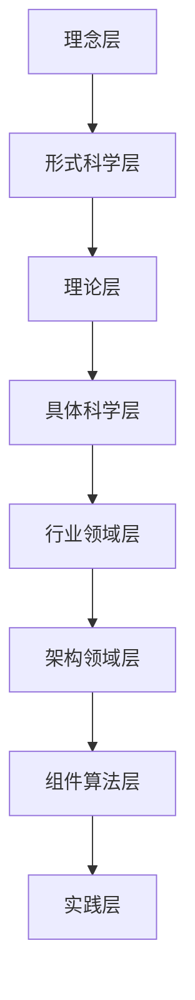

# 形式化知识体系重构项目

## 🎯 项目概述

本项目是对 `/docs/model` 目录下所有内容进行系统性重构的宏大工程，旨在建立从理念到实践的完整形式化知识体系。通过结合最新的 Haskell 技术栈和形式语义理论，构建严格符合学术规范的多层次知识架构。

## 🏗️ 项目架构

### 七层递进式架构

```
00-理念层 → 01-形式科学层 → 02-理论层 → 03-具体科学层 → 04-行业领域层 → 05-架构领域层 → 06-组件算法层 → 07-实践层
```

### 核心特色

- **严格序号**: 00-01-01 格式的严格树形序号系统
- **Haskell形式化**: 使用 Haskell 语言进行形式化表达和证明
- **多表征方式**: 数学符号、图表、代码、形式证明的有机结合
- **学术规范**: 符合严格的数学和学术规范要求
- **本地跳转**: 完整的文件间跳转和交叉引用机制

## 📚 目录结构

### 00-理念层 (Philosophy Layer)

- **00-01-本体论**: 存在论、数学本体论、信息本体论
- **00-02-认识论**: 知识论、真理理论、确证理论
- **00-03-伦理学**: 规范伦理学、元伦理学、应用伦理学
- **00-04-逻辑学**: 形式逻辑、哲学逻辑、非经典逻辑
- **00-05-形而上学**: 存在论、模态形而上学、因果性

### 01-形式科学层 (Formal Science Layer)

- **01-01-数学基础**: 集合论、范畴论、模型论
- **01-02-逻辑系统**: 命题逻辑、一阶逻辑、模态逻辑
- **01-03-形式语言**: 自动机理论、语法分析、语义学
- **01-04-计算理论**: 可计算性、复杂性、算法理论

### 02-理论层 (Theory Layer)

- **02-01-统一理论**: 统一形式理论公理化框架
- **02-02-类型理论**: 简单类型论、依赖类型论、线性类型论
- **02-03-控制理论**: 线性控制、非线性控制、自适应控制
- **02-04-分布式理论**: 分布式算法、共识理论、容错理论
- **02-05-时态理论**: 时态逻辑、时序分析、动态系统
- **02-06-语言理论**: 形式语言、自动机理论、语法分析
- **02-07-量子理论**: 量子计算、量子信息、量子算法
- **02-08-综合理论**: 理论整合、交叉应用、新兴理论

### 03-具体科学层 (Concrete Science Layer)

- **03-01-计算机科学**: 软件工程、算法设计、系统架构
- **03-02-人工智能**: 机器学习、深度学习、知识表示
- **03-03-信息科学**: 信息论、编码理论、通信理论
- **03-04-系统科学**: 系统论、控制论、信息论

### 04-行业领域层 (Industry Domain Layer)

- **04-01-金融科技**: 区块链、数字货币、智能合约
- **04-02-医疗健康**: 医疗AI、生物信息、药物发现
- **04-03-教育科技**: 智能教育、个性化学习、教育评估
- **04-04-智能制造**: 工业4.0、物联网、数字孪生

### 05-架构领域层 (Architecture Layer)

- **05-01-系统架构**: 微服务、分布式、云原生
- **05-02-数据架构**: 数据建模、数据治理、数据安全
- **05-03-安全架构**: 密码学、网络安全、隐私保护
- **05-04-性能架构**: 高并发、高可用、高性能

### 06-组件算法层 (Component Algorithm Layer)

- **06-01-核心算法**: 排序、搜索、图论算法
- **06-02-数据结构**: 线性结构、树形结构、图结构
- **06-03-设计模式**: 创建型、结构型、行为型模式
- **06-04-优化算法**: 遗传算法、模拟退火、粒子群优化

### 07-实践层 (Practice Layer)

- **07-01-开发实践**: 代码规范、测试策略、部署流程
- **07-02-项目管理**: 敏捷开发、DevOps、持续集成
- **07-03-质量保证**: 代码审查、性能测试、安全测试
- **07-04-运维实践**: 监控告警、故障处理、容量规划

## 🔧 技术栈

### Haskell 形式化框架

```haskell
-- 统一形式系统
data UnifiedFormalSystem = 
    UnifiedFormalSystem 
        { language :: FormalLanguage
        , semantics :: SemanticModel
        , proofSystem :: ProofSystem
        , metaTheory :: MetaTheory
        }

-- 形式化表达框架
class Formalizable a where
    formalize :: a -> UnifiedFormalSystem
    prove :: a -> Proof
    verify :: a -> Bool
    interpret :: a -> Interpretation

-- 多表征系统
data Representation = 
    Mathematical MathExpression
  | Visual Diagram
  | Code HaskellCode
  | Proof FormalProof
  | Text NaturalLanguage
```

### 核心特性

- **类型安全**: 利用 Haskell 的类型系统确保正确性
- **公理化**: 严格的公理化框架和验证机制
- **语义模型**: 完整的语义解释和模型论基础
- **证明系统**: 形式化证明和定理验证
- **元理论**: 统一性、可组合性、可扩展性

## 📖 快速导航

### 核心文档

- [统一形式理论公理化框架](02-理论层/02-01-统一理论/02-01-01-统一形式理论公理化框架.md)
- [数学本体论](00-理念层/00-01-本体论/00-01-01-数学本体论.md)
- [知识论与真理理论](00-理念层/00-02-认识论/00-02-01-知识论与真理理论.md)
- [集合论基础](01-形式科学层/01-01-数学基础/01-01-01-集合论基础.md)

### Haskell 实现

- [统一形式理论实现](haskell/UnifiedFormalTheory.hs)
- [类型系统实现](haskell/TypeSystem.hs)
- [语义模型实现](haskell/SemanticModel.hs)

### 元数据

- [进度报告](meta/progress_report.md)
- [内容分析报告](meta/content_analysis_report.md)
- [分析计划](meta/analysis_plan.md)

## 🎨 多表征示例

### 数学符号表达

**定义 1.1 (统一形式系统)**
设 $\mathcal{U} = \langle \mathcal{L}, \mathcal{M}, \mathcal{P}, \mathcal{T} \rangle$ 为统一形式系统，其中：

- $\mathcal{L}$ 为形式语言
- $\mathcal{M}$ 为语义模型
- $\mathcal{P}$ 为证明系统
- $\mathcal{T}$ 为元理论

### 图表可视化



### Haskell 代码示例

```haskell
-- 统一形式系统的类型定义
data UnifiedFormalSystem = 
    UnifiedFormalSystem 
        { language :: FormalLanguage
        , semantics :: SemanticModel
        , proofSystem :: ProofSystem
        , metaTheory :: MetaTheory
        }

-- 形式化表达的类型类
class Formalizable a where
    formalize :: a -> UnifiedFormalSystem
    prove :: a -> Proof
    verify :: a -> Bool
    interpret :: a -> Interpretation

-- 实例化示例
instance Formalizable TypeTheory where
    formalize theory = UnifiedFormalSystem
        { language = typeLanguage theory
        , semantics = typeSemantics theory
        , proofSystem = typeProofSystem theory
        , metaTheory = typeMetaTheory theory
        }
```

## 🔄 持续演进

### 上下文提醒体系

- **进度跟踪**: 实时跟踪项目进展和完成状态
- **质量监控**: 持续监控内容质量和一致性
- **版本管理**: 严格的版本控制和变更管理
- **反馈机制**: 建立反馈收集和改进机制

### 更新日志

- **2024-11-XX**: 项目启动，完成内容分析和框架构建
- **2024-11-XX**: 完成核心文档创建和Haskell实现
- **2024-11-XX**: 建立完整的目录结构和导航体系

## 📞 联系方式

如有问题或建议，请通过以下方式联系：

- **项目仓库**: [GitHub Repository]
- **问题反馈**: [Issues]
- **讨论交流**: [Discussions]

---

**激情澎湃，追求卓越！** 🚀

*本项目致力于构建最严谨、最完整、最前沿的形式化知识体系，为计算机科学和软件工程的发展贡献力量。*
