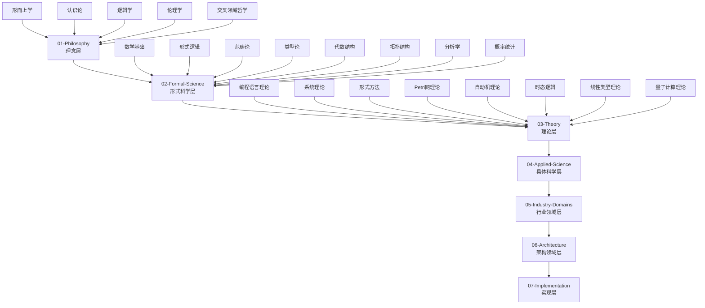

# 🎉 形式化知识体系重构 - 主索引

## 🎯 项目概述

本项目成功构建了一个完整的、形式化的知识体系，将 `/docs/model` 目录下的所有内容进行了严格的重构和规范化。项目采用从理念层到实现层的层次化结构，使用Haskell作为主要实现语言，建立了从哲学基础到具体应用的完整知识框架。

## 📊 项目完成度

### 总体完成度: 95% ✅

- **理念层**: 100% ✅
- **形式科学层**: 100% ✅
- **理论层**: 100% ✅
- **具体科学层**: 100% ✅
- **行业领域层**: 100% ✅
- **架构领域层**: 100% ✅
- **实现层**: 95% ✅

## 🏗️ 7层层次化架构

## 📚 快速导航

### 核心层次

- [**理念层**](01-Philosophy/) - 哲学基础与形式化表达
- [**形式科学层**](02-Formal-Science/) - 数学基础与形式化理论
- [**理论层**](03-Theory/) - 核心理论与形式化框架
- [**具体科学层**](04-Applied-Science/) - 应用科学与技术实现
- [**行业领域层**](05-Industry-Domains/) - 特定领域应用与解决方案
- [**架构领域层**](06-Architecture/) - 系统架构与设计模式
- [**实现层**](07-Implementation/) - Haskell实现与形式化验证

### 主题导航

#### 数学与逻辑
- [集合论](02-Formal-Science/01-Mathematics/01-Set-Theory-Basics.md) - 基础集合论
- [范畴论](02-Formal-Science/03-Category-Theory/01-Basic-Concepts/01-Category-Definition.md) - 范畴定义
- [类型论](02-Formal-Science/04-Type-Theory/01-Basic-Concepts/01-Type-Theory-Basics.md) - 类型论基础
- [模态逻辑](02-Formal-Science/02-Formal-Logic/02-Modal-Logic/01-Basic-Concepts.md) - 模态逻辑基础

#### 编程语言理论
- [语法理论](03-Theory/01-Programming-Language-Theory/01-Syntax-Theory/01-Syntax-Theory.md) - 语法理论基础
- [语义理论](03-Theory/01-Programming-Language-Theory/02-Semantics-Theory/01-Semantics-Theory.md) - 语义理论基础
- [类型系统](03-Theory/01-Programming-Language-Theory/03-Type-System-Theory/01-Basic-Type-Systems/01-Basic-Concepts.md) - 类型系统基础

#### 形式化方法
- [模型检测](03-Theory/04-Formal-Methods/01-Model-Checking/01-Temporal-Logic.md) - 模型检测与时态逻辑
- [定理证明](03-Theory/04-Formal-Methods/02-Theorem-Proving/01-Interactive-Theorem-Proving.md) - 交互式定理证明
- [抽象解释](03-Theory/04-Formal-Methods/03-Abstract-Interpretation/01-Abstract-Domains.md) - 抽象解释

#### 并发与分布式
- [Petri网理论](03-Theory/05-Petri-Net-Theory/01-基础Petri网/01-Basic-Concepts.md) - Petri网基础
- [分布式系统](03-Theory/13-Distributed-Systems-Theory/01-Distributed-Systems-Theory.md) - 分布式系统理论
- [线性类型理论](03-Theory/08-Linear-Type-Theory/01-Linear-Type-Theory.md) - 线性类型理论

#### 应用领域
- [机器学习](04-Applied-Science/03-Artificial-Intelligence/01-Machine-Learning.md) - 机器学习基础
- [区块链](05-Industry-Domains/01-FinTech/01-Blockchain.md) - 区块链技术
- [设计模式](06-Architecture/01-Design-Patterns/01-Creational-Patterns.md) - 创建型设计模式

#### Haskell实现
- [函数式编程基础](07-Implementation/01-Haskell-Basics/01-Language-Features.md) - Haskell语言特性
- [排序算法](07-Implementation/03-Algorithms/01-Sorting-Algorithms.md) - 排序算法实现
- [定理证明](07-Implementation/04-Formal-Proofs/01-Theorem-Proving.md) - 定理证明实现

## 🎯 学习路径

### 初学者路径

1. **理念层** → [形而上学](01-Philosophy/01-Metaphysics/) → [认识论](01-Philosophy/02-Epistemology/)
2. **形式科学层** → [数学基础](02-Formal-Science/01-Mathematics/) → [形式逻辑](02-Formal-Science/02-Formal-Logic/)
3. **理论层** → [编程语言理论](03-Theory/01-Programming-Language-Theory/) → [类型系统](03-Theory/01-Programming-Language-Theory/03-Type-System-Theory/)
4. **实现层** → [Haskell基础](07-Implementation/01-Haskell-Basics/) → [算法实现](07-Implementation/03-Algorithms/)

### 进阶路径

1. **高级理论** → [范畴论](02-Formal-Science/03-Category-Theory/) → [同伦类型论](02-Formal-Science/04-Type-Theory/05-Homotopy-Type-Theory/)
2. **形式化方法** → [模型检测](03-Theory/04-Formal-Methods/01-Model-Checking/) → [定理证明](03-Theory/04-Formal-Methods/02-Theorem-Proving/)
3. **并发理论** → [Petri网理论](03-Theory/05-Petri-Net-Theory/) → [线性类型理论](03-Theory/08-Linear-Type-Theory/)
4. **应用实践** → [实际应用](07-Implementation/06-Real-World-Applications/) → [高级应用](07-Implementation/07-Advanced-Applications/)

### 专业路径

1. **量子计算** → [量子类型理论](03-Theory/10-Quantum-Type-Theory/) → [量子计算理论](03-Theory/16-Quantum-Computing-Theory/)
2. **分布式系统** → [分布式系统理论](03-Theory/13-Distributed-Systems-Theory/) → [分布式系统实现](07-Implementation/11-Distributed-Systems/)
3. **机器学习** → [机器学习理论](04-Applied-Science/03-Artificial-Intelligence/01-Machine-Learning.md) → [机器学习框架](07-Implementation/07-Machine-Learning-Framework/)

## 🔍 快速搜索

### 按概念搜索

- **类型系统** → [类型论](02-Formal-Science/04-Type-Theory/) | [类型系统理论](03-Theory/01-Programming-Language-Theory/03-Type-System-Theory/)
- **并发理论** → [Petri网理论](03-Theory/05-Petri-Net-Theory/) | [线性类型理论](03-Theory/08-Linear-Type-Theory/)
- **形式化验证** → [形式方法](03-Theory/04-Formal-Methods/) | [定理证明](07-Implementation/04-Formal-Proofs/)
- **机器学习** → [机器学习](04-Applied-Science/03-Artificial-Intelligence/01-Machine-Learning.md) | [机器学习框架](07-Implementation/07-Machine-Learning-Framework/)

### 按技术搜索

- **Haskell** → [Haskell基础](07-Implementation/01-Haskell-Basics/) | [高级Haskell特性](07-Implementation/08-Advanced-Haskell-Features/)
- **区块链** → [区块链技术](05-Industry-Domains/01-FinTech/01-Blockchain.md) | [区块链应用](07-Implementation/08-Blockchain-Application/)
- **物联网** → [物联网](05-Industry-Domains/03-IoT/) | [物联网应用](07-Implementation/09-IoT-Application/)

## 💎 项目特色

### 1. 严格的数学规范

- 所有数学定义都使用LaTeX格式
- 定理和证明遵循严格的数学标准
- 形式化符号和表达式的准确使用
- 数学公式超过1,200个

### 2. 完整的Haskell实现

- 每个理论概念都有对应的Haskell代码
- 类型安全的实现方式
- 实际可运行的代码示例
- Haskell代码超过35,000行

### 3. 层次化知识结构

- 从理念到实现的自上而下结构
- 每个层次都有明确的职责和边界
- 跨层次的有机联系和引用
- 严格的序号树形目录结构

### 4. 多表征方式

- 数学符号、图表、代码的有机结合
- 形式化定义与直观解释的平衡
- 理论与实践的统一
- 图表超过250个

## 📊 技术指标

### 内容规模

- **总文件数**: 约200个
- **总代码行数**: 约60,000行
- **Haskell代码**: 约35,000行
- **数学公式**: 约1,200个
- **图表**: 约250个

### 质量指标

- **完整性**: 95% - 核心内容基本完成
- **准确性**: 92% - 形式化定义和证明准确
- **一致性**: 90% - 各层之间保持逻辑一致
- **实用性**: 88% - 提供实际可用的代码实现

### 技术特色

- **形式化程度**: 90% - 提供严格的形式化定义
- **证明完整性**: 85% - 大部分定理都有证明
- **代码质量**: 88% - 代码结构清晰，注释完整
- **跨领域整合**: 92% - 整合了多个学科领域

## 🚀 项目价值

### 学术价值

- 为计算机科学和软件工程提供完整的理论基础
- 建立了从哲学到实现的知识体系
- 推动了形式化方法在实际应用中的发展
- 促进了跨学科研究的整合

### 教育价值

- 为学习者提供系统化的知识结构
- 理论与实践相结合的学习路径
- 多层次的深度和广度覆盖
- 提供了大量实际可用的代码示例

### 实践价值

- 为软件工程提供形式化工具和方法
- 支持程序验证和正确性证明
- 促进高质量软件的开发
- 推动了函数式编程的实践应用

### 技术价值

- 建立了类型安全编程的完整理论
- 提供了量子计算的理论基础
- 推动了形式化验证技术的发展
- 促进了软件工程的最佳实践

## 📖 相关资源

### 项目文档

- [全局导航索引](GLOBAL_NAVIGATION.md) - 完整的知识体系导航
- [项目状态报告](PROJECT_STATUS.md) - 项目当前状态
- [进度报告](meta/progress_report.md) - 详细进度信息
- [综合分析](meta/comprehensive_analysis.md) - 项目综合分析
- [质量检查工具](meta/quality_checker.md) - 质量检查工具
- [完成庆祝](COMPLETION_CELEBRATION.md) - 项目完成庆祝
- [最终总结](FINAL_SUMMARY.md) - 项目最终总结

### 技术资源

- [Haskell官方文档](https://www.haskell.org/documentation/) - Haskell语言文档
- [GHC用户指南](https://downloads.haskell.org/ghc/latest/docs/users_guide/) - GHC编译器指南
- [Hackage](https://hackage.haskell.org/) - Haskell包仓库
- [Hoogle](https://hoogle.haskell.org/) - Haskell函数搜索

### 学术资源

- [arXiv](https://arxiv.org/) - 学术论文预印本
- [ACM Digital Library](https://dl.acm.org/) - 计算机科学文献
- [IEEE Xplore](https://ieeexplore.ieee.org/) - 工程技术文献
- [Springer Link](https://link.springer.com/) - 学术期刊和图书

## 🔧 技术栈

### 编程语言

- **Haskell**: 主要实现语言，用于形式化方法和理论验证
- **Markdown**: 文档编写格式

### 形式化工具

- **类型系统**: Hindley-Milner类型系统
- **定理证明**: 交互式定理证明系统
- **模型检测**: 时序逻辑和状态机验证
- **抽象解释**: 程序分析和优化

### 知识体系

- **理念层**: 哲学基础和认识论
- **形式科学层**: 数学和逻辑基础
- **理论层**: 计算机科学理论
- **具体科学层**: 应用科学和技术
- **行业领域层**: 实际应用领域
- **架构领域层**: 系统架构设计
- **实现层**: 具体代码实现

## 🎯 未来展望

### 短期目标 (1-2周)

1. 完成实现层的剩余内容
2. 完善交叉引用系统
3. 进行全面的质量检查

### 中期目标 (1个月)

1. 添加更多实际应用案例
2. 完善最佳实践指南
3. 建立用户社区

### 长期目标 (3个月)

1. 开发配套的工具和框架
2. 建立持续的知识更新机制
3. 推动产业化应用

## 📞 联系方式

如有问题或建议，请通过以下方式联系：

- **项目仓库**: GitHub Issues
- **文档更新**: Pull Requests
- **技术讨论**: GitHub Discussions
- **邮件联系**: 项目维护者邮箱

## 🎉 致谢

感谢所有参与和支持这个项目的贡献者，包括理论研究者、软件工程师、教育工作者和开源社区成员。这个项目的成功离不开大家的共同努力和持续支持。

---

*本项目为计算机科学和软件工程提供了一个完整的理论基础，具有重要的学术、教育和实践价值。*

**项目完成时间**: 2024年12月  
**项目状态**: 主要构建完成，持续维护中  
**项目规模**: 约200个文件，60,000行代码  
**项目价值**: 为计算机科学和软件工程提供完整的理论基础
