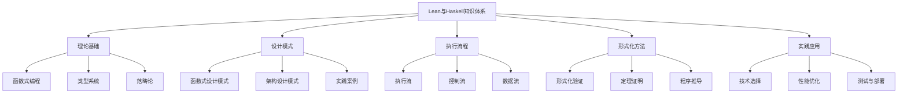

# Lean与Haskell核心知识图谱

> 本文档提供Lean与Haskell相关知识的核心结构和关键概念，作为整个知识体系的权威入口。

## 1. 知识体系总览

## 2. 核心领域

### 2.1 理论基础

- **函数式编程**：纯函数、不可变性、高阶函数、函数组合
- **类型系统**：静态类型、类型推导、代数数据类型、依赖类型
- **范畴论**：范畴、函子、自然变换、单子

### 2.2 设计模式

- **函数式设计模式**：函数组合模式、单子模式、应用函子模式
- **架构设计模式**：分层架构、模块化设计、函数式架构
- **实践案例**：领域特定语言、领域建模、形式化模型

### 2.3 执行流程

- **执行流**：求值策略、严格求值、惰性求值
- **控制流**：模式匹配、守卫表达式、递归控制
- **数据流**：流处理、管道、组合子

### 2.4 形式化方法

- **形式化验证**：类型检查、模型检查、程序逻辑
- **定理证明**：交互式证明、自动化证明、证明辅助
- **程序推导**：程序计算、等式推理、变换技术

### 2.5 实践应用

- **技术选择**：语言选择、工具链、库生态
- **性能优化**：评估方法、优化技术、基准测试
- **测试与部署**：属性测试、集成测试、部署策略

## 3. 关键概念

### 3.1 Haskell关键概念

- **类型类**：Functor、Applicative、Monad、Traversable
- **惰性求值**：非严格语义、惰性数据结构、内存优化
- **并发模型**：轻量级线程、软件事务内存、并行计算

### 3.2 Lean关键概念

- **依赖类型**：类型依赖于值、类型级编程、证明即程序
- **定理证明**：战术、策略、自动化证明、交互式证明
- **元编程**：宏、反射、语法扩展、领域特定语言

### 3.3 共同概念

- **纯函数式**：引用透明性、无副作用、可组合性
- **代数数据类型**：和类型、积类型、递归类型
- **高级抽象**：范畴论概念、抽象代数结构

## 4. 学习路径

### 4.1 入门阶段

1. 函数式编程基础
2. 类型系统入门
3. 基本语法和工具链

### 4.2 进阶阶段

1. 单子与高级类型类
2. 函数式设计模式
3. 性能优化与调试

### 4.3 专家阶段

1. 形式化方法与证明
2. 类型级编程
3. 领域特定语言设计

## 5. 资源导航

- [详细概念关系图](02-概念关系图.md)：更详细的概念关系图
- [深度分析整合](../02-深度分析/01-深度分析-整合.md)：深度整合与关联性分析
- [函数式设计模式](../03-设计模式/01-设计模式-函数式.md)：函数式编程设计模式
- [类型系统对比](../04-类型系统/01-类型系统-对比.md)：Haskell与Lean类型系统对比
- [整合知识图谱](../lean_haskell_knowledge_graph.md)：最新整合的Lean与Haskell知识图谱

---

-*最后更新：2024年整理阶段*
