# Lean与Haskell核心知识图谱：软件设计与形式模型的深度整合

## 🎯 知识图谱概述

本知识图谱深度整合Lean和Haskell在**软件设计模式**、**应用模型**、**形式模型**、**执行流**、**控制流**和**数据流**等多个维度的关联性。通过消除内容重复，构建全面且深入的知识体系，为技术选型、系统设计和形式化验证提供理论与实践支持。

## 📚 知识图谱层次结构

```mermaid
graph TB
    %% 顶层结构
    ROOT[Lean与Haskell知识体系] --> L1[语言特性层]
    ROOT --> L2[设计模式层]
    ROOT --> L3[执行流与控制流层]
    ROOT --> L4[形式化方法层]
    ROOT --> L5[应用实践层]
    
    %% 第一层：语言特性层
    L1 --> L1_1[类型系统特性]
    L1 --> L1_2[语法与表达式]
    L1 --> L1_3[编程范式支持]
    L1 --> L1_4[工具链与生态]
    
    %% 第二层：设计模式层
    L2 --> L2_1[函数式基础模式]
    L2 --> L2_2[高级函数式模式]
    L2 --> L2_3[架构设计模式]
    L2 --> L2_4[类型级设计模式]
    L2 --> L2_5[验证设计模式]
    
    %% 第三层：执行流与控制流层
    L3 --> L3_1[求值策略]
    L3 --> L3_2[控制结构]
    L3 --> L3_3[数据流处理]
    L3 --> L3_4[并发与并行]
    L3 --> L3_5[执行优化策略]
    
    %% 第四层：形式化方法层
    L4 --> L4_1[形式规范]
    L4 --> L4_2[定理证明]
    L4 --> L4_3[类型安全]
    L4 --> L4_4[程序验证]
    L4 --> L4_5[应用领域]
    
    %% 第五层：应用实践层
    L5 --> L5_1[软件工程实践]
    L5 --> L5_2[领域特定应用]
    L5 --> L5_3[教育与学习路径]
    L5 --> L5_4[语言融合与互操作]
    L5 --> L5_5[未来发展方向]
```



## 🔗 核心概念关系图

```mermaid
graph TB
    %% 主要领域节点
    ROOT[Lean与Haskell知识体系] --> THEORY[理论基础]
    ROOT --> DESIGN[设计模式]
    ROOT --> MODELS[应用与形式模型]
    ROOT --> FLOW[执行、控制与数据流]
    ROOT --> PRACTICE[实践应用]
    ROOT --> INTEGRATION[语言集成]

    %% 理论基础分支
    THEORY --> TH1[语言范式]
    THEORY --> TH2[类型系统]
    THEORY --> TH3[计算模型]
    THEORY --> TH4[范畴论]

    %% 类型系统详细展开
    TH2 --> TH2_1[Haskell类型系统]
    TH2 --> TH2_2[Lean依赖类型]
    TH2_1 --> TH2_1_1[Hindley-Milner类型推导]
    TH2_1 --> TH2_1_2[类型类与多态]
    TH2_1 --> TH2_1_3[GADT/类型族]
    TH2_2 --> TH2_2_1[依赖类型基础]
    TH2_2 --> TH2_2_2[命题即类型]
    TH2_2 --> TH2_2_3[归纳类型族]

    %% 设计模式分支
    DESIGN --> DS1[函数式模式]
    DESIGN --> DS2[架构模式]
    DESIGN --> DS3[类型级模式]
    DESIGN --> DS4[抽象模式]

    %% 函数式模式详细展开
    DS1 --> DS1_1[单子模式]
    DS1 --> DS1_2[函子/应用函子模式]
    DS1 --> DS1_3[自由模式]
    DS1_1 --> DS1_1_1[Haskell单子实现]
    DS1_1 --> DS1_1_2[Lean单子实现]
    DS1_1_1 --> DS1_1_1_1[IO, State, Either]
    DS1_1_2 --> DS1_1_2_1[IO, ST, 定理证明单子]

    %% 应用与形式模型分支
    MODELS --> MD1[领域特定语言 (DSL)]
    MODELS --> MD2[系统集成模型]
    MODELS --> MD3[类型理论模型]
    MODELS --> MD4[语义模型]

    %% DSL详细展开
    MD1 --> MD1_1[Haskell DSL (解析器组合子, 业务规则)]
    MD1 --> MD1_2[Lean DSL (数学, 证明, 形式化规范)]

    %% 执行、控制与数据流分支
    FLOW --> FL1[求值策略]
    FLOW --> FL2[控制结构]
    FLOW --> FL3[数据流处理]
    FLOW --> FL4[并发模型]

    %% 求值策略详细展开
    FL1 --> FL1_1[Haskell惰性求值 (优势与挑战)]
    FL1 --> FL1_2[Lean严格求值 (优势与挑战)]

    %% 实践应用分支
    PRACTICE --> PR1[系统开发]
    PRACTICE --> PR2[科学计算]
    PRACTICE --> PR3[形式验证]
    PRACTICE --> PR4[安全关键系统]

    %% 关系展示
    DS1_1 --共享概念--> TH4
    TH2_2 --支持--> PR3
    FL1 --影响--> PR1
    INTEGRATION --结合--> PRACTICE
    MD3 --理论基础--> TH2
```

## 📊 核心概念对比分析

### 3.1 理论基础整合

| 概念类别 | Haskell实现 | Lean实现 | 整合价值与应用场景 |
| :--- | :--- | :--- | :--- |
| **函数式范式** | 纯函数式，引用透明 | 依赖类型函数式，强调证明 | 结合代码的纯粹性与逻辑的严格性 |
| **类型系统** | Hindley-Milner, 类型类 | 依赖类型, 命题即类型, CoC | 强大的类型安全与形式化验证能力 |
| **计算模型** | 惰性求值，非严格语义 | 严格求值，规范化归约 | 灵活适应不同性能和计算场景 |
| **范畴论** | 函子、单子、应用函子 | 依赖类型中的范畴结构 | 提供高度抽象的组合与泛化能力 |

### 3.2 设计模式整合

| 设计模式 | Haskell实现方式 | Lean实现方式 | 最佳实践整合 |
| :--- | :--- | :--- | :--- |
| **函数式模式** | 单子、函子、自由单子等 | 单子、函子、依赖类型模式 | 抽象计算上下文、数据流和副作用 |
| **架构模式** | 单子变换器堆栈、FRP | 证明辅助的层次化架构 | 构建可证明的、模块化的系统架构 |
| **领域驱动** | 代数数据类型(ADT) | 归纳类型与定理 | 实现可验证的、精确的领域模型 |
| **组件模型** | 类型类、高阶组件 | 依赖记录类型、类型类 | 定义形式化的、可验证的组件契约 |

### 3.3 执行流与数据流整合

| 流水线特性 | Haskell | Lean | 整合价值与应用场景 |
| :--- | :--- | :--- | :--- |
| **求值策略** | 惰性求值 | 严格求值 | 优化无限数据结构与性能关键路径 |
| **控制流** | `do`表示法、模式匹配 | `do`表示法、模式匹配、证明策略 | 统一副作用管理和逻辑分支 |
| **数据流** | `Pipes`, `Conduit` | 依赖类型的流处理 | 构建类型安全、高效的数据处理管道 |
| **并发模型** | 轻量级线程 (Green Threads), STM | 类型安全的并发模型 | 结合高并发性能与无死锁保证 |

## 💻 代码实现对比

### 4.1 单子模式 (Monad)

**Haskell `State` Monad:**

```haskell
-- State单子定义
newtype State s a = State { runState :: s -> (a, s) }

instance Monad (State s) where
    return a = State $ \s -> (a, s)
    m >>= k = State $ \s -> 
        let (a, s') = runState m s
        in runState (k a) s'

-- 使用示例
incrementAndDouble :: State Int Int
incrementAndDouble = do
    modify (+1)
    get >>= \current -> return (current * 2)
```

**Lean `StateM` Monad:**

```lean
-- State Monad 定义
def StateM (s α : Type) : Type := s → α × s

instance : Monad (StateM s) where
  pure x := fun st => (x, st)
  bind m f := fun st =>
    let (x, st') := m st
    f x st'

-- 使用示例
def incrementAndDouble : StateM Nat Nat := do
  let current ← get
  set (current + 1)
  return ((current + 1) * 2)
```

### 4.2 依赖类型模式

**Haskell (有限支持):**

```haskell
-- 使用GADT和类型族模拟依赖类型
data Nat = Z | S Nat

data Vector (n :: Nat) a where
  VNil  :: Vector 'Z a
  VCons :: a -> Vector n a -> Vector ('S n) a

-- 类型安全的索引访问
index :: Vector n a -> Fin n -> a
index (VCons x _) FZ = x
index (VCons _ xs) (FS i) = index xs i
```

**Lean (原生支持):**

```lean
-- 原生依赖类型
inductive Vector (α : Type) : Nat → Type
| nil  : Vector α 0
| cons : α → Vector α n → Vector α (n + 1)

-- 类型安全的索引访问
def Vector.get {α : Type} {n : Nat} (v : Vector α n) (i : Fin n) : α :=
  match v, i with
  | Vector.cons x _, ⟨0, _⟩ => x
  | Vector.cons _ xs, ⟨i+1, h⟩ => xs.get ⟨i, Nat.lt_of_succ_lt_succ h⟩
```

## 🎯 实践应用整合

| 应用领域 | 推荐技术栈 | 整合策略与原因 |
| :--- | :--- | :--- |
| **Web后端开发** | Haskell (主力) + Lean (验证) | 利用Haskell成熟的Web框架生态，同时用Lean形式化验证核心业务逻辑的正确性。 |
| **形式化验证** | Lean (主力) + Haskell (实现) | 使用Lean强大的定理证明能力进行算法和协议验证，然后用Haskell进行高性能实现。 |
| **安全关键系统** | Lean + Haskell/Rust | 采用Lean进行形式化规范和验证，结合Haskell或Rust进行安全、可靠的系统实现。 |
| **编译器开发** | Haskell + Lean | 使用Haskell进行编译器前端和后端的高效开发，用Lean对核心转换和优化过程进行形式化证明。 |

## 🎯 结论

Lean与Haskell在软件设计和形式化方法上具有高度的互补性。通过深度整合，开发者不仅可以构建功能强大、性能优越的系统，还能在编译期获得最高级别的正确性保证。这种结合为下一代高可信软件的开发提供了坚实的理论基础和强大的工程工具。

### 核心价值

1. **理论完整性**：从范畴论到类型理论，从函数式编程到形式化验证
2. **实践可行性**：结合Haskell的工程成熟度与Lean的验证能力
3. **知识体系化**：构建从理念到实践、从理论到应用的完整知识体系
4. **持续演进**：为未来语言发展和软件工程实践提供方向指导

---

*本文档整合了原有的多个知识图谱文件，消除了重复内容，构建了统一的知识体系。*
