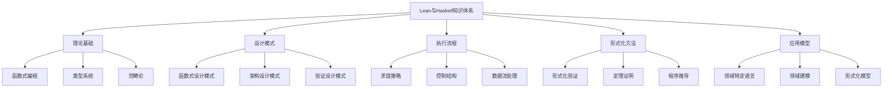

# Lean与Haskell概念关系图

> 本文档展示Lean与Haskell相关概念之间的关系，帮助理解各概念在整个知识体系中的位置。

## 1. 核心概念关系

## 2. 理论基础详解

### 2.1 函数式编程

- [函数式编程范式](../04-类型系统/01-类型系统-对比.md#函数式编程范式)：纯函数、不可变性、高阶函数、函数组合
- 函数式思维：声明式编程、表达式求值、递归思想
- 函数式抽象：抽象代数结构、类型类、模块化

### 2.2 类型系统

- [类型系统理论](../04-类型系统/01-类型系统-对比.md#类型系统理论)：静态类型、类型推导、代数数据类型
- 类型安全：类型检查、类型错误、类型保证
- 高级类型特性：依赖类型、线性类型、多态、类型类

### 2.3 范畴论

- [范畴论基础](../03-设计模式/01-设计模式-函数式.md#范畴论基础)：范畴、函子、自然变换
- 代数结构：幺半群、群、环、格
- 计算抽象：单子、余单子、应用函子

## 3. 设计模式详解

### 3.1 函数式设计模式

- [函数式设计模式](../03-设计模式/01-设计模式-函数式.md)：函数组合、高阶函数、不变性
- 单子模式：状态单子、IO单子、Reader单子
- 函数式数据处理：映射-归约模式、过滤器模式

### 3.2 架构设计模式

- [架构设计模式](../03-设计模式/02-设计模式-架构.md)：分层架构、模块化设计
- 函数式架构：纯函数架构、代数效应
- 验证驱动设计：形式化规约、验证模型

### 3.3 验证设计模式

- [验证设计模式](../06-形式化方法/01-形式化验证.md#验证设计模式)：属性测试、定理证明
- 形式化验证：不变量、前置条件、后置条件
- 类型驱动开发：类型作为规约、类型安全保证

## 4. 执行流程详解

### 4.1 求值策略

- [求值策略](../05-执行流控制流/01-执行流-控制流.md#求值策略)：严格求值、惰性求值
- 求值顺序：应用序、正则序
- 优化技术：记忆化、流融合、短路求值

### 4.2 控制结构

- [控制结构](../05-执行流控制流/01-执行流-控制流.md#控制结构)：模式匹配、守卫表达式
- 递归控制：尾递归、互递归、递归模式
- 异常处理：Either模式、Maybe模式、结果类型

### 4.3 数据流处理

- [数据流处理](../05-执行流控制流/02-数据流-处理.md)：流处理、管道、组合子
- 数据变换：映射、过滤、折叠、扫描
- 并发模型：并行映射、并行归约、工作窃取

## 5. 形式化方法详解

### 5.1 形式化验证

- [形式化验证](../06-形式化方法/01-形式化验证.md)：类型检查、模型检查
- 程序逻辑：霍尔逻辑、分离逻辑
- 验证技术：归纳证明、不变量证明

### 5.2 定理证明

- [定理证明](../06-形式化方法/02-定理证明.md)：交互式证明、自动化证明
- 证明辅助：策略、战术、自动化提示
- 证明模式：归纳法、反证法、构造法

### 5.3 程序推导

- [程序推导](../06-形式化方法/03-程序推导.md)：程序计算、等式推理
- 变换技术：融合、去递归、累加器变换
- 优化方法：不动点融合、短路融合

## 6. 应用模型详解

### 6.1 领域特定语言

- [领域特定语言](../03-设计模式/03-设计模式-实践.md#领域特定语言)：嵌入式DSL、独立DSL
- DSL设计：语法设计、语义模型、类型安全
- 应用领域：金融建模、硬件描述、规则引擎

### 6.2 领域建模

- [领域建模](../03-设计模式/03-设计模式-实践.md#领域建模)：代数数据类型、类型驱动设计
- 建模技术：代数效应、依赖类型、线性类型
- 验证模型：不变量、状态机、时序逻辑

### 6.3 形式化模型

- [形式化模型](../06-形式化方法/01-形式化验证.md#形式化模型)：状态机、Petri网、时序逻辑
- 模型检查：可达性分析、死锁检测、活性验证
- 规约语言：TLA+、Alloy、Z表示法

## 相关链接

- [函数式编程范式](../04-类型系统/01-类型系统-对比.md#函数式编程范式)
- [类型系统理论](../04-类型系统/01-类型系统-对比.md#类型系统理论)
- [范畴论基础](../03-设计模式/01-设计模式-函数式.md#范畴论基础)
- [函数式设计模式](../03-设计模式/01-设计模式-函数式.md)
- [架构设计模式](../03-设计模式/02-设计模式-架构.md)
- [验证设计模式](../06-形式化方法/01-形式化验证.md#验证设计模式)
- [求值策略](../05-执行流控制流/01-执行流-控制流.md#求值策略)
- [控制结构](../05-执行流控制流/01-执行流-控制流.md#控制结构)
- [数据流处理](../05-执行流控制流/02-数据流-处理.md)
- [形式化验证](../06-形式化方法/01-形式化验证.md)
- [定理证明](../06-形式化方法/02-定理证明.md)
- [程序推导](../06-形式化方法/03-程序推导.md)
- [领域特定语言](../03-设计模式/03-设计模式-实践.md#领域特定语言)
- [领域建模](../03-设计模式/03-设计模式-实践.md#领域建模)
- [形式化模型](../06-形式化方法/01-形式化验证.md#形式化模型)
- [整合知识图谱](../lean_haskell_knowledge_graph.md)

---

-*最后更新：2024年整理阶段*
