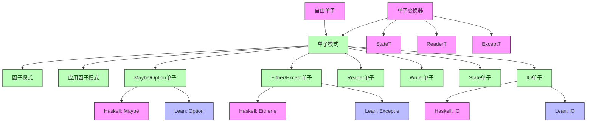
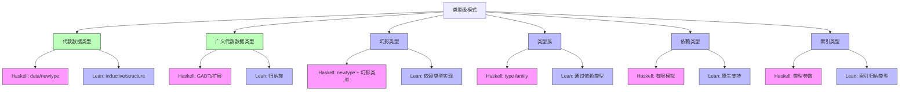
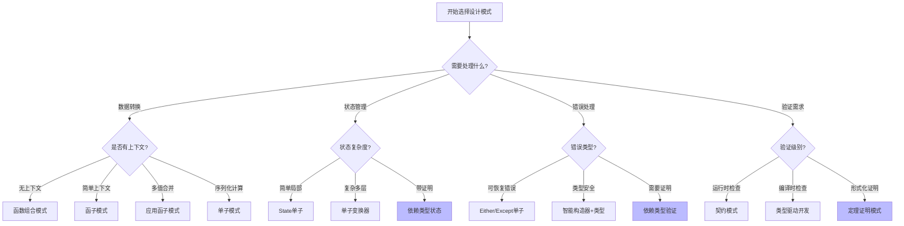

# Lean与Haskell设计模式关系图谱

## 🎯 概述

本文档深入分析Lean和Haskell编程语言中的设计模式关系，包括函数式设计模式、架构模式、类型级模式和验证模式等，展示两种语言设计模式的层次结构、共性差异和应用场景，为开发者提供全面的设计模式导航和选择指南。

## 📊 设计模式层次结构

```mermaid
graph TB
    %% 顶层分类
    ROOT[函数式设计模式体系]
    ROOT --> BASIC[基础函数式模式]
    ROOT --> ADV[高级函数式模式]
    ROOT --> ARCH[架构模式]
    ROOT --> TYPE[类型级模式]
    ROOT --> VER[验证模式]

    %% 基础函数式模式
    BASIC --> B1[值层次模式]
    BASIC --> B2[函数层次模式]
    BASIC --> B3[类型层次模式]

    %% 值层次模式
    B1 --> B1_1[不可变数据模式]
    B1 --> B1_2[代数数据类型模式]
    B1 --> B1_3[模式匹配]

    %% 函数层次模式
    B2 --> B2_1[高阶函数模式]
    B2 --> B2_2[组合模式]
    B2 --> B2_3[部分应用模式]
    B2 --> B2_4[柯里化模式]

    %% 类型层次模式
    B3 --> B3_1[类型类模式]
    B3 --> B3_2[多态模式]
    B3 --> B3_3[类型实例模式]

    %% 高级函数式模式
    ADV --> A1[抽象容器模式]
    ADV --> A2[计算效果模式]
    ADV --> A3[流程控制模式]

    %% 抽象容器模式
    A1 --> A1_1[函子模式]
    A1 --> A1_2[应用函子模式]
    A1 --> A1_3[单子模式]
    A1 --> A1_4[遍历模式]
    A1 --> A1_5[折叠模式]

    %% 计算效果模式
    A2 --> A2_1[状态管理模式]
    A2 --> A2_2[错误处理模式]
    A2 --> A2_3[环境传递模式]
    A2 --> A2_4[IO效果模式]

    %% 架构模式
    ARCH --> AR1[分层架构]
    ARCH --> AR2[事件驱动架构]
    ARCH --> AR3[管道-过滤架构]
    ARCH --> AR4[函数式接口]
    ARCH --> AR5[解释器模式]

    %% 类型级模式
    TYPE --> T1[类型族模式]
    TYPE --> T2[GADT模式]
    TYPE --> T3[幻影类型模式]
    TYPE --> T4[类型级编程]
    TYPE --> T5[依赖类型模式]
    TYPE --> T6[索引类型模式]

    %% 验证模式
    VER --> V1[类型保证模式]
    VER --> V2[定理证明模式]
    VER --> V3[不变量模式]
    VER --> V4[属性测试模式]
    VER --> V5[形式化规范模式]

    %% 语言支持标记
    classDef haskell fill:#f9f,stroke:#333,stroke-width:1px;
    classDef lean fill:#bbf,stroke:#333,stroke-width:1px;
    classDef both fill:#bfb,stroke:#333,stroke-width:1px;

    %% 将节点分类到各语言
    class B1_1,B1_2,B1_3,B2_1,B2_2,B2_3,B2_4,B3_1,B3_2,B3_3,A1_1,A1_2,A1_3,A1_4,A1_5,A2_1,A2_2,A2_3,A2_4,AR1,AR2,AR3,AR4,AR5,T1,T2,T3,T4,V4 both;
    class T5,T6,V1,V2,V3,V5 lean;
```



## 🔍 设计模式分类表

### 1. 函数式基础模式

| 模式类别 | 设计模式 | Haskell实现 | Lean实现 | 应用场景 |
|---------|---------|------------|---------|---------|
| **不可变数据** | 持久数据结构 | `Data.Map`, `Data.Set` | `rbmap`, `rbset` | 高效不可变数据结构 |
| **代数数据类型** | 积类型（记录） | `data Person = Person { name :: String, age :: Int }` | `structure Person where name : String; age : Nat` | 复合数据表示 |
| **代数数据类型** | 和类型（枚举） | `data Result = Success Int \| Error String` | `inductive Result \| success (n : Nat) \| error (msg : String)` | 状态或结果表示 |
| **模式匹配** | 解构匹配 | `case maybe of Just x -> f x; Nothing -> defaultVal` | `match opt with \| some x => f x \| none => defaultVal` | 条件处理、数据提取 |
| **高阶函数** | 函数作参数 | `map (+1) [1,2,3]` | `List.map (fun x => x + 1) [1,2,3]` | 行为参数化、抽象 |
| **组合模式** | 函数管道 | `f . g . h` | `f ∘ g ∘ h` | 数据转换流水线 |
| **类型类模式** | 接口抽象 | `class Show a where show :: a -> String` | `class Show (α : Type) where show : α → String` | 多态行为、抽象接口 |

### 2. 高级函数式模式

| 模式类别 | 设计模式 | Haskell实现 | Lean实现 | 应用场景 |
|---------|---------|------------|---------|---------|
| **函子模式** | 数据映射 | `fmap (+1) (Just 2)` | `Functor.map (· + 1) (some 2)` | 容器值转换 |
| **应用函子** | 上下文应用 | `pure (+) <*> Just 1 <*> Just 2` | `pure Nat.add <*> some 1 <*> some 2` | 上下文中函数应用 |
| **单子模式** | 计算链接 | `Just 1 >>= \x -> Just (x + 1)` | `some 1 >>= fun x => some (x + 1)` | 计算序列化、上下文传递 |
| **单子变换器** | 效果组合 | `runStateT (runReaderT comp env) initState` | 有限支持 | 多种效果组合 |
| **自由单子** | 解释器分离 | `Free`, `freer-simple` | 有限支持 | 领域语言、效果分离 |
| **状态模式** | 状态封装 | `State` 单子 | `StateT` 单子 | 状态管理、可变计算 |
| **错误处理** | 优雅失败 | `Either` 单子 | `Except` 单子和依赖类型 | 错误传播、异常捕获 |

### 3. 架构设计模式

| 模式类别 | 设计模式 | Haskell实现 | Lean实现 | 应用场景 |
|---------|---------|------------|---------|---------|
| **分层架构** | 关注点分离 | 单子变换器堆栈 | 类型和证明分层 | 复杂系统分解 |
| **事件驱动** | 响应式系统 | FRP库、事件系统 | 有限支持 | 用户界面、异步系统 |
| **管道-过滤** | 数据流处理 | Conduit、Pipe库 | 函数组合 | 流数据处理 |
| **解释器模式** | DSL解释 | GADTS、自由单子 | 定理证明DSL | 领域语言实现 |
| **依赖注入** | 环境传递 | Reader单子 | 类型参数化 | 配置和依赖传递 |
| **责任链** | 处理器链接 | 单子链、Kleisli箭头 | 函数组合 | 请求处理流水线 |

### 4. 类型级设计模式

| 模式类别 | 设计模式 | Haskell实现 | Lean实现 | 应用场景 |
|---------|---------|------------|---------|---------|
| **类型族** | 关联类型 | `type family` | 依赖类型 | 类型关系表达 |
| **GADT** | 类型精确化 | `GADTs` 语言扩展 | 归纳族、依赖类型 | 类型安全数据结构 |
| **依赖类型** | 类型依赖值 | 有限模拟 | 原生支持 | 编译时保证、证明 |
| **幻影类型** | 类型标记 | `newtype` 技术 | 依赖类型 | 静态区分相似类型 |
| **类型级编程** | 类型计算 | 类型族、多参数类型类 | 元编程 | 编译时计算、验证 |
| **类型状态** | 状态跟踪 | 幻影类型、类型族 | 索引类型、依赖类型 | 状态机、协议实现 |

### 5. 验证设计模式

| 模式类别 | 设计模式 | Haskell实现 | Lean实现 | 应用场景 |
|---------|---------|------------|---------|---------|
| **类型保证** | 编码不变量 | NewType、GADT | 依赖类型 | 合法性保证 |
| **定理证明** | 正确性证明 | 有限支持 (LiquidHaskell) | 完整支持 | 算法正确性、不变量 |
| **契约设计** | 前置/后置条件 | Smart构造器 | 依赖函数类型 | 接口契约、断言 |
| **属性测试** | 基于属性验证 | QuickCheck, Hedgehog | 基于证明 | 自动化测试、反例发现 |
| **形式化模型** | 系统建模 | 有限支持 | 完整支持 | 系统规范、协议验证 |

## 🔄 设计模式关联图

### 单子模式家族关系图



### 类型级模式关系图



## 📚 设计模式实现对比示例

### 1. 单子模式实现对比

**Haskell 单子实现：**

```haskell
-- 单子类型类
class Monad m where
    return :: a -> m a
    (>>=) :: m a -> (a -> m b) -> m b

-- Maybe单子实例
instance Monad Maybe where
    return = Just
    Nothing >>= _ = Nothing
    Just x >>= f = f x

-- 单子应用：链式计算
safeDivide :: Double -> Double -> Maybe Double
safeDivide _ 0 = Nothing
safeDivide x y = Just (x / y)

computation :: Double -> Double -> Double -> Maybe Double
computation x y z = do
    result1 <- safeDivide x y  -- 第一次运算
    result2 <- safeDivide result1 z  -- 第二次运算
    return result2  -- 返回结果
```

**Lean 单子实现：**

```lean
-- 单子类型类
class Monad (m : Type → Type) where
  pure : α → m α
  bind : m α → (α → m β) → m β

-- Option单子实例
instance : Monad Option where
  pure := some
  bind := fun ma f => 
    match ma with
    | none => none
    | some a => f a

-- 单子应用：链式计算
def safeDivide (x y : Float) : Option Float :=
  if y == 0 then none else some (x / y)

def computation (x y z : Float) : Option Float := do
  let result1 ← safeDivide x y  -- 第一次运算
  let result2 ← safeDivide result1 z  -- 第二次运算
  return result2  -- 返回结果
```

### 2. 验证模式实现对比

**Haskell 类型安全验证：**

```haskell
-- 使用NewType和Smart构造器
newtype NonEmptyString = NonEmptyString { getString :: String }

-- 智能构造器确保非空
mkNonEmptyString :: String -> Maybe NonEmptyString
mkNonEmptyString s = 
    if not (null s)
    then Just (NonEmptyString s)
    else Nothing

-- 使用GADT实现类型安全
data SafeList a where
  Nil :: SafeList a
  Cons :: a -> SafeList a -> SafeList a

-- 保证头部存在的函数
safeHead :: SafeList a -> Maybe a
safeHead Nil = Nothing
safeHead (Cons x _) = Just x

-- 或使用LiquidHaskell进行更高级验证
{-@ 
type NonZero = {v:Int | v /= 0} 
@-}
{-@ safeDivide :: Int -> NonZero -> Int @-}
safeDivide :: Int -> Int -> Int
safeDivide x y = x `div` y
```

**Lean 类型安全验证：**

```lean
-- 使用依赖类型确保非空字符串
def NonEmptyString : Type := {s : String // s ≠ ""}

-- 智能构造器
def mkNonEmptyString (s : String) : Option NonEmptyString :=
  if h : s ≠ "" then
    some ⟨s, h⟩
  else
    none

-- 使用归纳类型和证明
inductive SafeList (α : Type)
  | nil : SafeList α
  | cons : α → SafeList α → SafeList α

-- 带证明的头部函数
def safeHead {α : Type} (xs : SafeList α) (h : xs ≠ SafeList.nil) : α :=
  match xs, h with
  | SafeList.nil, h => absurd rfl h
  | SafeList.cons x _, _ => x

-- 依赖类型确保除数非零
def safeDivide (x : Int) (y : Int) (h : y ≠ 0) : Int :=
  x / y
```

## 📝 设计模式选择指南

### 1. 场景匹配表

| 需求场景 | 推荐设计模式 | 首选语言 | 实现方法 |
|---------|------------|---------|---------|
| **值处理与转换** | 函子模式 | 两者皆可 | Functor类型类和实例 |
| **不确定计算** | Maybe/Option单子 | 两者皆可 | 单子bind操作 |
| **错误处理** | Either/Except单子 | Haskell更成熟 | 单子错误传播 |
| **状态管理** | State单子 | Haskell | State单子变换器 |
| **依赖注入** | Reader单子 | Haskell | Reader单子或类型参数 |
| **并行计算** | Applicative模式 | Haskell | 应用函子序列操作 |
| **DSL实现** | 解释器模式 | 两者互补 | Haskell的GADT或Lean的定理 |
| **类型安全验证** | 依赖类型模式 | Lean | 依赖类型和证明 |
| **算法正确性** | 定理证明模式 | Lean | 形式化证明 |
| **领域建模** | 代数数据类型 | 两者皆可 | 数据定义和智能构造器 |

### 2. 模式选择决策树



## 🔄 语言间设计模式迁移指南

### 从Haskell到Lean

1. **单子模式转换**
   - Haskell的`Maybe`变为Lean的`Option`
   - 保持do记法语法，但注意Lean的箭头符号`←`
   - 将类型类实例适应为Lean的类型类实例语法

2. **类型安全模式增强**
   - 将NewType和智能构造器转换为依赖类型
   - 将运行时检查转换为编译时证明
   - 利用Lean的类型系统表达更多不变量

3. **函数式接口转换**
   - 类型类转换为Lean的类型类
   - 高阶函数保持相似结构，但使用Lean语法

### 从Lean到Haskell

1. **依赖类型模式降级**
   - 将依赖类型转换为GADT或幻影类型
   - 将编译时证明转换为运行时检查
   - 考虑使用LiquidHaskell增强验证能力

2. **证明模式转换**
   - 将定理证明转换为属性测试
   - 使用类型安全技术尽可能在编译时捕获错误
   - 添加运行时断言作为回退

3. **高级类型模式**
   - 将索引类型转换为类型参数和GADT
   - 将宇宙多态性转换为类型类多态性

## 📈 设计模式演化趋势

1. **依赖类型的普及**
   - Haskell通过语言扩展逐步增强类型系统
   - Lean继续发展形式化验证能力和易用性

2. **验证与实现的融合**
   - 形式化验证和实用开发方法的结合
   - 从证明生成代码，从代码提取证明义务

3. **混合范式设计模式**
   - 函数式与面向对象模式的融合
   - 效果系统(effect systems)的标准化

4. **形式化领域建模**
   - 领域驱动设计与形式化方法的结合
   - 更强类型安全的DSL实现方式

## 🧠 设计模式思维导图

```text
函数式设计模式
├── 值层次模式
│   ├── 不可变数据模式 (Haskell/Lean)
│   └── 代数数据类型 (Haskell/Lean)
├── 函数层次模式
│   ├── 高阶函数模式 (Haskell/Lean)
│   ├── 组合模式 (Haskell/Lean)
│   └── 柯里化模式 (Haskell/Lean)
├── 容器抽象模式
│   ├── 函子模式 (Haskell/Lean)
│   ├── 应用函子模式 (Haskell/Lean)
│   └── 单子模式 (Haskell/Lean)
├── 类型级模式
│   ├── 类型类模式 (Haskell/Lean)
│   ├── 类型族模式 (Haskell)
│   ├── GADT模式 (Haskell)
│   ├── 依赖类型模式 (Lean)
│   └── 索引类型模式 (Lean)
├── 架构模式
│   ├── 分层架构 (Haskell/Lean)
│   ├── 事件驱动架构 (Haskell)
│   ├── 解释器模式 (Haskell/Lean)
│   └── 管道-过滤架构 (Haskell)
└── 验证模式
    ├── 类型安全模式 (Haskell/Lean)
    ├── 属性测试模式 (Haskell)
    ├── 定理证明模式 (Lean)
    └── 契约设计模式 (Haskell/Lean)
```

## 📚 设计模式资源与参考

### Haskell设计模式资源

1. **书籍**
   - "Haskell设计模式" - Ryan Lemmer
   - "Haskell中的函数式设计与架构" - Alexander Granin

2. **库与框架**
   - mtl - 单子变换器库
   - lens - 函数式引用
   - servant - 类型级API

### Lean设计模式资源

1. **书籍与教程**
   - "定理证明与程序开发" - Lean社区
   - "依赖类型编程指南" - Lean文档

2. **库与框架**
   - mathlib - 数学库和证明模式
   - Lean 4标准库
