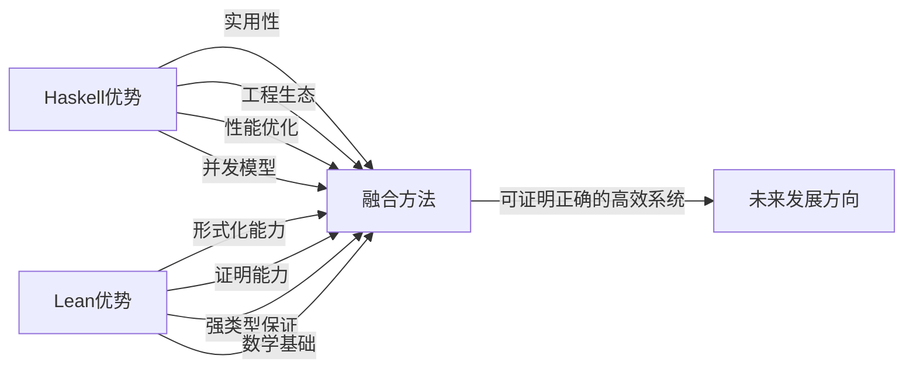

# Lean与Haskell形式化方法与验证模型分析

## 🎯 概述

本文档深入分析Lean和Haskell在形式化方法与程序验证方面的能力、机制和应用场景。形式化方法是基于数学严格定义的技术，用于规范、开发和验证软件系统。尽管两种语言都源于函数式编程范式，但它们在形式化方法的支持上有着显著差异，反映了设计哲学和应用重点的不同。

## 📊 形式化方法比较图

```mermaid
graph TD
    %% 顶层分类
    ROOT[形式化方法与验证] --> SPEC[形式规范]
    ROOT --> PROOF[定理证明]
    ROOT --> TYPE[类型安全]
    ROOT --> VERIF[程序验证]
    ROOT --> APPL[应用领域]
    
    %% 形式规范分支
    SPEC --> S1[规范语言]
    SPEC --> S2[契约设计]
    SPEC --> S3[不变量表达]
    
    %% 规范语言
    S1 --> S1_H[Haskell规范]
    S1 --> S1_L[Lean规范]
    
    S1_H --> S1_H1[注释规范]
    S1_H --> S1_H2[LiquidHaskell]
    
    S1_L --> S1_L1[类型即命题]
    S1_L --> S1_L2[依赖类型规范]
    
    %% 定理证明分支
    PROOF --> P1[证明系统]
    PROOF --> P2[证明自动化]
    PROOF --> P3[证明辅助]
    
    %% 证明系统
    P1 --> P1_H[Haskell证明]
    P1 --> P1_L[Lean证明]
    
    P1_H --> P1_H1[外部证明器]
    P1_H --> P1_H2[限制性证明]
    
    P1_L --> P1_L1[原生证明系统]
    P1_L --> P1_L2[战术语言]
    P1_L --> P1_L3[证明库]
    
    %% 类型安全分支
    TYPE --> T1[类型系统能力]
    TYPE --> T2[静态保证]
    TYPE --> T3[运行时检查]
    
    %% 类型系统能力
    T1 --> T1_H[Haskell类型系统]
    T1 --> T1_L[Lean类型系统]
    
    T1_H --> T1_H1[代数数据类型]
    T1_H --> T1_H2[类型类]
    T1_H --> T1_H3[高级类型扩展]
    
    T1_L --> T1_L1[依赖类型]
    T1_L --> T1_L2[归纳类型族]
    T1_L --> T1_L3[同伦类型论]
    
    %% 程序验证分支
    VERIF --> V1[验证方法]
    VERIF --> V2[属性测试]
    VERIF --> V3[模型检验]
    
    %% 验证方法
    V1 --> V1_H[Haskell验证]
    V1 --> V1_L[Lean验证]
    
    V1_H --> V1_H1[QuickCheck]
    V1_H --> V1_H2[运行时断言]
    
    V1_L --> V1_L1[类型级验证]
    V1_L --> V1_L2[证明驱动开发]
    
    %% 应用领域分支
    APPL --> A1[软件系统]
    APPL --> A2[数学定理]
    APPL --> A3[协议验证]
    APPL --> A4[工业应用]
    
    %% 语言支持标记
    classDef haskell fill:#f9f,stroke:#333,stroke-width:1px;
    classDef lean fill:#bbf,stroke:#333,stroke-width:1px;
    classDef both fill:#bfb,stroke:#333,stroke-width:1px;
    
    class S1_H,P1_H,T1_H,V1_H haskell;
    class S1_L,P1_L,T1_L,V1_L lean;
    class S2,S3,P2,P3,T2,T3,V2,V3,A1,A2,A3,A4 both;
```



## 📑 形式规范能力比较

### 1. 规范表达机制

| 能力 | Haskell | Lean | 对比分析 |
|------|---------|------|---------|
| **基本规范方式** | 类型签名、文档注释 | 类型即规范、依赖类型 | Lean的规范直接是程序的一部分，Haskell需要额外机制 |
| **前置条件** | 注释或LiquidHaskell | 依赖类型函数 | Lean能直接在类型系统中表达前置条件 |
| **后置条件** | 注释或LiquidHaskell | 返回类型定理 | Lean的后置条件可以作为类型定理形式化 |
| **不变量** | 注释、类型或测试 | 归纳不变量、证明 | Lean提供更强的不变量保证 |
| **接口规范** | 类型类、文档 | 类型类+定理 | Lean能够证明接口性质 |

### 2. 形式规范示例

#### Haskell中的规范表达

**使用类型和注释：**

```haskell
-- | 对非空列表求平均值
-- 前置条件：列表不能为空
-- 后置条件：结果是列表元素的算术平均值
average :: [Double] -> Double
average [] = error "Cannot calculate average of empty list"
average xs = sum xs / fromIntegral (length xs)
```

**使用LiquidHaskell进行规范：**

```haskell
{-@ average :: {xs:[Double] | len xs > 0} -> Double @-}
average :: [Double] -> Double
average xs = sum xs / fromIntegral (length xs)

{-@ type NonZero = {v:Int | v /= 0} @-}
{-@ safeDivide :: Int -> NonZero -> Int @-}
safeDivide :: Int -> Int -> Int
safeDivide x y = x `div` y
```

#### Lean中的规范表达

**使用依赖类型作为规范：**

```lean
-- 使用依赖类型表达前置条件
def average (xs : List Float) (h : xs ≠ []) : Float :=
  xs.sum / xs.length.toFloat

-- 定义非空列表类型
def NonEmptyList (α : Type) := {xs : List α // xs ≠ []}

-- 安全平均值函数
def safeAverage (xs : NonEmptyList Float) : Float :=
  let ⟨list, _⟩ := xs
  list.sum / list.length.toFloat

-- 使用定理表达后置条件
theorem average_bounds (xs : List Float) (h : ∀ x ∈ xs, a ≤ x ∧ x ≤ b) :
  xs ≠ [] → a ≤ average xs ? ∧ average xs ? ≤ b := sorry
```

## 🔍 定理证明能力比较

### 1. 证明系统能力

| 能力 | Haskell | Lean | 对比分析 |
|------|---------|------|---------|
| **内置证明系统** | 无原生支持 | 完整证明系统 | Lean核心特性是证明系统，Haskell需借助外部工具 |
| **证明表示** | 程序即证明有限支持 | 程序即证明原生支持 | Lean的类型直接代表命题 |
| **证明策略** | 有限策略 | 完整战术系统 | Lean提供丰富的战术语言 |
| **证明检查** | 类型检查器 | 核心证明检查器 | Lean的证明检查更严格 |
| **证明元编程** | 有限元编程 | 强大元编程 | Lean支持证明的元编程 |

### 2. 证明示例对比

#### Haskell中的简单证明

**使用类型系统进行有限证明：**

```haskell
-- 使用GADT表达相等性证明
data Equal a b where
  Refl :: Equal a a

-- 使用Equal证明函数性质
symm :: Equal a b -> Equal b a
symm Refl = Refl

trans :: Equal a b -> Equal b c -> Equal a c
trans Refl Refl = Refl

-- 证明加法交换律（有限的表达）
addComm :: Int -> Int -> Equal Int Int
addComm a b = undefined -- 不能在Haskell核心系统中直接证明
```

#### Lean中的定理证明

**使用Lean的原生证明系统：**

```lean
-- 数学定理的证明
theorem add_comm (a b : Nat) : a + b = b + a := by
  induction a with
  | zero => simp
  | succ n ih => 
    simp [Nat.add_succ, Nat.succ_add]
    rw [ih]

-- 使用已有定理构建更复杂证明
theorem add_assoc (a b c : Nat) : (a + b) + c = a + (b + c) := by
  induction a with
  | zero => simp
  | succ n ih => 
    simp [Nat.add_succ]
    rw [ih]

-- 程序正确性证明
def reverse {α : Type} : List α → List α
  | [] => []
  | x::xs => reverse xs ++ [x]

theorem reverse_append {α : Type} (xs ys : List α) : 
  reverse (xs ++ ys) = reverse ys ++ reverse xs := by
  induction xs with
  | nil => simp
  | cons x xs ih => 
    simp [reverse]
    rw [ih, List.append_assoc]
```

### 3. 证明自动化比较

| 能力 | Haskell | Lean | 对比分析 |
|------|---------|------|---------|
| **证明搜索** | 有限搜索 | 强大的策略 | Lean提供更丰富的搜索策略 |
| **决策程序** | 借助外部 | 内置支持 | Lean内置多种决策程序 |
| **简化器** | 有限优化 | 强大重写系统 | Lean的简化器更为强大 |
| **自动证明** | 较少支持 | 广泛支持 | Lean更多自动化技术 |
| **定理重用** | 有限机制 | 完整库支持 | Lean有丰富的数学库 |

## 📊 类型安全比较

### 1. 类型系统能力

| 能力 | Haskell | Lean | 对比分析 |
|------|---------|------|---------|
| **基础类型** | 强静态类型 | 依赖类型 | Lean类型系统严格超越Haskell |
| **多态性** | 参数多态、类型类 | 依赖类型多态、宇宙多态 | 不同形式的多态机制 |
| **高级类型特性** | GADTs, 类型族, 角色 | 归纳类型族, 依赖类型 | 不同的表达高级类型的方式 |
| **类型级编程** | 类型族、多参数类型类 | 直接类型级函数 | Lean类型级编程更直接 |
| **类型定律** | 外部检查 | 可证明的定律 | Lean可以证明类型论定律 |

### 2. 静态保证比较

| 保证类型 | Haskell | Lean | 对比分析 |
|---------|---------|------|---------|
| **边界检查** | 部分静态检查 | 完全静态证明 | Lean可以静态证明边界安全 |
| **资源管理** | 借助类型机制 | 依赖类型跟踪 | Lean的资源跟踪更精确 |
| **状态机不变量** | 类型代数编码 | 命题证明 | Lean能直接证明状态机性质 |
| **并发安全** | 类型标记并发 | 有限并发支持 | Haskell并发安全机制更成熟 |
| **终止性** | 无法静态保证 | 完全静态证明 | Lean强制所有递归终止 |

### 3. 类型安全示例比较

#### Haskell类型安全

```haskell
-- 使用幻影类型保证单位一致性
newtype Meter = Meter Double
newtype Feet = Feet Double

-- 智能构造器确保非负值
newtype NonNegative = NonNegative { getValue :: Double }

mkNonNegative :: Double -> Maybe NonNegative
mkNonNegative x 
  | x >= 0    = Just (NonNegative x)
  | otherwise = Nothing

-- 使用类型系统区分已验证和未验证数据
data Validated a = Validated a
data Unvalidated a = Unvalidated a

validate :: Unvalidated a -> Either String (Validated a)
validate (Unvalidated x) = -- 验证逻辑
  if isValid x 
  then Right (Validated x) 
  else Left "Validation failed"

-- 安全向量访问（类型级长度）
data Vector (n :: Nat) a where
  Nil  :: Vector 'Z a
  Cons :: a -> Vector n a -> Vector ('S n) a

-- 但索引安全需要额外机制
data Fin (n :: Nat) where
  FZ :: Fin ('S n)
  FS :: Fin n -> Fin ('S n)

safeIndex :: Vector n a -> Fin n -> a
safeIndex (Cons x _) FZ = x
safeIndex (Cons _ xs) (FS n) = safeIndex xs n
```

#### Lean类型安全

```lean
-- 使用依赖类型确保向量安全访问
def Vector (α : Type) (n : Nat) : Type := Fin n → α

-- 安全访问，无需额外检查
def get {α : Type} {n : Nat} (v : Vector α n) (i : Fin n) : α := v i

-- 非空字符串类型
def NonEmptyString : Type := {s : String // s ≠ ""}

-- 非负数类型
def NonNegative : Type := {x : Float // x ≥ 0}

-- 有界整数类型
def IntBetween (a b : Int) : Type := {x : Int // a ≤ x ∧ x ≤ b}

-- 单位安全计算
structure Meter where value : Float
structure Feet where value : Float

-- 单位转换（类型安全）
def meterToFeet (m : Meter) : Feet :=
  ⟨m.value * 3.28084⟩

-- 状态机类型安全表达
inductive TrafficLight
  | red | yellow | green

def next : TrafficLight → TrafficLight
  | TrafficLight.red => TrafficLight.green
  | TrafficLight.yellow => TrafficLight.red
  | TrafficLight.green => TrafficLight.yellow

theorem trafficLight_cycle (l : TrafficLight) : 
  next (next (next l)) = l := by
  cases l <;> rfl
```

## 🔬 程序验证技术比较

### 1. 验证方法对比

| 方法 | Haskell | Lean | 对比分析 |
|------|---------|------|---------|
| **类型检查** | 强类型检查 | 依赖类型检查 | Lean类型检查更强大 |
| **属性测试** | QuickCheck, 强大成熟 | 有限支持 | Haskell测试工具更丰富 |
| **静态分析** | 外部工具 | 内置分析 | 两种语言使用不同方式静态分析 |
| **定理证明** | 有限支持 | 核心功能 | Lean专为证明而设计 |
| **模型检查** | 外部工具支持 | 类型级模型检查 | 使用不同的方法进行模型检查 |

### 2. 验证示例对比

#### Haskell验证示例

```haskell
import Test.QuickCheck

-- 属性测试：验证排序函数
prop_sort_idempotent :: [Int] -> Bool
prop_sort_idempotent xs = sort (sort xs) == sort xs

prop_sort_length :: [Int] -> Bool
prop_sort_length xs = length (sort xs) == length xs

prop_sort_sorted :: [Int] -> Bool
prop_sort_sorted xs = isSorted (sort xs)
  where 
    isSorted [] = True
    isSorted [_] = True
    isSorted (x:y:zs) = x <= y && isSorted (y:zs)

-- 使用LiquidHaskell进行静态验证
{-@ measure isSorted @-}
{-@ isSorted :: Ord a => [a] -> Bool @-}
isSorted :: Ord a => [a] -> Bool
isSorted [] = True
isSorted [_] = True
isSorted (x:y:zs) = x <= y && isSorted (y:zs)

{-@ sort :: Ord a => xs:[a] -> {ys:[a] | isSorted ys && length ys == length xs} @-}
sort :: Ord a => [a] -> [a]
sort = -- 排序实现
```

#### Lean验证示例

```lean
-- 排序的类型级规范
def Sorted {α : Type} [Ord α] : List α → Prop
  | [] => True
  | [_] => True
  | a::b::xs => a ≤ b ∧ Sorted (b::xs)

-- 排序函数（带证明）
def sort {α : Type} [Ord α] (xs : List α) : 
  {ys : List α // Sorted ys ∧ Multiset.ofList xs = Multiset.ofList ys} := 
  -- 排序实现带证明

-- 验证排序性质
theorem sort_idempotent {α : Type} [Ord α] (xs : List α) :
  sort (sort xs).val = sort xs := by
  -- 证明排序的幂等性

theorem sort_length {α : Type} [Ord α] (xs : List α) :
  (sort xs).val.length = xs.length := by
  -- 证明排序保持长度
```

### 3. 形式验证工作流对比

| 工作流 | Haskell | Lean | 对比分析 |
|-------|---------|------|---------|
| **规范优先** | 类型优先，测试验证 | 类型与证明优先 | Lean更强调前置规范 |
| **验证驱动开发** | 测试驱动开发 | 证明驱动开发 | 不同的开发方法学 |
| **增量验证** | 增量测试 | 增量证明 | 验证与开发过程的集成度不同 |
| **验证反馈** | 测试反馈 | 证明反馈 | 不同形式的开发周期 |
| **正确性保障** | 高可信度 | 数学保证 | 不同级别的保证强度 |

## 🌐 应用领域对比

### 1. 形式化方法应用场景

| 应用场景 | Haskell | Lean | 优劣分析 |
|---------|---------|------|---------|
| **编译器验证** | 较好支持 | 优秀支持 | Lean可以提供更强的正确性保证 |
| **协议验证** | 有限应用 | 良好支持 | Lean更适合协议形式化 |
| **安全关键系统** | 有限应用 | 优秀支持 | Lean严格保证更适合安全关键领域 |
| **算法正确性** | 良好支持 | 优秀支持 | Lean可以证明复杂算法性质 |
| **数学形式化** | 有限应用 | 核心应用 | Lean专为数学形式化设计 |
| **大规模软件** | 良好支持 | 有限应用 | Haskell工程生态更成熟 |
| **工业应用** | 较广应用 | 正在增长 | Haskell在工业界应用更广泛 |

### 2. 案例研究对比

#### Haskell成功案例

```text
编译器开发: GHC（Glasgow Haskell Compiler）
优势: 使用强类型系统表达语言构造，保证转换正确性
验证程度: 类型安全保证，测试覆盖，有限形式方法

金融系统: 多家金融机构采用Haskell开发交易系统
优势: 类型安全，并发模型，表达式强度
验证程度: 类型检查，属性测试，部分形式化规范

DSL实现: 各种领域特定语言
优势: 类型安全的嵌入式DSL，组合能力强
验证程度: 类型级约束，有限证明
```

#### Lean成功案例

```text
数学定理形式化: mathlib数学库
优势: 形式化数学理论，机器验证证明
验证程度: 完全形式化证明

算法正确性证明: 各类算法的形式化验证
优势: 证明算法复杂性和正确性属性
验证程度: 完全机器检查的证明

编译器验证: Lean编译器的形式化部分
优势: 关键组件的形式化验证
验证程度: 类型安全和部分证明
```

## 🔄 形式化方法的融合与发展

### 1. 两种方法的互补性



### 2. 互操作性与工具链整合

| 整合方向 | 现状与潜力 | 实现方法 |
|---------|------------|---------|
| **Haskell引入依赖类型** | 逐步增加特性 | 语言扩展，如Dependent Haskell |
| **Lean引入高效执行** | 提升工程实践 | 优化编译器，扩展库生态 |
| **跨语言验证** | 早期探索阶段 | 共享形式规范，互操作协议 |
| **统一工具链** | 发展中 | IDE整合，证明辅助交互 |
| **知识共享** | 快速发展 | 形式方法社区交流 |

### 3. 未来发展趋势

| 趋势 | 描述 | 可能实现 |
|------|------|----------|
| **更易用的形式化方法** | 降低形式方法使用门槛 | 更好的自动化，更友好的工具 |
| **工程实践与形式化结合** | 在实际项目中应用形式方法 | 增量采用，混合方法 |
| **形式化和AI结合** | 使用AI辅助证明和验证 | 证明搜索，验证建议 |
| **验证生态系统** | 验证组件的生态建设 | 已验证库，模块化验证 |
| **主流开发整合** | 形式方法进入主流开发 | 轻量级形式化，教育推广 |

## 📜 形式化方法资源与参考

### 1. Haskell形式化方法资源

1. **工具与框架**：
   - LiquidHaskell - 精化类型系统
   - QuickCheck - 属性测试框架
   - Hedgehog - 属性测试框架
   - Agda - 相关依赖类型系统

2. **书籍与文献**：
   - "Thinking with Types" - Sandy Maguire
   - "Pearls of Functional Algorithm Design" - Richard Bird
   - "Certified Programming with Dependent Types" - Adam Chlipala

3. **社区资源**：
   - Haskell Wiki上的形式方法资源
   - Haskell形式方法研讨会资料
   - Research Papers in Functional Programming

### 2. Lean形式化方法资源

1. **工具与库**：
   - mathlib - 数学库
   - Lean Prover - 核心证明工具
   - Lean VSCode扩展 - 交互式证明开发

2. **书籍与文献**：
   - "Theorem Proving in Lean" - Lean团队
   - "Programming in Lean" - Lean社区
   - "Interactive Theorem Proving and Program Development"

3. **社区资源**：
   - Lean Zulip社区
   - Lean Together会议资料
   - Formal Methods in Mathematics研讨会

### 3. 交叉学习资源

1. **跨语言概念**：
   - 类型理论基础
   - 形式化方法概论
   - 证明辅助系统导论

2. **整合实践**：
   - 形式化方法工业应用案例
   - 混合验证方法论
   - 从测试到证明的过渡策略

3. **工具链整合**：
   - 多语言形式验证框架
