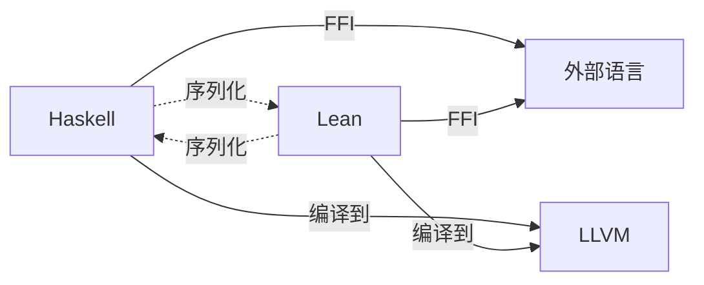

# Lean与Haskell语言特性比较图谱

## 🎯 概述

本文档对比分析Lean和Haskell两种函数式语言的核心特性，展示它们在类型系统、执行模型、设计模式和应用场景等方面的异同点，帮助开发者和研究人员更好地理解和选择适合的语言工具。

## 📊 语言特性对比图

```mermaid
graph TD
    %% 核心语言维度
    ROOT[语言特性比较]
    ROOT --> TYPE[类型系统]
    ROOT --> EXEC[执行模型]
    ROOT --> DESIGN[设计模式支持]
    ROOT --> TOOL[工具链与生态]
    ROOT --> APP[应用领域]
    
    %% 类型系统比较
    TYPE --> T_H[Haskell类型系统]
    TYPE --> T_L[Lean类型系统]
    
    %% Haskell类型系统
    T_H --> TH1[Hindley-Milner类型推导]
    T_H --> TH2[类型类与实例]
    T_H --> TH3[参数多态]
    T_H --> TH4[高级类型特性]
    TH4 --> TH4_1[GADT]
    TH4 --> TH4_2[类型族]
    TH4 --> TH4_3[类型角色]
    TH4 --> TH4_4[类型应用]
    
    %% Lean类型系统
    T_L --> TL1[依赖类型]
    T_L --> TL2[同伦类型论]
    T_L --> TL3[归纳类型族]
    T_L --> TL4[宇宙层次]
    
    %% 执行模型比较
    EXEC --> E_H[Haskell执行模型]
    EXEC --> E_L[Lean执行模型]
    
    %% Haskell执行模型
    E_H --> EH1[默认惰性求值]
    E_H --> EH2[非确定性评估顺序]
    E_H --> EH3[运行时系统GHC]
    E_H --> EH4[内存管理与GC]
    
    %% Lean执行模型
    E_L --> EL1[默认严格求值]
    E_L --> EL2[确定性评估顺序]
    E_L --> EL3[证明辅助执行]
    E_L --> EL4[编译优化策略]
    
    %% 设计模式支持比较
    DESIGN --> D_H[Haskell设计模式]
    DESIGN --> D_L[Lean设计模式]
    
    %% Haskell设计模式
    D_H --> DH1[函数式设计模式]
    D_H --> DH2[类型驱动设计]
    D_H --> DH3[单子变换器]
    D_H --> DH4[自由单子]
    
    %% Lean设计模式
    D_L --> DL1[依赖类型模式]
    D_L --> DL2[证明驱动开发]
    D_L --> DL3[形式验证模式]
    D_L --> DL4[命题即类型模式]
    
    %% 工具链比较
    TOOL --> TO_H[Haskell工具链]
    TOOL --> TO_L[Lean工具链]
    
    %% Haskell工具链
    TO_H --> TOH1[GHC编译器]
    TO_H --> TOH2[Hackage/Cabal包管理]
    TO_H --> TOH3[HLS语言服务器]
    TO_H --> TOH4[丰富的库生态]
    
    %% Lean工具链
    TO_L --> TOL1[Lean编译器]
    TO_L --> TOL2[Lake包管理]
    TO_L --> TOL3[证明编辑功能]
    TO_L --> TOL4[数学库生态]
    
    %% 应用领域比较
    APP --> A_H[Haskell应用领域]
    APP --> A_L[Lean应用领域]
    
    %% Haskell应用领域
    A_H --> AH1[Web开发]
    A_H --> AH2[系统编程]
    A_H --> AH3[数据处理]
    A_H --> AH4[编译器开发]
    
    %% Lean应用领域
    A_L --> AL1[数学形式化]
    A_L --> AL2[程序验证]
    A_L --> AL3[定理证明]
    A_L --> AL4[形式化规范]
    
    %% 关系连接
    TH2 -.关联.-> TL1
    EH1 -.对比.-> EL1
    DH2 -.互补.-> DL2
    AH3 -.可结合.-> AL2
```

## 📑 特性详细对比表

### 1. 类型系统对比

| 特性 | Haskell | Lean | 优缺点分析 |
|------|---------|------|-----------|
| **基础类型系统** | 静态强类型，Hindley-Milner类型推导 | 依赖类型系统，基于构造演算 | Haskell类型推导更自动化；Lean类型表达力更强 |
| **多态性** | 参数多态，类型类多态 | 依赖类型多态，宇宙多态 | Haskell多态更便于日常使用；Lean多态更精确 |
| **抽象机制** | 类型类，实例机制 | 类型类，结构化定义 | Haskell类型类更成熟；Lean结合依赖类型更灵活 |
| **高级类型特性** | 类型族，GADT，类型角色 | 归纳类型族，索引类型 | Haskell特性更面向工程；Lean特性更面向数学 |
| **类型安全** | 强类型安全，编译时检查 | 定理级类型安全，证明支持 | Lean提供更强的正确性保证 |

### 2. 执行模型对比

| 特性 | Haskell | Lean | 优缺点分析 |
|------|---------|------|-----------|
| **求值策略** | 默认惰性求值（非严格） | 默认严格求值 | Haskell支持无限数据结构；Lean求值更可预测 |
| **执行顺序** | 非确定性（依赖求值需求） | 确定性（严格求值） | Haskell更灵活；Lean更可控 |
| **内存模型** | 复杂的堆内存管理，GC | 更可预测的内存使用 | Haskell内存泄漏更难调试；Lean内存使用更透明 |
| **并行执行** | 软件事务内存，轻量级线程 | 有限支持 | Haskell并行能力更成熟 |
| **编译优化** | GHC高级优化，内联，专用化 | 证明简化，逻辑优化 | Haskell运行性能更优；Lean证明性能更优 |

### 3. 设计模式支持对比

| 特性 | Haskell | Lean | 优缺点分析 |
|------|---------|------|-----------|
| **函数式模式** | 全面支持，生态系统成熟 | 支持，但更侧重形式验证 | Haskell更适合纯函数式编程；Lean更适合证明化编程 |
| **抽象模式** | 类型类，单子，函子 | 类型类，证明抽象 | Haskell抽象更面向计算；Lean抽象更面向证明 |
| **组合模式** | 函数组合，单子变换器 | 函数组合，证明组合 | Haskell组合更自动化；Lean组合更明确 |
| **DSL支持** | 强大的嵌入式DSL能力 | 数学化DSL，证明DSL | Haskell更适合业务DSL；Lean更适合形式化DSL |
| **错误处理** | Maybe/Either单子，异常 | 依赖类型，Option类型 | Haskell错误处理更灵活；Lean更严格且类型安全 |

### 4. 工具链与生态系统对比

| 特性 | Haskell | Lean | 优缺点分析 |
|------|---------|------|-----------|
| **编译系统** | GHC成熟稳定，多后端 | Lean编译器，持续发展 | Haskell工具链更成熟；Lean更专注证明辅助 |
| **包管理** | Cabal，Stack，丰富的Hackage | Lake，更小的生态 | Haskell生态系统更大更成熟 |
| **IDE支持** | 多种IDE插件，HLS支持 | VSCode专用扩展，证明视图 | Lean的证明交互体验更好；Haskell的开发工具更全面 |
| **测试框架** | QuickCheck，HUnit等多种选择 | 以证明为主的验证 | Haskell测试工具更多样；Lean以证明代替测试 |
| **文档系统** | Haddock，丰富的社区资源 | 数学化文档，定理库 | Haskell学习资源更丰富；Lean数学文档更严谨 |

### 5. 应用领域对比

| 特性 | Haskell | Lean | 优缺点分析 |
|------|---------|------|-----------|
| **工业应用** | Web后端，金融科技，编译器 | 形式验证，数学软件 | Haskell工业应用更广泛；Lean学术应用更专注 |
| **学术研究** | 程序语言理论，类型理论 | 数学基础，定理证明，类型理论 | Lean在数学形式化方面更强；Haskell在PL研究更普遍 |
| **安全关键** | 金融系统，安全软件 | 协议验证，安全证明 | 二者互补，Lean验证核心算法，Haskell实现系统 |
| **教学用途** | 函数式编程入门，类型理论 | 证明辅助，类型论教学 | Haskell作为函数式编程教学更普及；Lean在证明理论教学更专业 |

## 🔍 语言互操作性分析

### 1. 互操作机制

### 2. 互操作优势

| 互操作场景 | 实现方式 | 应用价值 |
|-----------|----------|---------|
| **Lean验证，Haskell实现** | Lean导出验证模型，Haskell实现 | 获得形式化验证的高性能实现 |
| **共享数据结构** | 定义共同的数据交换格式 | 无缝集成两种语言的优势 |
| **混合开发流程** | 基于API的松耦合集成 | 结合二者优势的开发方法论 |

## 📊 语言选择决策矩阵

### 根据项目特性选择语言

| 项目需求 | 首选语言 | 理由 |
|---------|---------|------|
| **大型Web应用** | Haskell | 成熟的Web框架，性能优化，社区支持 |
| **形式化数学** | Lean | 强大的证明系统，数学库，定理支持 |
| **安全关键系统** | Lean+Haskell | Lean做形式验证，Haskell做实现 |
| **编译器开发** | Haskell | 成熟的编译技术，强大的DSL支持 |
| **定理证明** | Lean | 专为证明设计的类型系统和工具 |
| **数据处理** | Haskell | 丰富的库，惰性求值对大数据友好 |
| **教学演示** | 视教学目标 | 函数式编程选Haskell，形式化选Lean |

## 🚀 语言融合路径

1. **理论层面融合**：探索依赖类型与Haskell类型类系统的统一
2. **工具层面融合**：开发Haskell与Lean的互操作工具
3. **方法论融合**：结合Lean的形式验证与Haskell的工程实践
4. **教学融合**：创建统一的函数式编程与形式化方法教学路径

## 📝 结论

Haskell和Lean各有其设计哲学和优势领域：Haskell在实用函数式编程、性能优化和工程应用方面表现优异；Lean在形式化验证、定理证明和数学研究方面具有独特优势。通过深入理解两种语言的特性及其关系，可以根据项目需求做出合适的技术选择，甚至在某些应用场景下结合两者的优势，实现"最佳实践"。
