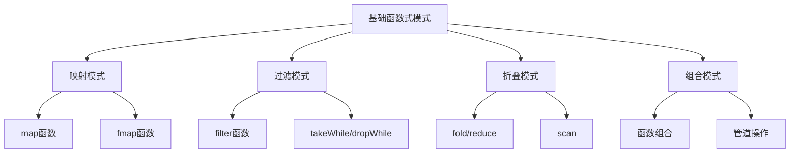

# Lean与Haskell函数式设计模式

> 本文档探讨Lean与Haskell中的函数式设计模式，包括基础模式、高级模式及其应用场景。

## 1. 函数式设计模式基础

### 1.1 函数式设计核心原则

- **纯函数**：无副作用，相同输入产生相同输出
- **不可变数据**：数据一旦创建不可修改
- **高阶函数**：函数可作为参数和返回值
- **组合优先**：通过组合构建复杂行为
- **类型驱动**：利用类型系统指导设计

### 1.2 基础函数式模式



## 2. 单子设计模式

### 2.1 单子基础

单子是函数式编程中的核心抽象，提供了处理计算上下文的统一接口。

```haskell
-- Haskell中的Monad类型类
class Applicative m => Monad m where
    return :: a -> m a
    (>>=)  :: m a -> (a -> m b) -> m b
```

```lean
-- Lean中的Monad类型类
class Monad (m : Type → Type) where
  pure : α → m α
  bind : m α → (α → m β) → m β
```

### 2.2 常见单子模式

| 单子模式 | Haskell实现 | Lean实现 | 应用场景 |
|---------|------------|---------|---------|
| **Maybe单子** | `Maybe a` | `Option α` | 可能失败的计算 |
| **列表单子** | `[a]` | `List α` | 多值计算、非确定性 |
| **状态单子** | `State s a` | `StateM s α` | 状态传递、可变状态 |
| **Reader单子** | `Reader r a` | `ReaderM r α` | 环境依赖、配置 |
| **Writer单子** | `Writer w a` | `WriterM w α` | 日志记录、累积输出 |
| **IO单子** | `IO a` | `IO α` | 输入输出操作 |
| **错误处理单子** | `Either e a` | `Except ε α` | 错误处理与恢复 |

### 2.3 单子变换器模式

单子变换器允许组合多个单子，构建复杂的计算上下文。

```haskell
-- Haskell中的单子变换器示例
newtype StateT s m a = StateT { runStateT :: s -> m (a, s) }

-- 使用示例
type AppMonad = StateT AppState (ReaderT Config (ExceptT Error IO))
```

```lean
-- Lean中的单子变换器示例
def StateT (s : Type) (m : Type → Type) (α : Type) : Type :=
  s → m (α × s)

-- 使用示例
def AppMonad (α : Type) := StateT AppState (ReaderT Config (ExceptT Error IO)) α
```

## 3. 函子设计模式

### 3.1 函子基础

函子提供了在上下文中映射值的能力。

```haskell
-- Haskell中的Functor类型类
class Functor f where
    fmap :: (a -> b) -> f a -> f b
```

```lean
-- Lean中的Functor类型类
class Functor (f : Type → Type) where
  map : (α → β) → f α → f β
```

### 3.2 常见函子模式

| 函子模式 | Haskell实现 | Lean实现 | 应用场景 |
|---------|------------|---------|---------|
| **容器函子** | 列表、树、Map等 | 列表、树、映射等 | 数据结构转换 |
| **上下文函子** | Maybe、Either等 | Option、Except等 | 上下文感知计算 |
| **函数函子** | `((->) r)` | `(r → -)` | 函数转换 |
| **IO函子** | `IO` | `IO` | 副作用操作转换 |

### 3.3 应用函子模式

应用函子扩展了函子，允许在上下文中应用函数。

```haskell
-- Haskell中的Applicative类型类
class Functor f => Applicative f where
    pure  :: a -> f a
    (<*>) :: f (a -> b) -> f a -> f b
```

```lean
-- Lean中的Applicative类型类
class Functor f => Applicative (f : Type → Type) where
  pure : α → f α
  seq  : f (α → β) → f α → f β
```

## 4. 高级函数式设计模式

### 4.1 自由单子模式

自由单子提供了将效应描述与解释分离的能力。

```haskell
-- Haskell中的Free单子
data Free f a = Pure a | Free (f (Free f a))

-- 使用示例
data TelegramF a = SendMessage String a | ReceiveMessage (String -> a)

type Telegram = Free TelegramF
```

```lean
-- Lean中的Free单子
inductive Free (f : Type → Type) (α : Type)
| pure : α → Free f α
| free : f (Free f α) → Free f α
```

### 4.2 最终编码模式

最终编码（Finally Tagless）提供了可扩展的解释器模式。

```haskell
-- Haskell中的最终编码
class Expr rep where
  lit :: Int -> rep Int
  add :: rep Int -> rep Int -> rep Int
  if_ :: rep Bool -> rep a -> rep a -> rep a

-- 解释器实现
newtype Eval a = Eval { runEval :: a }

instance Expr Eval where
  lit n = Eval n
  add e1 e2 = Eval (runEval e1 + runEval e2)
  if_ c t e = Eval (if runEval c then runEval t else runEval e)
```

```lean
-- Lean中的最终编码
class Expr (rep : Type → Type) where
  lit : Int → rep Int
  add : rep Int → rep Int → rep Int
  if_ : rep Bool → rep α → rep α → rep α

-- 解释器实现
def Eval (α : Type) := α

instance : Expr Eval where
  lit n := n
  add e1 e2 := e1 + e2
  if_ c t e := if c then t else e
```

### 4.3 类型状态模式

类型状态模式使用类型系统跟踪计算状态。

```haskell
-- Haskell中的类型状态
data Opened
data Closed

newtype File s = File Handle

open :: FilePath -> IO (File Closed)
close :: File Opened -> IO (File Closed)
read :: File Opened -> IO (String, File Opened)
```

```lean
-- Lean中的类型状态
inductive FileState
| opened
| closed

def File (s : FileState) := Handle

def open : FilePath → IO (File FileState.closed)
def close : File FileState.opened → IO (File FileState.closed)
def read : File FileState.opened → IO (String × File FileState.opened)
```

## 5. 函数式数据处理模式

### 5.1 映射-归约模式


```haskell
-- Haskell示例
processData :: [Int] -> Int
processData = sum . filter even . map (*2)
```

```lean
-- Lean示例
def processData (data : List Int) : Int :=
  data.map (· * 2) |> List.filter Even.even |> List.foldl (· + ·) 0
```

### 5.2 组合子模式

组合子模式通过组合简单函数创建复杂行为。

```haskell
-- Haskell解析器组合子示例
expr :: Parser Int
expr = chainl1 term addOp

term :: Parser Int
term = chainl1 factor mulOp

factor :: Parser Int
factor = number <|> parens expr
```

```lean
-- Lean解析器组合子示例
def expr : Parser Int :=
  chainl1 term addOp

def term : Parser Int :=
  chainl1 factor mulOp

def factor : Parser Int :=
  number <|> parens expr
```

## 6. 实践应用

### 6.1 领域特定语言设计

| DSL特性 | 函数式设计模式 | 实现技术 |
|--------|-------------|---------|
| **嵌入式DSL** | 组合子模式、最终编码 | 类型类、高阶函数 |
| **语法设计** | 解析器组合子 | 单子、应用函子 |
| **语义模型** | 解释器模式、自由单子 | 代数数据类型、单子 |
| **类型安全** | 类型状态、幻影类型 | GADT、依赖类型 |

### 6.2 函数式架构设计

| 架构组件 | 函数式设计模式 | 实现技术 |
|---------|-------------|---------|
| **分层架构** | 单子变换器堆栈 | 单子、单子变换器 |
| **依赖注入** | Reader单子模式 | Reader单子、环境 |
| **状态管理** | 状态单子模式 | State单子、不可变状态 |
| **错误处理** | Either单子模式 | Either单子、异常处理 |
| **副作用隔离** | IO单子模式 | IO单子、纯函数 |

### 6.3 测试策略

| 测试方法 | 函数式设计模式 | 实现技术 |
|---------|-------------|---------|
| **单元测试** | 纯函数测试 | QuickCheck、属性测试 |
| **属性测试** | 生成器组合子 | Arbitrary实例、生成器 |
| **模拟依赖** | Reader单子替换 | 依赖注入、测试环境 |
| **状态测试** | State单子追踪 | 状态检查、不变量验证 |

## 7. Lean与Haskell模式对比

| 设计模式 | Haskell特点 | Lean特点 | 整合价值 |
|---------|------------|---------|---------|
| **单子模式** | 广泛使用、类型类 | 证明友好、依赖类型 | 可验证的副作用管理 |
| **函子模式** | 丰富生态、实用 | 范畴论基础、形式化 | 数学严谨与工程实践 |
| **自由单子** | 效应系统、DSL | 形式化效应、证明 | 可证明的效应系统 |
| **类型状态** | 类型级编程、GADT | 依赖类型、索引类型 | 强大的类型安全保证 |
| **组合子** | 丰富库支持 | 形式化语义 | 可验证的组合逻辑 |

---

*最后更新：2024年整理阶段*
