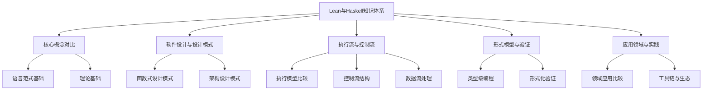
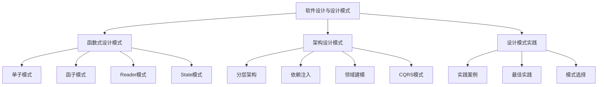
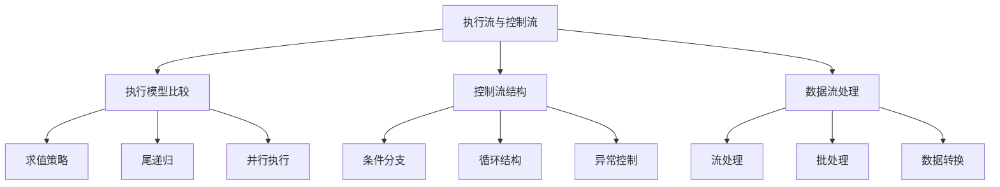
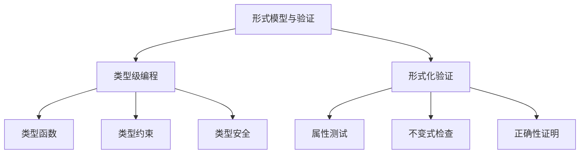

# Lean与Haskell知识图谱导航

> 本文档提供Lean与Haskell知识体系的知识图谱导航，以可视化方式展示知识结构，便于理解概念间关系。

## 1. 知识图谱总览

## 2. 核心概念图谱

- [整合知识图谱](../lean_haskell_knowledge_graph.md)：最新整合的Lean与Haskell知识图谱
- [核心知识图谱](../01-核心知识图谱/01-知识图谱-核心.md)：原有核心知识图谱
- [概念关系图](../01-核心知识图谱/02-概念关系图.md)：概念之间的关系图谱

## 3. 软件设计与设计模式

- [函数式设计模式](../03-设计模式/01-设计模式-函数式.md)：函数式编程设计模式
- [架构设计模式](../03-设计模式/02-设计模式-架构.md)：架构层面设计模式
- [设计模式实践](../03-设计模式/03-设计模式-实践.md)：设计模式实践案例

## 4. 执行流与控制流

- [执行流控制流](../05-执行流控制流/01-执行流-控制流.md)：执行流与控制流分析
- [数据流处理](../05-执行流控制流/02-数据流-处理.md)：数据流处理模型
- [并发模型](../05-执行流控制流/03-并发模型.md)：并发编程模型

## 5. 形式模型与验证

- [类型系统对比](../04-类型系统/01-类型系统-对比.md)：Haskell与Lean类型系统对比
- [类型系统高级特性](../04-类型系统/02-类型系统-高级特性.md)：高级类型系统特性
- [形式化验证](../06-形式化方法/01-形式化验证.md)：形式化验证方法
- [定理证明](../06-形式化方法/02-定理证明.md)：定理证明技术

## 6. 导航资源

- [总索引](01-总索引.md)：完整的文档目录和索引
- [快速导航](../快速导航.md)：知识体系的快速访问入口
- [整理总结报告](../整理总结报告_更新版.md)：整理工作的总结和后续计划

---

-*最后更新：2024年*
