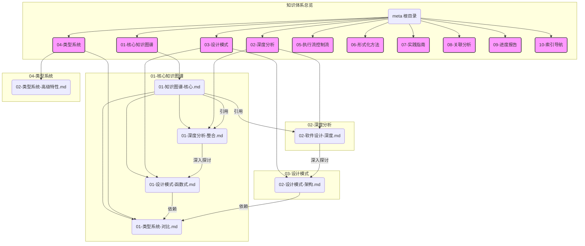

# 知识图谱导航

> 本文档为Haskell与Lean相关项目的知识图谱导航主文档，提供可视化知识结构。

# Lean/Haskell 知识体系核心导航图

```mermaid
graph TD
    subgraph 知识体系总览
        A(meta 根目录) --> C1(01-核心知识图谱)
        A --> C2(02-深度分析)
        A --> C3(03-设计模式)
        A --> C4(04-类型系统)
        A --> C5(05-执行流控制流)
        A --> C6(06-形式化方法)
        A --> C7(07-实践指南)
        A --> C8(08-关联分析)
        A --> C9(09-进度报告)
        A --> C10(10-索引导航)
    end

    subgraph 01-核心知识图谱
        C1 --> F1_1(01-知识图谱-核心.md)
        F1_1 --> F2_1
        F1_1 --> F3_1
        F1_1 --> F4_1
    end

    subgraph 02-深度分析
        C2 --> F2_1(01-深度分析-整合.md)
        C2 --> F2_2(02-软件设计-深度.md)
    end

    subgraph 03-设计模式
        C3 --> F3_1("01-设计模式-函数式.md")
        C3 --> F3_2("02-设计模式-架构.md")
    end

    subgraph 04-类型系统
        C4 --> F4_1("01-类型系统-对比.md")
        C4 --> F4_2("02-类型系统-高级特性.md")
    end
    
    %% 核心文件关联
    F1_1 -- 引用 --> F2_1
    F1_1 -- 引用 --> F2_2
    F2_1 -- 深入探讨 --> F3_1
    F2_2 -- 深入探讨 --> F3_2
    F3_1 -- 依赖 --> F4_1
    F3_2 -- 依赖 --> F4_1
    
    %% 样式定义
    classDef category fill:#f9f,stroke:#333,stroke-width:2px;
    class C1,C2,C3,C4,C5,C6,C7,C8,C9,C10 category;
```
